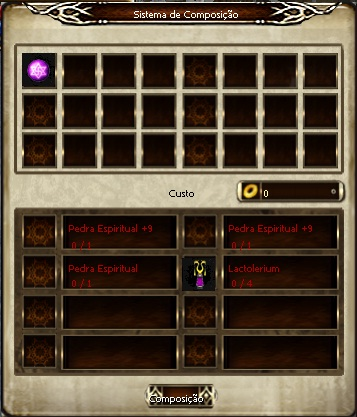

## Pedra Espiritual

<html>
  <head>
    <meta charset="utf-8" />
    <meta name="viewport" content="width=device-width" />
  </head>
  <body>

É possível refinar a Pedra Espiritual até +9, e adicionar outros atributos através de uma combinação específica. Caso essa combinação seja bem sucedida, o atributo adicionado será escolhido aleatoriamente, e esse procedimento só pode ser efetuado por personagens Arch acima do nível 356.

<strong>Combinação de itens</strong>

Você pode combinar as Pedras Espirituais no NPC "Shany''. São necessários 1 Pedra Espiritual +0~+9 e 2 Pedras Espirituais +9. Você deve também possuir 4 "Poeiras de Lactolerium" para completar o processo.

<strong>Observações:</strong>

Quando a combinação ocorrer com sucesso, o atributo do item será randômico. 
Quando a combinação ocorrer com sucesso serão reduzidos 2.000.000 de GOLD do inventário. 
Caso a combinação falhe, serão reduzidos 500.000 de GOLD do inventário. 
A Pedra Espiritual não possui nenhum efeito nos itens refinados. 
Você poderá utilizar a Pedra Espiritual refinada como um item de combinação normalmente.

<strong>Observações:</strong>

* "A Pedra Espiritual com refinação de +0 a +9 não possui influência na probabilidade de Sucesso da criação.  
* A Pedra Espiritual utilizada na combinação não pode possuir Classe E ou F.  
* Você pode combinar Pedras Espiritual mesmo se elas possuírem diferentes Classes.	 		

<strong>Sucesso na Combinação</strong>

1 - Todos os itens utilizados durante a combinação irão desaparecer e uma nova Pedra Espiritual +0 aparecerá com um atributo randômico. 
2 - A Experiência do personagem irá reduzir em 2 milhões se houver sucesso na combinação. 
	a. Pedra Espiritual (Classe F)+0 - limite de level 256, aumento de HP, perfuração +15. 
	b. Pedra Espiritual (Classe F)+0 - limite de level 256, aumento de +100 de HP, absorção de dano +15. 
	Pedra Espiritual (Classe F)+0 - limite de level 256, aumento de +100 de HP, perfuração +15, absorção de dano +15. 
3- A Nova Pedra Espiritual será de Classe F. 

<strong>Falha na Combinação</strong>

1 - A Pedra Espiritual utilizada no Slot 3 será destruída e as Pedras utilizadas nos Slots 1 e 2 irão permanecer.
2 - As 4 Poeiras de Lactolerium serão destruídas.
3 - Caso a combinação falhe, serão reduzidos 500.000 de GOLD do inventário.

  </body>
</html>