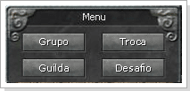

## Sistema de Pontos

<html>
  <head>
    <meta charset="utf-8" />
    <meta name="viewport" content="width=device-width" />
  </head>
  <body>

Quando um jogador morre no PvP ou em uma área PK, a experiência do personagem será bloqueada. O C. Point aumenta toda vez que outro jogador o mata. O C. Point do seu personagem reduz toda vez que você ganha experiência através da caça de monstros. Quando o seu C. Point atinge 0, a condição de "HOLD" na sua experiência será removido.

<strong>No caso do C.Point acumular ou aumentar</strong>

- Quando a experiência do personagem e 1620000000 e o C. Point e 0.  
- Quando você morre no PvP, o seu C. Point aumenta 5000. A experiência do seu personagem será bloqueada em 1620000000.  
- Se você morrer no PvP pela primeira vez, você receberá 5000 C. Point. Se você morrer pela quarta vez, o C. Point será 20000. Sua experiência ficará bloqueada até você conseguir o total de 20000 de experiência                   

<strong>No caso do C.Point reduzir</strong>

Quando a experiência do personagem está bloqueada e o C. Point e 20000.  
Quando você adquire experiência caçando monstros ou matando jogadores do reino inimigo, o seu C. Point irá reduzir.  
- Quando o C. Point da personagem se tornar 0, o bloqueio (HOLD) será removido e você poderá receber a experiência novamente.

<strong>Observações:</strong>

<ull>
	<li>O C. Point pode ser reduzido por meios de caça ou PvP. Quando você remover todo o C. Point o bloqueio da experiência será removido e você poderá evoluir novamente.</li>
	<li>Matar monstros, não afeta o seu C. Point.</li>
	<li>O C. Point pode atingir o máximo de 1/10 da experiência do total que você deve adquirir para passar de level. O C. Point é afetado diretamente pelo level do personagem, quanto maior o level maior o limite do C. Point.</li>
	<li>Quando o C. Point atingir um valor acumular 80%, seu ataque físico será reduzido em 50%. Você deve tomar cuidado com essa condição.</li>
	<li>Quando a experiência do seu personagem de level 300~355 está baixa, você não receberá punição.</li>
	<li>Quando a experiência do seu personagem de level 300~355 cair, você não receberá redução de penalidade.</li>
</ul>

Todos os novos personagens irão iniciar com 0 pontos de Caos. Toda vez que o seu personagem matar outro jogador o seus pontos de Caos serão reduzidos. Personagens com 65 de pontos de Caos terão a cor do nome alterado para preto. Matar personagens com nomes em preto não irá causar penalidade de pontos de Caos.  
Para verificar os pontos de caos utilize o comando "/cp" na janela de chat.

<strong>Circunstâncias onde os Pontos de Caos serão reduzidos</strong>

- Dependendo dos Pontos de Caos do jogador que está sendo morto, a redução dos Pontos de Caos podem ser de 2~3  
-O mesmo sistema se aplica para o ataque a membros de outros reinos.

<table align="center" border="0" cellpadding="1" cellspacing="1" width="550"> 
	<tr align="center">
		<td><strong>CP do Alvo</strong></td>
		<td><strong>Abaixo de 0</strong></td>
		<td><strong>1 ~ -25</strong></td>
		<td><strong>26 ~ -50</strong></td>
		<td><strong>51 ~ -75</strong></td>
	</tr>
	<tr align="center">
		<td>Pontos Reduzidos</td>
		<td>-3</td>
		<td>-3</td>
		<td>-3</td>
		<td>-2</td>
	</tr>
</table>

<strong>Aumentando os Pontos de Caos</strong>

<table border="0" cellpadding="2" cellspacing="2" width="370px">
	<tr>
		<td>
- Subindo level: 
</td>
		<td>

		1) 1~350 : <strong>+3</strong> 
		2) 350~370 : <strong>+1</strong> 
		3) 371~400 : <strong>+5</strong> 
</td>
	</tr>
	<tr>			
		<td>
- NPC GodGovernment 
</td>
		<td>
<strong>: 100 PK por + 10</strong>
</td>
	</tr>
</table>

<strong>PK Drop</strong>

Quando o personagem atinge um valor negativo (qualquer valor negativo que seja) de Pontos de Caos (CP), ele entrará no modo PK-Drop. Isso significa que, caso o personagem morra, ele correrá o risco de dropar (perder) algum item que esteja equipado no personagem ou em seu inventário. Essa é uma forma de “penalidade” por matar outros personagens. É preciso tomar cuidado com isso, pois caso ocorra, não será possível recuperar o item perdido.

<strong>Guerra entre Guilds</strong>

A Guilda campeã é aquela que possui Zona de Guilda em uma cidade em específico e você pode checar quem é o dono da cidade verificando a Torre da Vitória.  
O número de vitórias da Guilda será inserida na Torre e o máximo é 5.  
Os membros da Guilda campeã recebem os seguintes benefícios:  
- Quando você se conectar, você aparecerá na Zona de Guilda da respectiva cidade. 
- Receberá 30% de desconto ao comprar itens nos NPCs. 
- Direito de coletar impostos de todas as lojas de sua cidade. 
- Membros da Guilda que possuírem a Torre da Vitória 5 e jogadores que possuírem mesma cidadania e reino da Guilda receberão Bônus de 3% de XP. 
- Os impostos só podem ser configurados pelo Líder da Guilda e varia de 10%~20% e pode ser escolhido apenas uma vez ao dia. Só o Líder pode verificar os impostos coletados em tempo real nos NPCs.  
 
<strong>NOTE:</strong> O Líder da Guilda deve configurar os impostos após a Guerra de Guildas ou o imposto ficará no NPC e será acumulado até a próxima Guerra.                   

<strong>Guerra de Guildas</strong>

A Batalha entre a Guilda dona da cidade e o desafiante inicia todo domingo as 8:00pm. A declaração de guerra deverá ser feita até o sábado.                 

<strong>Depósito da Guerra de Guilda</strong>

Você pode aplicar a FAMA de Guilda para a Guerra de Guilda no NPC em frente a zona de Guilda de cada Cidade. O tempo para o depósito é de 24 horas de todo sábado, mas só pode ser feita pelo Líder ou pelo Sub-líder da Guilda. 
A Guilda que depositar o maior tributo será escolhida para a batalha.                

<strong>Processo da Guerra de Guilda</strong>

- A Guerra de Guilda será iniciada todo domingo as 20:00.  
- 20:00: O líder da Guilda campeã e seus membros serão convocados para a Zona de Batalha e cada Guilda poderá convocar apenas 26 jogadores (Caso a Guilda possua mais de 26 membros, os mesmos serão escolhidos   randomicamente). 
- 20:03 : Início da Guerra de Guilda. 
- 3:30 : Fim da Guerra de Guilda.  
Caso haja membros de cada Guilda ainda vivos, a Guilda com maior número de pontos ganha. 
O total de pontos é igual à somatória de leveis dos membros vivos da Guilda e serão automaticamente levados para a Zona de Guilda da cidade.  
No caso de empate, a Guilda defensora irá permanecer como campeã.               

<strong>Declaração de Guerra</strong>

A Declaração de Guerra foi criada para controlar a Guerra entre duas Guildas diferentes através da "Declaração de Guerra" e "Aceitamento". Somente o Líder da guilda de cada Guilda pode autorizar a "Declaração de Guerra" e "Aceitamento". Você pode atacar imediatamente a Guilda inimiga assim que a Guerra iniciar. Você não irá perder CP ao atacar outros jogadores.             

<table align="center" width="800">
	<tr>
		<td align="center" width="200">

</td>
		<td>1 - Somente o Líder da guilda pode declarar Guerra a outras Guildas. Clique com o botão direito do mouse no Líder ou em um membro da Guilda que deseja declarar guerra e selecione Guilda no menu.</td>
	</tr>
	<tr>
		<td align="center">

		</td>
		<td>2 - Selecione "Declarar Guerra" no menu.</td>
	</tr>
	<tr>
		<td align="center">

		</td>
		<td>3 - Caso escolha "Confirmar" significa que você declarou guerra a outra Guilda. Será enviada uma mensagem no jogo informando "Guilda XXX declarou Guerra a XXX".</td>
	</tr>
</table>
Para completar a declaração de Guerra, o Líder da Guilda desafiada deverá efetuar o mesmo processo.

<strong>Observações:
</strong>

Comando de Teleporte e Convocação não podem ser utilizados durante a Guerra. Os membros da Guilda deverão estar na cidade que a Guerra foi declarada. Por exemplo, se a Guerra foi declarada a Guilda de Armia, você deve ficar em Armia. O valor mínimo de FAMA de Guilda necessário para a Guerra de Guilda é 50 milhões.

  </body>
</html>