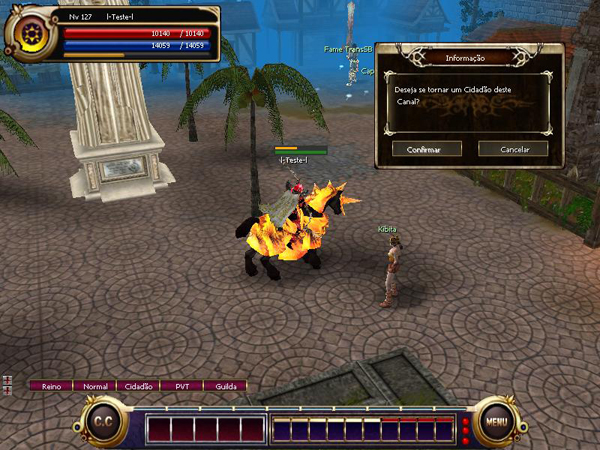
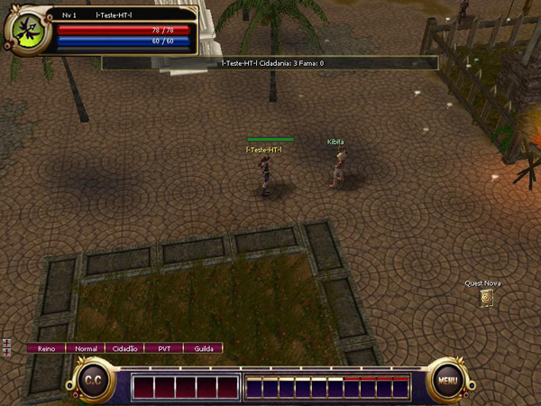
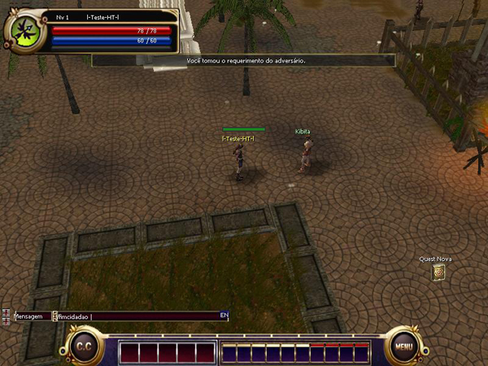

## Cidadania

<html>
  <head>
    <meta charset="utf-8" />
    <meta name="viewport" content="width=device-width" />
  </head>
  <body>

<strong>Como obter Cidadania</strong>

Para se tornar cidadão de um dos canais do servidor escolhido, basta clicar com o botão esquerdo do mouse em cima do NPC de cidadania, após acessar o servidor e canal desejado, esse NPC se encontra na cidade de Armia (primeira cidade acessada) e é conhecido como Kibita.  

Nenhum valor é cobrado para realizar o registro de cidadania em personagens mortais, abaixo segue os valores para as demais categorias:

<ul>
<li>
<strong>Arch>:</strong> (Level + 200) x 10,000 Gold
</li>
<li>
<strong>Celestial:</strong> (Level + 400) x 10,000 Gold
</li>
</ul> 

<strong>Benefícios da cidadania
</strong>

Ao realizar caças no canal onde a cidadania foi obtida, será acrescentado 10% de adicionais na taxa de Drop, caso o Bônus alcançar 80%, a taxa de XP será aumentada.

<strong>Aumentando o Drop do canal
</strong>

Caso o Kefra seja morto, o Bônus será aumentado em 20% em seu respectivo canal. A cada 100,000,000 XP ganho por um cidadão, será acrescentado 1% no bônus de Drop.

<strong>Verificando a cidadania</strong>

A cidadania do personagem pode ser verificada através do comando "/ nome do personagem"

<strong>Desfazendo a cidadania
</strong>

Para deixar de ser cidadão de um canal, basta digitar o comando "/fimcidadao"

<strong>Observações</strong>
Os benefícios de cidadania relacionados à caça serão obtidos apenas quando a caça ser realizada no respectivo canal onde a cidadania foi obtida.

Personagens Archs e Celestiais podem adquirir itens por meio de compra nos NPCs de qualquer canal, mas a venda de itens é possível de ser realizada apenas nos NPCs presentes no canal de sua cidadania.

Caso a cidadania de um personagem Mortal seja desfeita, o mesmo adquirirá automaticamente a cidadania no primeiro canal que acessar após a retirada de sua cidadania.

  </body>
</html>