## História

<html>
  <head>
    <meta charset="utf-8" />
    <meta name="viewport" content="width=device-width" />
  </head>
  <body>

<strong>Movimentos</strong>

Coloque o cursor do Mouse no local onde deseja ir, clique com o botão esquerdo e o seu personagem irá para o local selecionado. No modo de defesa, você pode fugir caso você possua botas. A velocidade de movimento depende do item, skills e se você possui uma montaria ou não.

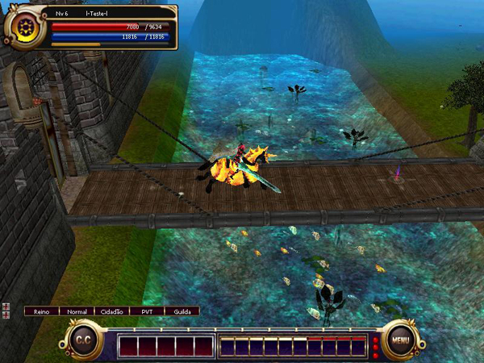

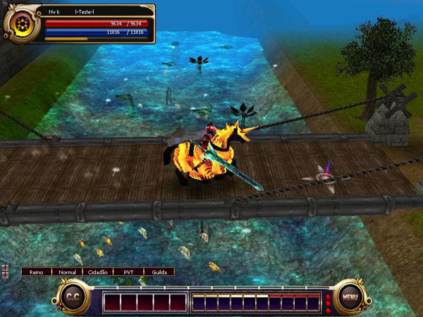

 

<strong>Ataque</strong>

Para atacar o inimigo, utilize o botão esquerdo do mouse. Chegue perto do alvo antes de atacá-lo, se você estiver muito longe do mesmo. Caso esteja utilizando um arco ou uma arma de arremesso, simplesmente clique no alvo com o botão esquerdo do mouse + Shift para que você permaneça na mesma posição.

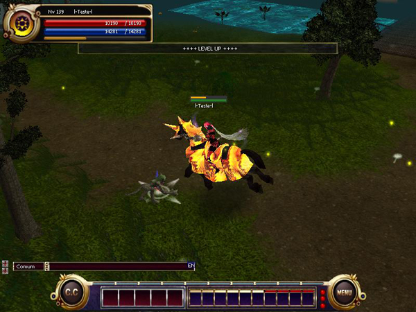

 

<strong>Skill</strong>

Você deve registrar as skills no slot rápido 1~10 na tela do jogo para poder utilizá-las. Para utilizar uma skill basta selecioná-la na barra de slot rápido e clicar no alvo com o botão direito do mouse. Se você desejar utilizar alguma Skill em um membro do seu grupo, basta clicar no nome dele com o botão direito do mouse na janela de Grupo.

 

<strong>Ataque automático</strong>

Clique no botão de ataque automático 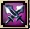, ou pressione a tecla "T" para ativar/desativar o modo de ataque automático. No modo automático o personagem atacará o alvo selecionado previamente até que seja feita alguma alteração ou movimento. Se selecionado com o botão esquerdo aplicará dano físico e se selecionado com o botão direito atacará com Skills. No caso das Skills, apenas as Skills definidos na barra de Skill rápida, dentre eles apenas os que estiverem com a marcação em laranja serão aplicados na ordem.

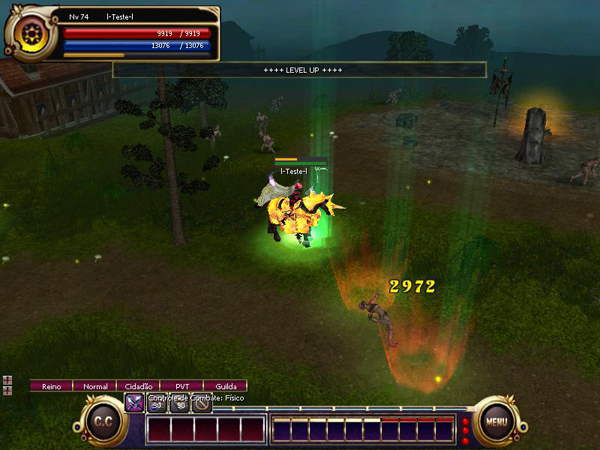

 

<strong>Loja/Depósito</strong>

Há um comerciante que vende todas as armaduras, armas, poções e pergaminhos. Porque você pode comprar os itens básicos na cidade, alguns itens podem ser adquiridos nos campos de caça ou nas QUESTs e eventos. Para entrar na loja, basta clicar no vendedor. A localização dos NPCs comerciantes está disponível no Mapa do jogo.

 

<strong>Compra</strong>

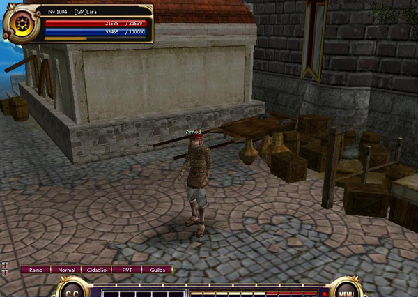

Se você selecionar o NPC comerciante, uma janela com os itens à venda será aberta. Coloque o cursor do mouse em cima do item que deseja adquirir e você poderá ver o nome do item, sua descrição e preço. Só clique no item quando tiver certeza que é o item que deseja comprar.

 

<strong>Venda</strong>

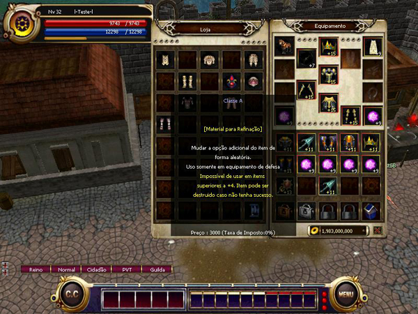

Se você selecionar o NPC comerciante, uma janela com os itens à venda será aberta. Após pegar o item do seu inventário arraste-o a janela do NPC e clique novamente. Você receberá uma confirmação da venda do item que possibilita que você cancele caso seja o item errado.

 

<strong>Guarda Carga</strong>

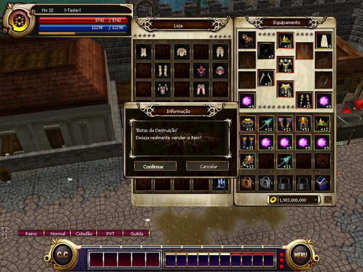

Ao clicar no NPC Guarda Carga, uma janela com o seu banco será exibido. Após selecionar o item que deseja guardar, arraste-o a janela do NPC e clique novamente.

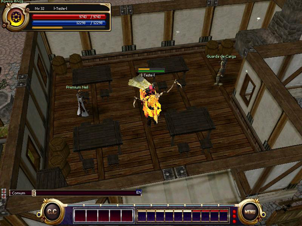

Ao clicar no NPC Guarda Carga, você encontrará um local com o valor de GOLD no seu inventário e no seu "Banco", basta clicar na moeda de GOLD ao lado do valor descrito, após esse procedimento uma pequena janela irá aparecer onde você deve informar o valor que deseja depositar ou retirar. Confirme o processo. Você pode guardar o limite de 2 bilhões de GOLD no seu Guarda Carga, porém esse valor pode ser superado caso você guarde o GOLD como barras de Prata de 1 ou 10 bilhões.

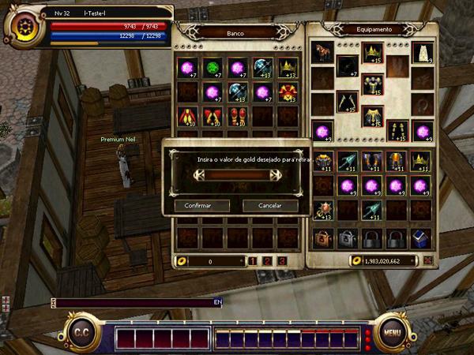

 

<strong>Troca/Venda</strong>

Para realizar uma troca. Clique no jogador com o qual deseja efetuar a troca clicando nele com os botões Ctrtl+Botão direito do mouse e selecionando a opção Troca. O jogador irá receber uma mensagem confirmando se ele deseja efetuar a troca.

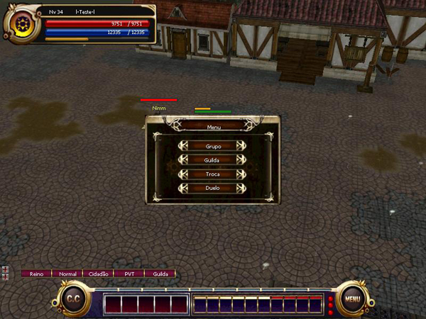

Caso outro jogador solicite a troca, você irá receber uma mensagem. Basta apertar o botão confirmar caso deseje efetuar a troca, ou o botão Cancelar caso não queira. Após confirmar a troca, uma janela será aberta com o seu inventário e a janela de troca. Para selecionar o item que deseja entregar basta clicar com o botão esquerdo do mouse no item.

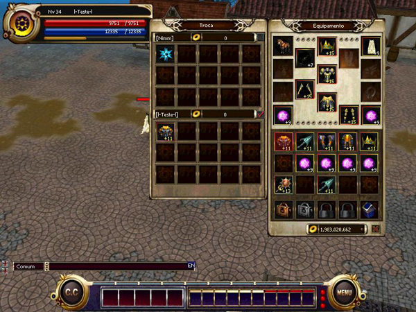

Quando você clicar na moeda de GOLD localizada abaixo do seu inventário, uma janela irá aparecer para que você coloque o valor que deseja negociar. Caso os itens e o GOLD estejam corretos, confirme a troca apertando o botão confirmar na janela de troca. Mas caso você não possua espaço suficiente no inventário, a troca não poderá ser executada.

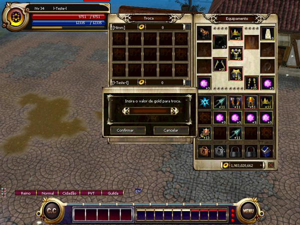

<strong>Obs.:</strong> Caso você ative o botão PK localizado no canto inferior esquerdo da janela do jogo, nenhum jogador poderá realizar troca com você e vice-versa.

 

<strong>Venda automática</strong>

Venda automática é um sistema, que facilita a compra e a venda dos itens pelos jogadores. Caso você clique no botão de Venda automático, uma janela irá abrir onde você deve colocar o nome da sua "loja". Apenas coloque o nome da Loja e confirme.

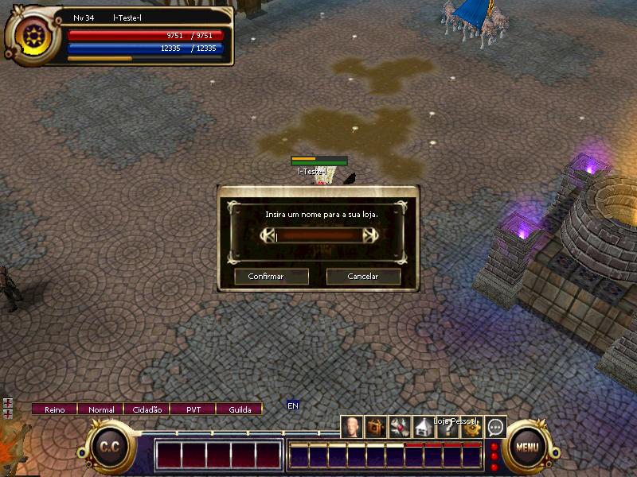

Clique nos itens que deseja vender, após clicar no item uma janela será exibido onde você deve informar o preço do item. Você pode vender o máximo de 12 itens. Após registrar todos os itens que deseja vender, clique no botão confirmando a abertura da loja e a Venda Automática será iniciada.

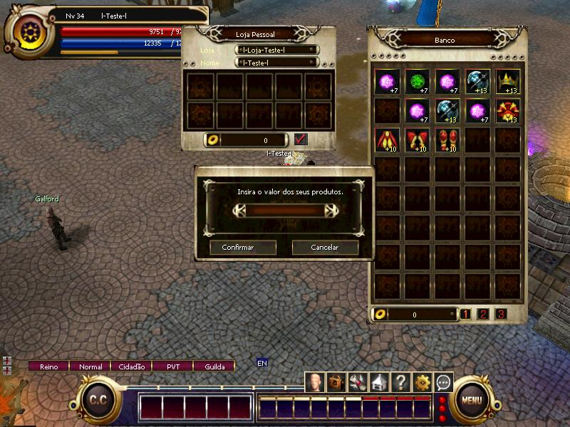

<strong>Obs.:</strong> Você pode utilizar também a página Fórum Mercado para negociar itens.

  </body>
</html>