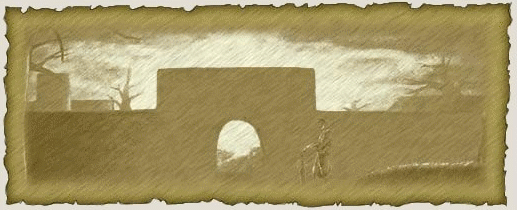
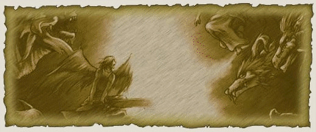
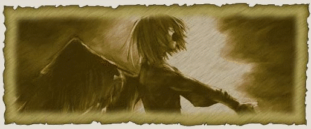
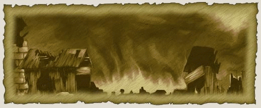
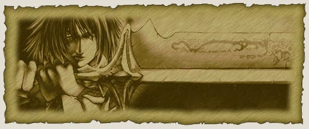

## História

<html>
  <head>
    <meta charset="utf-8" />
    <meta name="viewport" content="width=device-width" />
  </head>
  <body>

<strong>Início dos Tempos</strong>

"Sente aí e escute a nossa história e nada de gracinhas ou eu vou ter que enfiar um pouco de respeito na sua cabeça com a minha bengala... Bem melhor assim, agora pegue um pouco de vinho e cale a boca. Eu vou contar a história do nosso povo... e preste muita atenção porque eu não vou repetir"  
Antes mesmo de existir a mais antiga estrela no céu e de os mundos povoarem o universo, dois seres supremos já existiam; seres mais antigos que a própria criação. Seus nomes são impronunciáveis em nossa língua, por isso os chamamos de Yetzirah e Tzfah.   
Na primeira união desses dois seres, não só a Terra foi criada, mas também os primeiros seres humanos e toda a flora e fauna do planeta. E assim, a humanidade começou a povoar a Terra.  
Yetzirah, que começou a amar seus filhos, resolveu construir um local para sempre estar perto deles, esse local foi chamado de Hekalote, a Morada dos Deuses, e desse lugar ela cuidava da humanidade. Com o passar dos tempos, começaram a formar-se tribos que se fundiram e evoluíram, organizando-se em um reino central, onde tudo era estudado e praticado: política, ciência, arte, economia, pois tudo fazia parte do processo de evolução...  
E Tzfah passou a odiar a humanidade, pois eles haviam conquistado algo que nunca tinha sido dele, o amor de Yetzirah.

 

<strong>Criação dos Deuses</strong>

"Isso mesmo, seu cabeça oca, nos nunca tivemos permissão para rezar para os seres supremos. Eles não precisam das nossas orações, só rezávamos para os deuses, mas isso não faz mais diferença. Os deuses não podem mais escutar nossos cânticos de louvor porque a ponte Sephira foi destruída. O que é a ponte Sephira? Se você passasse menos tempo falando e mais tempo ouvindo, talvez soubesse a história... agora, coloque mais lenha no fogo, estou congelando até os ossos..."   
Depois da criação dos humanos, Yetzirah e Tzfah se uniram mais 5 vezes, e de cada união foi criado um deus: Kafma, Armia, Daleth, Samech e Haden.   
Quando os deuses nasceram, Tzfah percebeu o terrível erro que cometera; pois, assim que seus filhos crescessem, eles se uniriam e o matariam em nome de sua mãe e por amor aos humanos.   
Tão logo os deuses despertaram Tzfah, que não podia matá-los, os trancou num campo de êxtase, de onde eles nunca sairiam.   
Agora o ódio de Tzfah era ainda maior, uma vez que a semente do ciúme e da ira tinham germinado no âmago de seu ser, e sua fúria se voltou contra os humanos. Terremotos, vulcões e outros desastres assolavam a Terra e hordas de monstros que atacavam vilas e cidades, matando tudo que encontravam. E, apesar de tudo que Yetzirah tinha ensinado para os humanos, eles nada podiam fazer.   
Os deuses, que compartilhavam o amor de sua mãe pelos humanos, se compadeceram da desgraça que se abatia sobre a humanidade e, mesmo presos, começaram a moldar a energia de alguns humanos, fazendo com que chegassem ao ápice do poder que seus corpos poderiam aguentar enquanto Yetzirah elaborava um plano para libertar seus filhos e salvar a humanidade.

    
 

<strong>A Batalha Celestial</strong>

    

"Você não se cansa de fazer perguntas idiotas? Nós sabemos de tudo isso porque graças a batalha celestial, as informações sobre a criação do mundo e sobre o segredo dos deuses caíram aqui na Terra, e é por isso que alguns de nós conseguimos fazer magias e manipular a energia dos espíritos. No fundo, eu acho que era isso que os deuses queriam desde o começo. Não, você não pode perguntar mais nada, agora deixe-me continuar antes que eu me irrite com a sua burrice..."   
Enquanto os deuses fortificavam secretamente os humanos, Yetzirah enfraquecia cada vez mais a prisão dos filhos, ambos sabendo que teriam que unir forças para acabar com a tirania de Tzfah, que, consumido pela chama do ódio e da inveja, tinha escravizado quase toda a população humana.   
No instante em que os deuses finalmente conseguiram se libertar, a batalha começou. Liderados por Armia e Kafma e tendo a ajuda de Yetzirah, os deuses investiram com uma fúria jamais vista para finalmente livrar o mundo do maligno Tzfah.   
O impacto da batalha pôde ser sentido tanto por humanos quanto pelos monstros, mas apenas os escolhidos sabiam que a hora tinha chegado e que eles precisavam ajudar os deuses. Para que os humanos pudessem chegar até Hekalote, Daleth criou a ponte Sephira, que ligava o mundo mortal ao reino divino; assim, aqueles que tinha sido tocados pela essência divina conseguiriam chegar a Morada dos Deuses para batalhar pelo destino de toda a humanidade. Esses humanos receberam o nome de Arch.  
Tzfah, porém, também criara seu próprio exército, um exército tocado pela mácula do ódio e, se aproveitando da situação, ordenou que suas tropas destruíssem todo e qualquer ser humano, pois agora os deuses e Yetzirah estavam ocupados demais para se preocupar com qualquer coisa além da batalha.   
Rios de sangue corriam, irrigando a terra e gerando ainda mais monstros e sofrimento para o povo humano, que sem seus defensores parecia não ter escapatória, finalmente os humanos seriam exterminados.   
A única maneira encontrada pelos deuses para acabar com essa loucura era banindo Tzfah do reino divino e o aprisionando no centro da Terra, de onde ele nunca poderia escapar, e foi isso que os deuses fizeram.  
Quando Tzfah foi arremessado a Terra, numa atitude desesperada ele quebrou a ponte Sephira, impedindo os deuses de completar o encantamento. Isso o deixou num estado de semiconsciência, mas ainda livre para influenciar sua legião maligna para dominar a Terra.  

 

<strong>A Guerra Continental</strong>

 

"Sim, isso mesmo, a fúria de Tzfah foi direcionada para os deuses e para a sua antiga amante Yetzirah, mas não se esqueça que de todos os motivos que Tzfah tinha para cometer tamanha loucura, os humanos estão em primeiros da lista, e se você acha que a guerra limitou-se ao mundo celestial, você e mais lerdo do que eu pensava. Os deuses nos ajudaram muito e como pagamos a eles? Os transformando em meros seres para testes, e nessas horas que eu não tenho orgulho de ser um humano."  
Por causa da guerra Celestial, os humanos começam ficar sabendo do sistema do mundo e os segredos do céu. Isso fez com que os humanos em vez de louvar os deuses, começam a analisá-los, ou seja, eles tornaram-se cobaias de estudos como qualquer outro elemento da natureza. Depois de muita analise e estudos, os humanos finalmente conseguiram compreender a fonte de poder dos estilhaços da ponte Sephira, e com as descobertas certas, poderiam ser criados encantamentos que ajudariam os humanos nessa guerra.   
Mas a ganância e sede de poder sempre falam mais alto...   
Um dos magos que estavam estudando os poderes mágicos da Sephira foi tomado por uma arrogância sem precedentes, se considerando mais poderoso que os próprios deuses, agora que já entendia como funcionavam seus poderes, seu nome era Nershess, da cidade de Koren.   
Tzfah percebeu a mácula na alma de Nesse e o convocou para lutar ao seu lado nessa guerra, juntos eles invadiram Armia, o centro sagrado do continente.   
O exército de Tzfah e solto em terras humanas, infestando diversas cidades no mundo, levando o desespero para todos e as cidades que não sofreram invasão dos monstros sofrem perante a magia maligna de Nershess.   
Mas ele não contava que o poder que se desprendeu da ponte, por sua vez, influenciasse diretamente nos humanos, criando mortais capazes de se defenderem dos monstros de Tzfah, e fosse encarado como o último presente dos deuses para seus queridos humanos, pois agora eles não mais poderiam tomar conta da Terra, uma vez que sua ligação foi encerrada com a quebra da ponte Sephira, podendo interferir apenas cedendo um pouco de poder para aqueles que realmente acreditam.

 

<strong>Nos Dias de Hoje</strong>

 

"Parece que finalmente eu consegui sua atenção... a juventude de hoje só presta atenção em histórias quando elas são sangrentas e cheias de guerra. Não fiquei ai me olhando com cara de bobo, essa historia aconteceu mesmo. Ou você está me chamando de mentiroso? Eu posso estar velho, mas ainda consigo ensinar boas maneiras para uma criança  cheia de confiança."   
400 anos depois e o mundo não se recuperou totalmente da guerra celestial, os humanos estão novamente se organizando em grandes cidades, voltando a estudar magia, se reorganizando em grandes reinos e rezando para a volta dos deuses.   
Embora o poder dos Arch, hoje em dia, seja apenas uma lenda, muitos guerreiros saem em busca desse poder adormecido no coração e na alma da humanidade.   
Não se sabe ao certo quando ou se os deuses voltarão, até lá os humanos tem de lutar com toda a vontade para livrar a Terra do mal que Tzfah fez e ainda faz.   
"Isso é tudo o que eu tenho para lhe contar, se você acha que tem o necessário para seguir seu destino, vá em frente, mas não pense que será uma jornada fácil, muito desistem no meio do caminho, outros não têm tanta sorte e acabam morrendo em combate contra um monstro qualquer, mas acredite no seu destino, e se ele for bom com você, quem sabe não será você o responsável por tornar a história dos Arch real novamente?"

  </body>
</html>