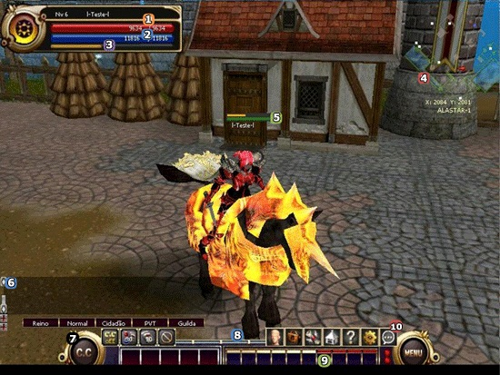
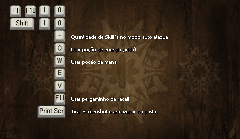
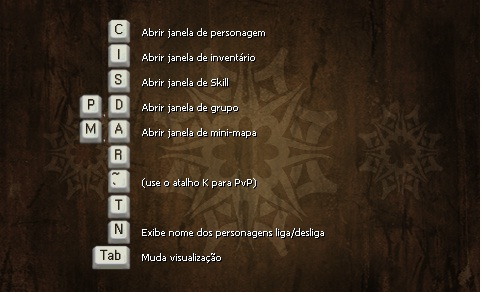
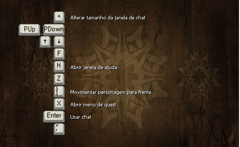

## Interface

<html>
  <head>
    <meta charset="utf-8" />
    <meta name="viewport" content="width=device-width" />
  </head>
  <body>

<strong>Display</strong>

Interface do jogo

<table align="center" border="0" cellpadding="10" cellspacing="10">
<tr>
<td align="center">1</td>
<td><strong>Barra de HP:</strong> O valor do lado esquerdo da barra vermelho é o seu HP atual, o valor do lado direito é o seu HP máximo. A barra é localizada logo acima do personagem e pode ser ativada/desativada (junto ao nome dos personagens da tela) apertando a tecla "N".</td>
</tr>
<tr>
<td align="center">2</td>
<td><strong>Barra de MP:</strong> O valor do lado esquerdo da barra azul é o seu MP atual, o valor do lado direito é o seu MP máximo. Assim como a barra de HP é localizada logo acima do personagem e pode ser ativada/desativada (junto ao nome dos personagens da tela) apertando a tecla "N".</td>
</tr >
<tr>
<td align="center">3</td>
<td><strong>Barra de HP da Montaria:</strong> HP máximo é igual a barra amarela completa, a barra de HP da montaria se encontra logo abaixo da barra de MP.</td>
</tr>
<tr>
<td  align="center">4</td>
<td><strong>Mini Mapa:</strong> Permite que você veja a sua localização ou a dos membros do seu grupo. Atalho tecla "M".</td>
</tr >
<tr>
<td  align="center">5</td>
<td><strong>Indicadores de HP e HP da Montaria:</strong> Representação gráfica localizada da quantidade de HP e HP de montaria que o jogador possui no momento. Graças a esta barra, o jogador não precisa buscar as informações na barra principal (encontrada no canto esquerdo superior da tela).</td>
</tr>
<tr>
<td align="center">6</td>
<td><strong>Janela de Chat:</strong> Aperte a tecla "+" para aumenta-la, tecle 'ENTER' para ativar o campo de inserção de texto.</td>
</tr >
<tr>
<td align="center">7</td>
<td><strong>Quantidade de poção de HP no inventário:</strong> O menu de macro (CC) permite ao jogador escolher a porcentagem de HP/MP com que as poções serão utilizadas automaticamente, além de possibilitar que o personagem entre em modo de combate automático.</td>
</tr>
<tr>
<td align="center">8</td>
<td><strong>Barra de Experiência:</strong> Mostra experiência necessária até o próximo level.</td>
</tr >
<tr>
<td align="center">9</td>
<td><strong>Barra de Skills:</strong> (Pode definir 10 skills no total, "1~10" ou "F1~F10" pode ser usado para escolher entre as skills definidas. A skill definida pode ser excluída da barra selecionando-a e apertando a tecla "Del". As skills que funcionam no modo automático de ataque podem ser distinguidos através da barra em laranja acima do ícone da skill, podendo ser controlado de 2~10 skills através da tecla " Y ".</td>
</tr>
<tr>
<td align="center">10</td>
<td><strong>Barra de Menu do sistema:</strong> Possui vários botões da tela do jogo e opções.</td>
</tr >
</table>
 

<strong>Teclas de Atalho</strong>

		
  </body>
</html>