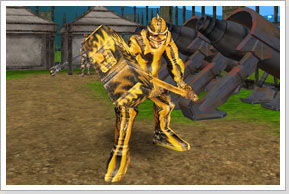
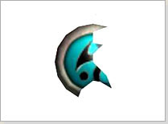
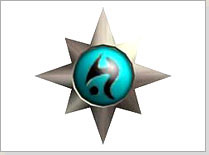

## Benção de Deus (Lv70~75)

<html>
  <head>
    <meta charset="utf-8" />
    <meta name="viewport" content="width=device-width" />
  </head>
  <body>

<table border="0" cellpadding="0" cellspacing="0">
	<thead>
	<tr>
		<td colspan="2">
<strong>Monstro Chefe (Boss)</strong>
</td>
	</tr>
	</thead>
	<tbody>		
	<tr>						
		<td></td>
		<td>
Nine Troll Chief
</td>
	</tr>
	</tbody>
</table>

<table border="0" cellpadding="0" cellspacing="0">
	<thead>
	<tr>
		<td colspan="2">
<strong>Recompensa</strong>
</td>
	</tr>
	</thead>
	<tbody>		
	<tr>						
		<td></td>
		<td>
<strong>Pedaço de Chance

			
Ao receber o Pedaço de Chance, entregue-o ao 'Sacerdote Kruno' e ele o transformará em Composto de Chance.

			
Não permitido para troca, venda, drop

			
Level Requerido: 70 ~ 75
</td>
	</tr>
	<tr class="tabela_linha2">
		<td></td>
		<td>
<strong>Composto de Chance</strong>

			
Use clicando com o botão direito do mouse.

			
No ato de uso reinicializa todos os skills e as aprendizagens em 50 pontos.

			
Não permitido para troca, venda ou drop.

			
Personagens Arch  ou superiores não podem usar esse item.

			
Level Requerido 70 ~ 75.

			
Usado apenas 1 vez.
</td>
	</tr>
	</tbody>
</table>
  </body>
</html>
