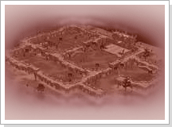

## Conquista do Castelo Orc (Lv45~All)

<html>
  <head>
    <meta charset="utf-8" />
    <meta name="viewport" content="width=device-width" />
  </head>
  <body>

<strong>Conquista do Castelo Orc</strong>

Na época em que os povos de Armia começaram a prosperar, a população ficou animada com o comércio entre as cidades e as caravanas de viajantes aumentaram consideravelmente.
Foi aí que a população conheceu o terror, pois com o aumento de pessoas na estrada, seres malignos, denominados Orcs, começaram a mostrar as garras. Orcs!! Sim...esses Orcs são seres malignos criados pelas energias demoníacas e são mais inteligentes e astutos que os outros monstros, montando várias armadilhas e emboscadas para os viajantes desatentos.

 
<table border="0" cellpadding="0" cellspacing="0">	
	<tr>						
		<td width="200px"></td>
		<td>
Como os humanos, eles podem usar diversos tipos de arma e uma vez que escolhem a vítima, não param até que tenham provado a carne e o sangue de sua presa. Os Orcs se estabeleceram num antigo castelo às margens da principal estrada que liga Azran e Armia, visando o dinheiro e a vida dos viajantes e exploradores que passam por perto. Os exploradores que já não suportavam mais a brutalidade e a violência praticada pelos Orcs tentaram em vão eliminar o Lorde Orc, que liderava o exército de Orcs, pensando que assim os Orcs debandariam para outro lugar, mas não conseguiram chegar nem perto, pois todos foram mortos antes que pudessem chegar ao covil do Lorde.
</td>
	</tr>
	<tr width="200px">
		<td></td>
		<td>
Caso queira eliminar o Lorde Orc, invada o castelo dos Orc. Mas antes, escolha valorosos guerreiros para acompanhá-lo, pois mesmo que voce seja um guerreiro altamente qualificado não será possível combater a quantidade de Orcs que residem no local. Para chegar ao castelo onde Lorde Orc permanece, primeiro você terá que matar os guardiões de cada porta e pegar a chave dos portões para abrir as portas para o próximo acesso. Dizem que o Lorde Orc possui uma pílula magica que contém poderes fantásticos. Para aqueles que desejam testar suas habilidades e aumentar seu poder, esta é a chance. Esqueça seus medos e entre no Castelo Orc!
</td>
	</tr>
	</tbody>
</table>
<table border="0" cellpadding="0" cellspacing="0">	
	<tr>						
		<td width="100px"></td>
		<td>
<strong>Pílula Mágica</strong>

			
Pílula Mágica: a pílula do Lorde Orc possui a habilidade espantosa de aumentar os pontos de skill de uma pessoa. Pode ser usada apenas uma vez, mas aumenta um total de 9 pontos de skill, permitindo uma rápida aprendizagem das skills
</td>
	</tr>
</table>
 

<strong>Atenção</strong>

A chave sumirá com o uso. O portão aberto com a chave será fechada após um tempo determinado.

O efeito da pílula mágica será aplicado apenas uma vez, no primeiro uso. Não é possível tomar a pílula mais de uma vez.

Não é possível convocar os membros do grupo para dentro do Castelo de Orc.

  </body>
</html>
