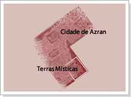
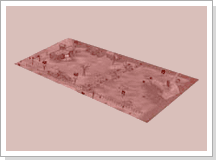

## Defendendo a Terra (Lv All)

<html>
  <head>
    <meta charset="utf-8" />
    <meta name="viewport" content="width=device-width" />
  </head>
  <body>

Com a evolução da cidade de Azran, a exploração das imediações da cidade começou a crescer. Não se sabe ao certo quando começou, mas os boatos sobre uma pedra mística tomou conta da cidade. Dizem que ela pode ser encontrada num local de exploração não muito longe da cidade, esse local recebeu o nome Terra Mistica.

<table border="0" cellpadding="0" cellspacing="0">
	<tr>						
		<td></td>
		<td>
Mas, de um tempo pra cá, monstros cada vez mais poderosos começaram a aparecer, fazendo com que o processo de exploração fosse comprometido. Por estas razões, o líder da exploração decidiu pedir reforcos para o capitão dos mercenários da cidade de Azran. Com o reforço, a exploração voltou a ter a sua capacidade normal, porém mesmo com os reforços, os monstros continuavam a atacar. De acordo com os rumores dos exploradores da Terra Mística, esses monstros tinham uma base na Ilha do Demonio, localizada na parte sul do mar. Muitos acreditam que exista uma passagem subterrânea, pois só assim os monstros conseguiriam chegar.
</td>
	</tr>
	<tr>						
		<td></td>
		<td>
entando acabar de uma vez por todas com os ataques dos monstros, o líder do expediente pediu ao capitão dos mercenários para que mandasse seus soldados mais poderosos e garantiu que, se a missão fosse completada, daria como recompensa um amuleto feito com as pedras mineradas nessa área. Por se tratar de monstros incrivelmente fortes, e necessário um grupo grande de guerreiros, caso contrário, o capitão dos mercenários não dará a permissão para a incursão. Caso o grupo seja vitorioso, basta se reportarem para o capitão e o líder do grupo receberá um amuleto feito com as pedras mineradas nas Terras Místicas.
</td>	
	</tr>
</table>
<table border="0" cellpadding="0" cellspacing="0">
	<tr>
		<td rowspan="2"></td>
		<td colspan="3">
<strong>Amuleto</strong>

						
Um acessório fabricado através das joias mineradas na Terra Mística, possui 2 opções adicionais fora a opção padrão diferente dos amuletos normais (O amuleto adquirido como recompensa será diferente dependendo do level do personagem).
</td>
	</tr>
	<tr>
		<td></td>
		<td>
			
Level 1~50

			
Level 51~80

			
Level 81 e acima
</td>
		<td>
			
Amuleto Prateado

			
Amuleto Dourado

			
Amuleto Mistico
</td>
	</tr>
</table>

<strong>Atenção<strong>

A permissão será dada apenas se estiver com um grupo formado.

Os membros do grupo devem estar por perto na hora de receber a recompensa pelo líder da expedição.

Para cada personagem, é possivel ser o lider do grupo apenas uma vez, mas como membro do grupo pode-se participar quantas vezes que quiser.

  </body>
</html>
