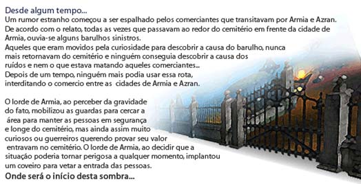
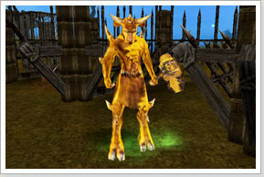
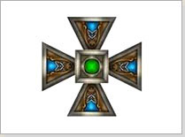

## Formatura de Cavaleiros (Lv101~150)

<html>
  <head>
    <meta charset="utf-8" />
    <meta name="viewport" content="width=device-width" />
  </head>
  <body>

<table border="0" cellpadding="0" cellspacing="0">
	<thead>
	<tr>
		<td colspan="2">
<strong>Monstro Chefe (Boss)</strong>
</td>
	</tr>
	</thead>
	<tbody>		
	<tr>						
		<td></td>
		<td>
Rei Taurus
</td>
	</tr>
	</tbody>
</table>

<table border="0" cellpadding="0" cellspacing="0">
	<thead>
	<tr>
		<td colspan="2">
<strong>Recompensa</strong>
</td>
	</tr>
	</thead>
	<tbody>		
	<tr>						
		<td></td>
		<td>
<strong>Emblema de Aprendiz

			
Ao equipar no slot de Familiar e ir ao encontro do capitão de treinamento, receberá o manto do aprendiz.

			
Não permitido para troca, drop e venda.

			
Não permitido para os personagens Arch ou superiores.

			
Level Requerido: 101 ~ 150.
</td>
	</tr>
	</tbody>
</table>
  </body>			
</html>
