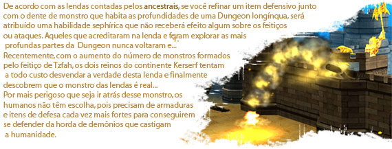
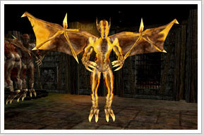
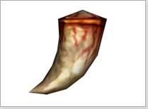

## Molar da Gárgula (Lv201~255)

<html>
  <head>
    <meta charset="utf-8" />
    <meta name="viewport" content="width=device-width" />
  </head>
  <body>

<table border="0" cellpadding="0" cellspacing="0">
	<thead>
	<tr>
		<td colspan="2">
<strong>Monstro Chefe (Boss)</strong>
</td>
	</tr>
	</thead>
	<tbody>		
	<tr>						
		<td></td>
		<td>
Chefe Gargula
</td>
	</tr>
	</tbody>
</table>

<table border="0" cellpadding="0" cellspacing="0">
	<thead>
	<tr>
		<td colspan="2">
<strong>Recompensa</strong>
</td>
	</tr>
	</thead>
	<tbody>		
	<tr>						
		<td></td>
		<td>
<strong>Molar de Gárgula

			
Após adquirir, clique com o botão direito do mouse para usar.

			
No ato de uso, aumenta o valor de refinamento dos itens de defesa equipados para +6, exceto escudo.

			
Não permitido a troca, venda, drop ou mover.

			
Não permitido para os personagens Arch ou superiores.

			
Level Requerido: 201 ~ 255.

			
Pode ser utilizado uma unica vez.
</td>
	</tr>
	</tbody>
</table>
  </body>
</html>
