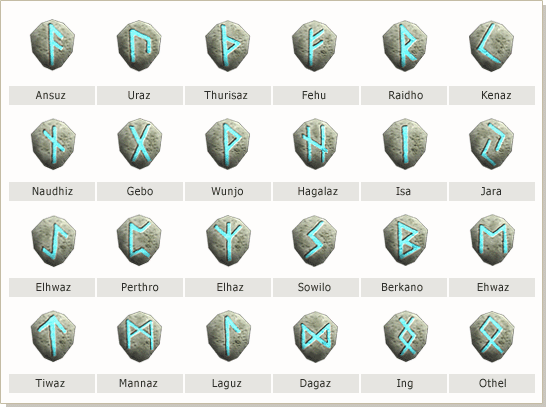
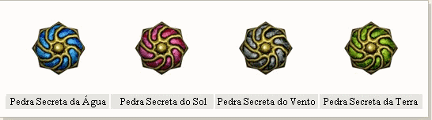
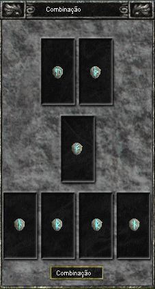
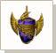
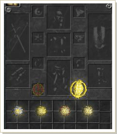
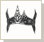
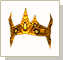
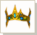

## Runas Secretas

<html>
  <head>
    <meta charset="utf-8" />
    <meta name="viewport" content="width=device-width" />
  </head>
  <body>

O Homem descobriu recentemente um distúrbio no espaço e descobriu um meio de ir para diferentes dimensões derrotando o BOSS da Dungeon Kefra. Isso pode ser considerado uma missão suicida, mas o poder que espera no novo continente é uma razão mais que o suficiente para qualquer homem enfrentar esse perigo.

Em um local chamado de "Torre da Punição", reinou um anjo que sonhava em abalar as estruturas do céu com seu poder. A Torre era controlada por monstros e para proteger o lar, eles o dividiram em 7 salas. Essa estratégia foi criada para proteger as "Runas Secretas" que eram a fonte de seu poder e consequentemente a fonte de todo mal.

Quando você cumprir os 7 testes, você estará mais perto de solucionar o mistério do "Segredo das Runas"
 

<strong>Forma de procedimento</strong>

<strong>1 - </strong>Após derrotar o Kefra, um portal irá aparecer em seu lar. O Portal permitirá que você acesse o Continente Desconhecido. Existem NPCs no Continente Desconhecido e o imposto será igual ao de Noatun.

<strong>2 - </strong>As "Zonas de QUEST" consistem em 7 salas e você poderá fazer a QUEST em grupos. O grupo deve ter pelo menos 4 membros..   Após formar o grupo, o líder do grupo deve clicar no NPC "Uxmall" após o tempo informado. Também, as "Pistas das Runas" devem estar no inventário e você ficará em um modo de espera. (Números possíveis de grupos: 21 Grupos)  &gt; AS Pistas das Runa podem ser obtidas combinando 7 Poeiras de Lactolerium no NPC Odin.

<strong>3 - </strong>Quando finalizar o tempo de espera, o próximo grupo da fila será levado randomicamente para uma das 7 salas. Processo dura 15 minutos, sendo 5 minutos de espera..

<strong>4 - </strong>Cada sala possui requisitos diferentes e se você se enquadrar em todos os requisitos, 1 Runa será entregue automaticamente para cada membro do Grupo.
 

<strong>Conquest of Test</strong>

A QUEST é composta por 7 salas e cada sala possui seus requisitos e meios de finalizá-la..  (Abaixo segue uma breve informação sobre as salas. )

<table  align="center" border="0" cellpadding="5" cellspacing="5">
  <tr  align="center">
    <td rowspan="2">
<strong>Sala</strong>
</td>
    <td colspan="2">
<strong>Números de Grupos que podem acessar a sala</strong>
</td>
    <td rowspan="2">
<strong>Tipo de campo</strong>
</td>
  </tr>
  <tr>
    <td>
<strong>Entrada mínima</strong>
</td>
    <td>
<strong>Entrada máxima</strong>
</td>
  </tr>		
  <tr>						
    <td>
<strong> Ansuz - Revival of devil's letter</strong>
</td>
    <td>
2 grupos
</td>
    <td>
2 grupos
</td>
    <td>
O centro é cercado por paredes móveis.
</td>
  </tr>
  <tr>
    <td>
<strong>Uraz - Choice and Regret's letter</strong>
</td>
    <td>
1 grupo
</td>
    <td>
3 grupos
</td>
    <td>
Tem 3 torres e nenhuma forma externa especial..
</td>
  </tr>
  <tr>						
    <td>
<strong>Thurisaz - Hero's letter</strong>
</td>
    <td>
1 grupo
</td>
    <td>
3 grupos
</td>
    <td>
Tem um círculo no centro do campo.
</td>
  </tr>
  <tr>
    <td>
<strong>Gebo - Gift's letter</strong>
</td>
    <td>
1 grupo
</td>
    <td>
3 grupos
</td>
    <td>
Há 5 campos e 4 portais em cada portão.
</td>
  </tr>
  <tr>						
    <td>
<strong>Hagalaz - 8th Magic's letter</strong>
</td>
    <td>
1 grupo
</td>
    <td>
3 grupos
</td>
    <td>
Existe 8 salas do boss ao centro do campo.
</td>
  </tr>
  <tr>
    <td>
<strong>Isa - Restraint and Argument's letter</strong>
</td>
    <td>
1 grupo
</td>
    <td>
3 grupos
</td>
    <td>
Há a sala do boss ao centro e uma sala selada parecida com um labirinto..
</td>
  </tr>
  <tr>						
    <td>
<strong>Jara - Protection against harm's letter<strong>
</td>
    <td>
1 grupo
</td>
    <td>
3 grupos
</td>
    <td>
Tem um armazém no campo com 3  entradas.
</td>
  </tr>
</table>
 

<strong>Chaves secretas, 'Ruínas'</strong>

- Existem 24 tipos de runas, e se você obtiver sucesso na composição das mesmas no NPC Alquimista Odin no Continente Desconhecido, você irá produzir uma das "Pedras Secretas" .
  
- Existem 4 tipos de Pedras Secretas e elas são utilizadas para fabricar a Pedra Ideal para a Classe Celestial.
  
A taxa de sucesso irá depender da sequência das Runas e essa sequência é indecifrável.

 

<strong>Runas</strong>

 

<strong>Pedras secretas</strong>

 
<table border="0" cellpadding="0" cellspacing="0">								
  <tr>						
    <td width="300px"></td>
    <td>
<strong>1 - </strong>Ao clicar no NPC Alquimista Odin no Continente Desconhecido, uma janela para a composição irá abrir, como na imagem ao lado.

    
<strong>2 - </strong>Se a combinação das 7 Runas for bem sucedida, você irá receber uma das Pedras Secretas e a taxa de sucesso irá depender da sequência das Runas. (A Pedra Secreta é entregue randomicamente). A sequência de Runas é indecifrável.
</td>
</tr>								
</table> 
<table border="0" cellpadding="0" cellspacing="0">
  <tr>
    <td colspan="2">
<strong>Challenge for Celestial God</strong>
</td>
  </tr>		
	<tr>
		<td>
		
<strong>1 - </strong>Após pegar as 4 Pedras Secretas, clique no rei do seu reino com um Sephirot equipado e uma Pedra da Imortalidade, uma Pedra Ideal irá aparecer no seu inventário.(Só é possível efetuar esse procedimento por personagens Arch ou Celestial).

		
<strong>2 - </strong>Utilize a Pedra Ideal para transformar o Arch em um Celestial. No entanto, o seu personagem Mortal deve ser level 400 e seu Arch lvel 356 ou mais.

		

		
Pedra ideal
</td>
		<td width="300px">
		</td>
	</tr>
</table> 
 

<strong>Cuidado</strong>

Quando utilizar a "Pedra Ideal" as habilidades do Celestial irão depender do level do seu Arch. Quando o Arch possuir level alto, a habilidade do Celestial também será alta e vice-versa..

Um tipo de Cythera será entregue ao Celestial, de acordo com o level do Arch no momento da criação do Celestial.

<table>
  <tr>
    <td></td>
    <td>Cythera Prateada: Arch level 356 ~ 380</td>
  </tr>
  <tr>
    <td></td>
    <td>Cythera Dourada: Arch level 381 ~ 399</td>
  </tr>
  <tr>
    <td></td>
    <td>Cythera Mística: Arch level 400</td>
  </tr>
  <tr>
    <td colspan="2">
Para mais informações verifique a Classe Celestial na seção Personagens &amp; Skills.
</td>
  </tr>
</table>
Para mais informações verifique a Classe Celestial na seção Personagens & Skills.
 

Você não pode retroceder ao Arch após criar o Celestial.

Caso você seja desconectado durante uma das 7 salas, você irá retornar a cidade ao conectar-se no jogo. Caso você morra em uma das 7 salas, você irá retornar a zona de QUEST.

Para cada QUEST, um total de 3 grupos poderá participar da QUEST das 7 salas; No entanto, somente o Grupo que der o último HIT no BOSS receberá o prêmio.

  </body>
</html>