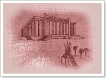
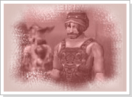

## Círculo Divino

<html>
  <head>
    <meta charset="utf-8" />
    <meta name="viewport" content="width=device-width" />
  </head>
  <body>

<table border="0" cellpadding="0" cellspacing="0">
	<tr>						
		<td width="250px"></td>
		<td>
Devastada pelas Guerras Celestiais e Continentais, a cidade de Armia ainda sofria com os saques e a destruição causada pelos monstros. As criaturas que mais atormentavam os humanos eram os Trolls e os Dread Taurus. Esses monstros saqueavam não apenas os itens preciosos, mas também crianças e humanos adultos, para servirem de escravos ou de alimento. Mas todos os seus ataques tinham um alvo principal, o ¡°Circulo Divino¡±, que estava em posse dos humanos. Depois de muito tentar, os monstros finalmente conseguiram destruir aquilo que os habitantes de Armia mais prezavam, pois esse círculo era feito de materiais que não mais poderiam ser encontrados na Terra, já que ele fora construído com materiais criados antes da Guerra Celestial. Era de suma importância que os pedaços dos círculos fossem recuperados.
</td>
	</tr>
	<tr>						
		<td></td>
		<td>
Com o Círculo, o Shaman da cidade de Azram dava uma benção que era capaz de alterar as habilidades antigas de um guerreiro por novas habilidades mais úteis para aqueles que traziam doações ou contribuições junto aos destroços levados pelos monstros. Esses fragmentos do Círculo Divino viraram o tesouro mais precioso para a tribo dos Trolls e dos Dread Taurus, só que eles são criaturas malignas e profanaram o Círculo Divino. Sempre que um pedaço do círculo e recuperado, antes de usar e necessário sua purificação, e isso pode ser feito pagando 1 milhão em Gold para o Alquimista do templo, que usa o dinheiro para ajudar a reconstruir a cidade. Ao levar o Círculo Divino purificado ao Shaman, ele pegará o círculo divino de volta, reinicializará todas as skills gravados no círculo divino junto a aprendizagem (Aprendizagem da Arma, cada linhagem de aprendizagem incluso) devolvendo de 50 a 100 pontos. Para ir ao encontro do Shaman e Alquimista Jeffi, equipe o pedaço do Círculo Divino no slot de item de evento (localizado no lado oposto do slot de medalha de guilda).
</td>	
	</tr>
</table>
<table border="0" cellpadding="0" cellspacing="0">
	<tr>
		<td width="250px"></td>
		<td>
<strong>Pedra do Círculo Divino</strong>

			
O Círculo Divino que esteve guardado na cidade de Armia simbolizava a força dos deuses, oferecendo a paz e a fé aos que viviam nessa época. Mas com a invasão dos Dread Taurus e dos Trolls ele foi destruído e seus pedaços foram espalhados pelo mundo. Atualmente o Shaman da cidade de Azran começou a juntar estes pedaços, mas primeiro eles terão de ser purificados das energias impuras dos monstros. Esse procedimento será efetuado pelo Alquimista Jeffi. O pedaço do Círculo Divino purificado mostrara as linhagens de skills que podem ser reinicializadas. Você tera de verificar se e a linhagem de skills que deseja reiniciar. O pedaço do Círculo Divino puro reinicializará até 50 pontos de aprendizagem e o Círculo Divino puro Completo reinicializará até 100 pontos.
</td>
	</tr>
</table>

<strong>Atenção<strong>

Para purificar o pedaço de Círculo Divino ou para concluir a quest com o Círculo Divino purificado, o pedaço do Círculo deve ser equipado no slot de item de evento. (do lado oposto do slot de medalha de guilda.)

No Círculo Divino purificado estão gravadas as linhagens de skill que podem ser reinicializadas e, caso seja uma linhagem que não deseja, você deverá conseguir e purificar o Círculo Divino com a linhagem que você deseja reinicializar.

Os pontos de aprendizagem que reinicializam através do Círculo Divino é de 50 pontos no caso de pedaço de Círculo Divino puro, e 100 pontos no caso do Círculo Divino Completo puro. Caso tenha menos pontos que a quantidade de pontos que o Círculo Divino oferece para a reinicialização, serão devolvidos apenas os pontos existentes.

O Círculo Divino pode ser usado apenas uma vez, e o Círculo Divino Completo pode ser usado infinitas vezes.

Caso utilize o Círculo Divino, os skill de nível 8 também serão reinicializados. Assim, para aprender uma skill de nível 8, será necessário gastar mais 100 milhões de Gold.

  </body>
</html>
