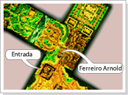

## Cubo da Maldade

<html>
  <head>
    <meta charset="utf-8" />
    <meta name="viewport" content="width=device-width" />
  </head>
  <body>

Ultimamente, o pensamento do ferreiro Arnold estava bastante confuso. Como sempre, Arnold ficava sentado em frente a sua forjaria observando, sem reação, os guerreiros que passavam pela frente. Não se sabe o que veio na cabeça dele, apenas que um dia ele levantou, limpando a poeira de seus joelhos e começou a dar risadas que poderiam ser ouvidas por todos que passavam por perto.

Após ter rido escandalosamente, começou a martelar alegremente espalhando o som de seu trabalho por toda Azran.

Todas as noites ele pegava as suas ferramentas e partia para algum lugar desconhecido, e só retornava quando o nascer do sol começava a secar o orvalho das folhas.

Depois de algum tempo, na mão do Arnold estavam uns convites e ele começou a vendê-los para os guerreiros que passavam a sua frente.

Quando alguém perguntava sobre a venda de convite de Cubo, Arnold apenas dava um sorriso malicioso, sem nem ao menos se dar ao trabalho de responder para quem quer que perguntasse.

<table align="center" border="0" cellpadding="2" cellspacing="2	"> 
	<tr align="center" cellpadding="10" cellspacing="10">
		<td><strong>Item</strong></td>
		<td><strong>Convide de Cubo</strong></td>
		<td><strong>Level necessário</strong></td>
	</tr>
	<tr>
		<td align="center"></td>
		<td>
<strong>Normal</strong>

			
O ferreiro Arnold está vendendo por 100.000 GOLD. É usado para entrar em 25 níveis do Cubo. Ao entrar na Área de Construção localizada na frente da entrada de Azran, clique no convite com o botão direito do mouse para acessar o Cubo.
</td>
		<td>
Arch level 1

			
~

			
Arch level 200
</td>
	</tr>
	<tr>
		<td align="center" width="100px"></td>
		<td>
<strong>Místico</strong>

			
O ferreiro Arnold está vendendo por 400.000 GOLD. É usado para entrar em 25 níveis do Cubo. Ao entrar na Área de Construção localizada na frente da entrada de Azran, clique no convite com o botão direito do mouse para acessar o Cubo.
</td>
		<td>
Arch level 1

			
~

			
Arch level 300
</td>
	</tr>
	<tr>
		<td align="center"></td>
		<td>
<strong>Arcano</strong>

			
O ferreiro Arnold está vendendo por 1.000.000 GOLD. É usado para entrar em 25 níveis do Cubo. Ao entrar na Área de Construção localizada na frente da entrada de Azran, clique no convite com o botão direito do mouse para acessar o Cubo.
</td>
		<td>
Arch level 1

			
~

			
Arch level 400
</td>
	</tr>
	<tr>
		<td align="center"></td>
		<td colspan="2">
<strong>Fruto Divino</strong>
			
O fruto que o Orc Trooper do Cubo possui aumenta a experiência da pessoa que consumir o fruto. Pode ser usado apenas 1 vez.
</td>
	</tr>
</table>
<table>
	<tr>
		<td colspan="2" align="center"><strong>Procedimentos</strong></td>
	</tr>
	<tr>
		<td align="center" width="250px"></td>
		<td>
Após comprar o convite e utilizar na área de construção na frente da entrada da cidade de Azran, você será transportado para o primeiro nível do Cubo.

			
Após entrar no primeiro nível do cubo e derrotar todos os monstros, será feita uma pergunta a todos ali presentes. Eles terão de escolher o portal que está exibindo a resposta correta e subir dentro de 10 segundos.

			
Depois que a pergunta for apresentada e os jogadores tiverem escolhido os portais marcados com O e X, dependendo da resposta, os jogadores avançam para o próximo nível.

			
Caso você consiga chegar ao nível 25 e derrotar o último chefe Orc Trooper, será presenteado com o Fruto Divino e um item que pode ser o 'Anel Branco do Amante' ou 'Safira' aleatoriamente.
</td>
	</tr>
</table>
<table border="0" cellpadding="5" cellspacing="5"> 
	<tr align="center">
		<td><strong>Nível</strong></td>
		<td><strong>Normal</strong></td>
		<td><strong>Místico</strong></td>
		<td><strong>Arcano</strong></td>
	</tr>
	<tr>
		<td>1</td>
		<td>Rei Gremlin</td>
		<td>War Boar</td>
		<td>Carbunkle Order</td>
	</tr><tr>
		<td>2</td>
		<td>Lobo</td>
		<td>Dragon Puppy</td>
		<td>Ghoul</td>
	</tr>
	<tr>
		<td>3</td>
		<td>Chefe Krill</td>
		<td>Eagle</td>
		<td>Hunter Troll</td>
	</tr>
	<tr>
		<td>4</td>
		<td>Lagarto</td>
		<td>Bow Orc</td>
		<td>Freak Troll</td>
	</tr>
	<tr>
		<td>5</td>
		<td>Orc Arqueiro</td>
		<td>Carbunkle Order</td>
		<td>Minotaur</td>
	</tr>
	<tr>
		<td>6</td>
		<td>Iguana</td>
		<td>Ghoul</td>
		<td>Chaos Orc</td>
	</tr>
	<tr>
		<td>7</td>
		<td>Cavaleiro Orc</td>
		<td>Taurus King</td>
		<td>Grimlock</td>
	</tr>
	<tr>
		<td>8</td>
		<td>Dragão Menor</td>
		<td>Hunter Troll</td>
		<td>Skeleton</td>
	</tr>
	<tr>
		<td>9</td>
		<td>Meio Orc</td>
		<td>Freak Troll</td>
		<td>Carbunkle High</td>
	</tr>
	<tr>
		<td>10</td>
		<td>Troll</td>
		<td>Chaos Orc</td>
		<td>Chaos Troll</td>
	</tr>
	<tr>
		<td>11</td>
		<td>Troll Caçador</td>
		<td>Skeleton</td>
		<td>Argos</td>
	</tr>
	<tr>
		<td>12</td>
		<td>Troll Caido</td>
		<td>Wild Ghoul</td>
		<td>Dark Elf Archer</td>
	</tr>
	<tr>
		<td>14</td>
		<td>Ghoul</td>
		<td>Zombie Bear</td>
		<td>Taurus King</td>
	</tr>
	<tr>
		<td>15</td>
		<td>Carbunkle</td>
		<td>Dark Elf Witch</td>
		<td>Dark Knight</td>
	</tr>
	<tr>
		<td>16</td>
		<td>Minotauro</td>
		<td>Cyclops</td>
		<td>Poison Hydra</td>
	</tr>
	<tr>
		<td>17</td>
		<td>Ghoul Chefe</td>
		<td>Strength Golem</td>
		<td>Froggy Mutant</td>
	</tr>
	<tr>
		<td>18</td>
		<td>Alto Carbunkle</td>
		<td>Combat Cyclops</td>
		<td>Gold Hatchling</td>
	</tr>
	<tr>
		<td>19</td>
		<td>Ciclope</td>
		<td>Argos</td>
		<td>Spider</td>
	</tr>
	<tr>
		<td>20</td>
		<td>Shamã Orc</td>
		<td>Cruel Zakum</td>
		<td>Orc Doctor</td>
	</tr>
	<tr>
		<td>21</td>
		<td>Esqueleto</td>
		<td>Froggy Phantom</td>
		<td>Skeleton Knight</td>
	</tr>
	<tr>
		<td>22</td>
		<td>Urso Zumbi</td>
		<td>Dark Elf Archer</td>
		<td>Undead Troll</td>
	</tr>
	<tr>
		<td>23</td>
		<td>Esqueleto Arqueiro</td>
		<td>Bandits Taron</td>
		<td>Chaos Moloch</td>
	</tr>
	<tr>
		<td>24</td>
		<td>Troll Zumbi</td>
		<td>Siver Hydra</td>
		<td>Fire Golem</td>
	</tr>
	<tr>
		<td>25</td>
		<td>Lorde Orc Trooper</td>
		<td>Orc Guardian</td>
		<td>Orc Leader</td>
	</tr>
	<tr>
		<td align="center" colspan="4">* nível 13, nível 20 e nível 24 estao guardados pelos monstros poderosos.</td>
	</tr>
</table>
 

<strong>Perguntas</strong>

1 - Ao matar todos os monstros da fase de Quest será qualificado para próxima fase.

2 - Avançará de 1 a 3 níveis com o acerto da pergunta.

3 - Caso erre a pergunta ira regredir de 1 a 4 níveis, ou será expulso do Cubo.

 

<strong>Atenção</strong>

Mesmo que tenha formado um grupo, cada membro do grupo deve ter o convite de Cubo para poder entrar na quest. Caso você não esteja dentro da área de construção, não será transferido para dentro do Cubo.

O convite nem sempre funciona! Compre por sua conta e risco. A chance do convite não levar ao Cubo é pequena, mas pode acontecer.

O valor da experiência de cada nível será aplicado apenas após acertar a pergunta. Caso erre a pergunta, uma quantia será descontada da sua experiência.

Caso dois personagens respondam a mesma pergunta no mesmo nível, avançarão juntamente.

</body>
</html>