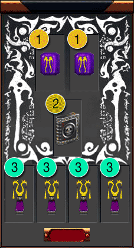
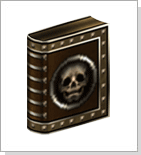
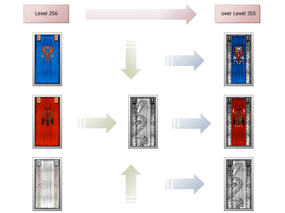

## Evolução do cavaleiro

<html>
  <head>
    <meta charset="utf-8" />
    <meta name="viewport" content="width=device-width" />
  </head>
  <body>
<table align="center" border="0" cellpadding="0" cellspacing="0">
	<tr>
		<td colspan="4">
<strong>Procedimento</strong>
</td>
	</tr>
	<tr>
		<td colspan="4">
Você pode destravar o level 355 e 370 do Arch levando 2 Packs de Lactolerium(10), 4 Poeiras de Lactolerium e um Pergaminho Selado ao NPC Lindy que se encontra na zona neutra entre "Akelonia" e "Hekalotia".
</td>
	</tr>
	<tr align="center">									
		<td rowspan="5" width="300px"></td>
		<td>
<strong>Slot</strong>
</td>
		<td>
<strong>Qtde</strong>
</td>
		<td>
<strong>Item</strong>
</td>
	</tr>
	<tr>									
		<td></td>
		<td>
2
</td>
		<td>
Pack de Lactolerium(10)
</td>
	</tr>
	<tr>
		<td></td>
		<td>
1
</td>
		<td>
Pergaminho Selado
</td>
	</tr>
	<tr>									
		<td></td>
		<td>
4
</td>
		<td>
Poeira de Lactolerium
</td>
	</tr>
	<tr>	
		<td colspan="4">
* Ao concluir, a sua capa irá se transformar automaticamente em uma capa da "Elite dos Aventureiros".
</td>
	</tr>
</table>
<table align="center" border="0" cellpadding="2" cellspacing="2	"> 
	<tr>
		<td align="center" width="150px"></td>
		<td>
<strong>Pergaminho Selado</strong>

			
É deixado randomicamente pelo "Guarda Beriel" em Nifleheim.

			
Se você combinar o Pergaminho Selado com os outros ingredientes, a sua capa se tornará uma capa da "Elite dos Aventureiros"

			
A capa da "Elite dos Cavaleiros" será +0 e a refinação da capa anterior será perdida.
</td>
	</tr>
</table>

<strong>Destravar level 355.</strong>

Após alcançar o level 355, 370 você destravar e então você irá receber a capa "Elite dos Aventureiros"

Você deverá pagar a mesma quantia de Sáfiras para entrar em um Reino novamente.

Ao concluir a QUEST a nova capa irá aparecer +0.

Refinar a nova capa segue o mesmo procedimento da capa 256. A refinação pode falhar para o +7 porém não irá quebrar.

Os mesmos atributos da capa inicial serão aplicados a capa " Elite dos Aventureiros". Os mesmos bônus e penalidades serão aplicadas nas Zonas PvP e PK.

<strong>Evolução do Arch 355 destravado</strong>

<strong>Evolução do Arch por level</strong>

<table>
	<tr>
		<td><strong>STATUS</strong></td>
		<td><strong>PONTOS DE SKILL</strong></td>
		<td><strong>PONTOS DE APRENDIZAGEM</strong></td>
		<td><strong>AC</strong></td>
	</tr>
	<tr>
		<td>12</td>
		<td>2</td>
		<td>1</td>
		<td>2</td>
	</tr>
</table>
</body>
</html>