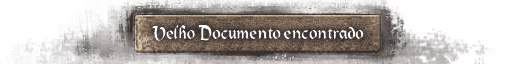
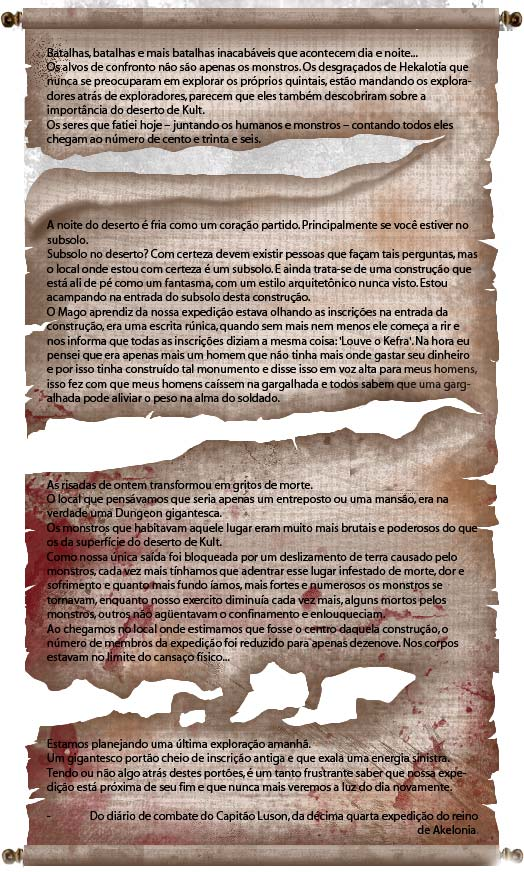
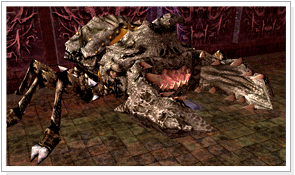
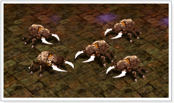

## Hall do Kefra

<html>
  <head>
    <meta charset="utf-8" />
    <meta name="viewport" content="width=device-width" />
  </head>
  <body>

<strong>Característica do Hall do Kefra</strong>

1 - Não é permitido marcar a posição com a Gema Estelar. É possível convocar membros de grupo e guilda.
Chat normal não é permitido (Chat de grupo e guilda liberado).

2 - Nome do jogador, guildmark e chat não são exibidos.

3 - Para entrar no Hall do Kefra você deve entregar um Pergaminho Selado ao Sobrevivente e depois entrar no portal. Você pode acessar o Hall do Kefra 100 vezes por Pegaminho Selado.

4 - O portal para acessar o Continente Desconhecido só será aberto após a morte do Kefra.

5 - O Kefra somente reaparece depois da Manutenção Periódica que ocorre semanalmente.

6 - Após matar o Kefra, ele irá dropar uma série de itens especiais e dará mais experiência aos personagens Mortal e Arch.

<table align="center" border="0" cellpadding="0" cellspacing="0">
	<tr>
		<td colspan="2" align="center">
<strong>Entrada para o hall do Kefra</strong>
</td>
	</tr>
	<tr>
		<td colspan="2">
Apareção do kefra e dos seus Guarda kefra
</td>
	</tr>
	<tr align="center">									
		<td>

			
Kefra
</td>
		<td rowspan="2">
Ao entrar no Hall do Kefra, você encontrará o Monstro chefe de Kefra e um número absurdo dos seus monstros guarda-costas (Guardas Kefra). É praticamente impossível enfrentá-los sozinho ou em um grupo pequeno. Deve-se formar um GRANDE grupo para poder caçar estes monstros. A força inacabável do Kefra, que está equipado com ataques e defesas inimagináveis e um número incontável de guardas, só dara duas opções: derrotar os monstros cruéis com a força unificada do grupo e receber uma premiação valiosa ou levar o grupo inteiro para o caminho da morte. A decisão está em suas mãos.
</td>
	</tr>
	<tr>
		<td>

		<td>
<strong>Guarda Kefra</strong>
</td>
	</tr>
</table>
</body>
</html>