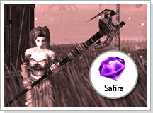

## Medalha do reino

<html>
  <head>
    <meta charset="utf-8" />
    <meta name="viewport" content="width=device-width" />
  </head>
  <body>

No começo da formação dos reinos de Akelonia e Hekalotia, muitos guerreiros procuravam esses reinos para formarem guildas, pois a segurança dos humanos estava diretamente ligada a quantidade de guerreiros unidos. Como isso era bom para ambos os reinos, a política de guildas foi criada, beneficiando as guildas mais poderosas.

Akelonia e Hekalotia, que viviam em uma guerra constante devido a suas filosofias conflitantes e pela supremacia marcial, necessitavam de grandes exércitos. As guildas funcionavam como um repositor de guerreiros.

Por estas razões, Akelonia e Hekalotia criaram, através do mestre da guilda que era responsável pelos seus exércitos, Shinner e Crusader, aplicando mágicas que permitem a convocação dos emblemas de guildas que eles carregam, através do oráculo real.

Também dizem que se você oferecer sáfiras, poderá atribuir tal habilidade aos membros da guilda que foram indicados pelo mestre da guilda.

<table border="0" cellpadding="0" cellspacing="0">
	<tr>
		<td colspan="2">
<strong>Forma de procedimento</strong>
</td>
	</tr>
	<tr>						
		<td align="center" width="250px"></td>
		<td>
<strong>1 - </strong>No caso do mestre de guilda ingressar em um dos reinos entre 'Akelonia' e 'Hekalotia' (após level 225), a medalha será transformada em 'Medalha do Reino' que permite a convocação dos membros da guilda.

			
<strong>2 - </strong>O mestre da guilda que já faz parte de um reino deve acompanhar o membro que deseja ter o reconhecimento do reino para o oráculo junto com 10 safiras para poder trocar pela 'Medalha do Reino'
</td>
	</tr>
	<tr>						
		<td colspan="2">
<strong>3 - </strong>No momento de oferecer as safiras, o grupo deve estar formado. A pessoa que for receber a 'medalha de guilda' deverá ser o líder do grupo e o mestre da guilda deverá fazer parte do reino e precisa estar dentro do grupo formado.
</td>
	</tr>
	<tr>
		<td colspan="2">
<strong>4 - </strong>Ao receber a 'Medalha do Reino', o nível restrito para a habilidade de convocação será aplicado como mostrado a seguir.
</td>
	</tr>
	<tr>
		<td colspan="2">
<strong>Level permitido para convocação = Seu level +100</strong>
</td>
	</tr>
</table>	
</body>
</html>