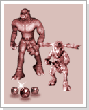

## Monstro Comerciante

<html>
  <head>
    <meta charset="utf-8" />
    <meta name="viewport" content="width=device-width" />
  </head>
  <body>

<strong>Monstro Comerciante<strong>

Mesmo se tratando de criaturas selvagens que surgem nas partes exteriores da cidade ou nos campos, algumas delas não são monstros sanguinários e sedentos por destruição. Veja o caso dos humanos, que às vezes podem ser mais demoníacos que os próprios monstros.

Existem relatos de monstros que possuem suas próprias sociedades tendo uma forma de vivência fora do comum. Realmente uma parte dos monstros, como os Gremlins ou os Krill, são 'educados' pelos humanos e por isso existem casos em que humanos conseguiram com facilidade os objetos raros e tesouros que eles possuem. Existem opiniões de que não devemos sempre tratar as criaturas apenas como inimigos, mas que poderemos, também, conhecê-los para o bem da humanidade.

A cidade de Azran, muito conhecida por suas mágicas, possui diversas joias preciosas e as pedras espirituais que servem como intermediário das mágicas, atraindo a curiosidade dos 'monstros comerciantes'. Se por acaso encontrar um desses monstros comerciantes, trate-os bem e não se esqueça de que eles podem encontrar itens que nenhum humano seria capaz de encontrar.

<table border="0" cellpadding="0" cellspacing="0">
	<tr>						
		<td width="180px"></td>
		<td>
<strong>Comerciante Carbunkle e Comerciante Zakum<strong>

			
Vendem cristal I ao cristal VII entre outros itens, sendo bastante difícil comprar algum item deles por terem um porte pequeno e por fugirem com uma extrema rapidez.
</td>
	</tr>
</table>

<strong>Procedimento do evento<strong>

No portão oeste da cidade de Azran aparece o 'Comerciante Carbunkle' e no portão sul da cidade de Azran aparece o 'Comerciante Zakum'. É extremamente difícil de encontrá-los por aparecerem muito raramente.

Essas duas criaturas comerciantes vendem cristais I ~ VII, além de outros itens variados.

O 'Comerciante Carbunkle' transporta os itens do portão oeste até o castelo Orc e o 'Comerciante Zakum' transporta os itens do portão sul até a direção do castelo Zakum.

A janela de comércio será fechada se o monstro abrir uma certa distância do seu personagem.

  </body>
</html>
