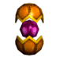

## Novo Começo

<html>
  <head>
    <meta charset="utf-8" />
    <meta name="viewport" content="width=device-width" />
  </head>
  <body>

Passado quase um mês e tendo os mesmos sonhos, os oráculos, aterrorizados, se reuniram com os reis para discutir sobre o assunto. Durante a angústia para desvendar o tal sonho, os oráculos tiveram um enorme susto, ao ver que as pedras de Sephira, encontradas por acaso pelos mestres de skill de Armia, se tratavam de uma das coisas que tinham visto nos sonhos. Tiveram o conhecimento de que as luzes que saiam dos mortos no sonho eram as pedras Sephira, que eram a base para formar o Sephirot, e que a escuridão era as almas utilizadas para formar a pedra da imortalidade. Através do Sephirot e da Pedra da Espiritualidade, os humanos poderão marcar a história com o começo de uma nova era.>

 
<table border="0" cellpadding="0" cellspacing="0">
	<tr>
		<td colspan="2" align="center">
<strong>Pedra Sephírica</strong>
</td>
	</tr>
	<tr>						
		<td width="120px"></td>
		<td>
Caso refine a Pedra Sephira através de Poeira de Oriharucon e a Poeira de Lactolerium e tenha sucesso será transformado em um atributo Sephira.

			
<strong>Tipos de Pedras</strong>

			
"Pedra do Lorde Orc, Pedra do Guerreiro Esqueleto, Pedra do Dragao Lich",

			
"Pedra do DemonLord, Pedra da Manticora, Pedra do Gargula de Fogo",

			
"Pedra do LugeferBroken, Pedra do Rei Demonlord"
</td>
	</tr>
	<tr>
		<td colspan="2" align="center">
<strong>Atributos da Sephira</strong>

			
Cada atributo da Sephira possui um nome como "Cochma" e você deve juntar todas as 8 pedras para formar um Sephirot.
</td>
	</tr>
</table>
<table>
	<tr align="center">
		<td><strong>Nome</strong></td>
		<td><strong>Atributo</strong></td>
		<td><strong>Imagem</strong></td>
		<td><strong>Nome</strong></td>
		<td><strong>Atributo</strong></td>
		<td><strong>Imagem</strong></td>
	</tr>
	<tr align="center">
		<td>Cochma</td>
		<td>Sabedoria</td>			
		<td width="150px"></td>
		<td>Tiphreth</td>
		<td>Beleza</td>			
		<td width="150px"></td>
	</tr><tr align="center">
		<td>Binah</td>
		<td>Compreensão</td>			
		<td width="150px"></td>
		<td>Netreth</td>
		<td>Triúnfo</td>			
		<td width="150px"></td>
	</tr>
	<tr align="center">
		<td>Chesed</td>
		<td>Benevolência</td>			
		<td width="150px"></td>
		<td>Iesod</td>
		<td>Base</td>			
		<td width="150px"></td>
	</tr>
	<tr align="center">
		<td>Geburah</td>
		<td>Força do Deus</td>			
		<td width="150px"></td>
		<td>Malchut</td>
		<td>Reino</td>			
		<td width="150px"></td>
	</tr>
</table>
<table border="0" cellpadding="2" cellspacing="2">
	<tr>
		<td colspan="2" align="center"><strong>Sephirot</strong></td>
	</tr>
	<tr>
		<td width="120px"></td>
		<td>
Trata-se de um item feito através da fusão dos atributos, um item que define a linhagem de Arch. Exibe a linhagem da classe.
</td>
	</tr>
	<tr>
		<td colspan="2" align="center"><strong>Definição do Sephirot de acordo com o mestre de Skill</strong></td>
	</tr>
</table>
<table border="0" cellpadding="2" cellspacing="2">
	<tr align="center">
		<td><strong>Mestre de Skill</strong></td>
		<td><strong>Sephirot</strong></td>
	</tr>
	<tr>
		<td>
Cap. Cavaleiro
</td>
		<td>
Fundição do Sephirot para transformação em Arch da linhagem de Transknight.
</td>
	</tr>
	<tr>
		<td>
ForeLearner
</td>
		<td>
Fundição do Sephirot para transformação em Arch da linhagem de Huntress.
</td>
	</tr>
	<tr>
		<td>
Foema Anciã
</td>
		<td>
Fundição do Sephirot para transformação em Arch da linhagem de Foema.
</td>
	</tr>
	<tr>
		<td>
Mestre Archi
</td>
		<td>
Fundição do Sephirot para transformação em Arch da linhagem de BeastMaster.
</td>
	</tr>
</table>

<strong>Probabilidade de decisão de atributo da sephira</strong>

A definição do atributo da Sephira ocorre através de probabilidade, e a definição de Sephira superior será diferente da definição de Sephira inferior. Caso consiga 7 dos 10 atributos e estiver faltando Marchut, refinar a 'Pedra do Frenzy Demonlord' terá maior possibilidade de conseguir a Marchut do que refinando outros tipos de pedras e caso tenha obtido todos os 7 atributos e esteja faltando a Binah, será mais fácil obter através da 'Pedra do Guerreiro Esqueleto' do que das outras pedras.

 
<table border="0" cellpadding="2" cellspacing="2">
	<tr align="center">
		<td width="100"><strong>Atributos / Probabilidade</strong></td>
		<td width="100"><strong>Lord Orc</strong></td>
		<td width="100"><strong>Guerreiro Esqueleto</strong></td>
		<td width="100"><strong>Dragão Lich</strong></td>
		<td width="100"><strong>DemonLord</strong></td>
		<td width="100"><strong>Mantícora</strong></td>
		<td width="100"><strong>Gárgula de Fogo</strong></td>
		<td width="100"><strong>Lugefer Broken</strong></td>
		<td width="100"><strong>Rei DemonLord</strong></td>
	</tr>
	<tr>
		<td>
Cochma
</td>
		<td>
56
</td>
		<td>
21
</td>
		<td>
3
</td>
		<td>
3
</td>
		<td>
-
</td>
		<td>
-
</td>
		<td>
-
</td>
		<td>
-
</td>
	</tr>
	<tr>
		<td>
Binah
</td>
		<td>
24
</td>
		<td>
55
</td>
		<td>
18
</td>
		<td>
7
</td>
		<td>
-
</td>
		<td>
-
</td>
		<td>
-
</td>
		<td>
-
</td>
	</tr>
	<tr>
		<td>
Chesed
</td>
		<td>
12
</td>
		<td>
10
</td>
		<td>
55
</td>
		<td>
15
</td>
		<td>
-
</td>
		<td>
-
</td>
		<td>
-
</td>
		<td>
-
</td>
	</tr>
	<tr>
		<td>
Geburah
</td>
		<td>
3
</td>
		<td>
4
</td>
		<td>
9
</td>
		<td>
55
</td>
		<td>
-
</td>
		<td>
-
</td>
		<td>
-
</td>
		<td>
-
</td>
	</tr>
	<tr>
		<td>
Tiphreth
</td>
		<td>
-
</td>
		<td>
-
</td>
		<td>
-
</td>
		<td>
-
</td>
		<td>
50
</td>
		<td>
9
</td>
		<td>
2
</td>
		<td>
2
</td>
	</tr>
	<tr>
		<td>
Netreth
</td>
		<td>
-
</td>
		<td>
-
</td>
		<td>
-
</td>
		<td>
-
</td>
		<td>
12
</td>
		<td>
50
</td>
		<td>
6
</td>
		<td>
3
</td>
	</tr>
	<tr>
		<td>
Yesod
</td>
		<td>
-
</td>
		<td>
-
</td>
		<td>
-
</td>
		<td>
-
</td>
		<td>
6
</td>
		<td>
4
</td>
		<td>
50
</td>
		<td>
5
</td>
	</tr>
	<tr>
		<td>
Malchut
</td>
		<td>
-
</td>
		<td>
-
</td>
		<td>
-
</td>
		<td>
-
</td>
		<td>
2
</td>
		<td>
2
</td>
		<td>
4
</td>
		<td>
50
</td>
	</tr>
</table>

<strong>Ingredientes para fusão</strong>

Custo necessário para fundir os atributos pelo mestre de skill: 30.000.000 Gold.

<strong>Forma de procedimento</strong>

<strong>1 - </strong>Confirmar a Quest indo ao encontro ao rei do seu reino após equipar a pedra da Vida Eterna.

<strong>2 - </strong>Obter a "Pedra Sephírica (ex. Pedra do Frenzy Demonlord)" através da caça..

<strong>3 - </strong>Ao refinar a 'Pedra Sephírica' através da Poeira Oriharucon obterá o 'Atributo da Sephira (ex. Marchut)'.

<strong>4 - </strong>Através das pedras, juntar os 8 tipos de 'Atributos de Sephira'.

<strong>5 - </strong>Para escolher a linhagem após a transformação em Arch, converse com o mestre de skill da linhagem desejada e ele transformará os atributos mais a taxa (30.000.000gold) em uma 'Sephirot'.

<strong>6 - </strong>Equipar a "Pedra da Imortalidade (Pedra da Vida Eterna)" e a "Sephirot" nos slots de Orb e clique no Rei do seu reino.

<strong>7 - </strong>Após clicar no botão 'confirmar' na janela de mensagem, passará automaticamente para uma janela de seleção e na janela de escolha de personagem estará o Personagem Arch.

<strong>Obs.</strong>

Caso não equipe a Pedra da Imortalidade no slot de Orb, o Rei irá avisar para que os Cavaleiros fiquem em guarda.

Certifique-se de que você possui um espaço vazio no menu de seleção de Personagem antes de falar com o Rei.

Para definir a linhagem de arch no ato de fusão de Sephirot, caso queira Arch da linhagem de Transknight, deve fundir pelo Cap. Cavaleiros, e caso queira um Arch na linhagem de Beastmaster deverá conversar com o Mestre Archi, e assim por diante.

Slot onde o Sephirot deve ser equipado.

  </body>
</html>
