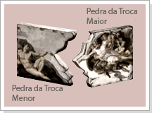
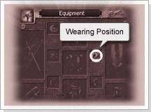

## Pedra da Troca

<html>
  <head>
    <meta charset="utf-8" />
    <meta name="viewport" content="width=device-width" />
  </head>
  <body>

<strong>Monstro Comerciante<strong>

O comerciante Premium Neil vende as Pedras da troca Maior e Menor. Dizem que a pedra da troca leva o nome do personagem que a possui. Por isso, são comercializadas por um valor bastante elevado e, como tem grandes poderes, deve ser usada com muito cuidado.

 
<table border="0" cellpadding="0" cellspacing="0"> 
	<tr>
		<td colspan="2">
<strong>Procedimentos</strong>
</td>			
	</tr>
	<tr>
		<td colspan="2">
Você deve possuir a Pedra da Troca Maior e a Pedra da Troca Menor para conseguir trocar o nome do Personagem.
</td>			
	</tr>		
	<tr>
		<td width="200px"></td>
		<td>
<strong>1 -</strong> As Pedras da Troca, tanto a Maior quanto a Menor, são vendidas pelo comerciante Premium Neil.

		</td>
	</tr>
	<tr>
		<td width="200px"></td>
		<td>
<<strong>2 -</strong> Após obter cada um dos dois itens, equipe a 'Pedra da Troca Maior' no slot de equipar o Familiar do personagem (cujo nome você deseja trocar), coloque a 'Pedra da Troca Menor' no banco e desconecte do jogo.
</td>
	</tr>
	<tr>
		<td colspan="2">
<strong>3 -</strong> 	Após desconectar do jogo, conecte novamente e crie um novo personagem com o nome que deseja usar. Caso você já tenha 4 personagens e não possa mais criar, deverá apagar um dos personagens para poder criar um novo (se você desejar apenas trocar de nome com algum dos personagens já criados anteriormente, não é necessário criar mais um).
</td>
	</tr>
	<tr>
		<td colspan="2">
<strong>4 -</strong> Após criar um novo personagem (com o nome desejado) e logar (conectar) com ele, equipe a 'Pedra da Troca Menor' no novo personagem e desconecte.
</td>			
	</tr>
	<tr>
		<td colspan="2">
<strong>5 -</strong> 	Após logar novamente, você poderá observar que os nomes dos personagens estarão trocados, concluindo o processo. Após a troca de nomes entre os personagens, as pedras da troca sumirão.
</td>	
	</tr>
</table>
 

<strong>Atenção<strong>

Os dois personagens que estiverem equipados com as Pedras da Troca irão trocar seus nomes sem prévia confirmação. Portanto, tome cuidado.

  </body>
</html>
