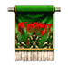
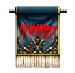

## Pesadelo

<html>
  <head>
    <meta charset="utf-8" />
    <meta name="viewport" content="width=device-width" />
  </head>
  <body>

Após 400 anos da tempestade sangrenta ocasionada pela Guerra Celestial, os humanos finalmente estão encontrando forças para reconstruir a glória da época magnífica do passado. Através de inacabáveis esforços e, com o suporte da cidade de Armia no continente de Kerserf, os humanos conseguiram um grande poder que permitiria até mesmo desafiar as forças da escuridão. Essa força só foi encontrada com a união de todos os humanos sob uma mesma bandeira, até mesmo os dois reinos rivais se juntaram sob essa bandeira.

Para concluir o seu objetivo, os dois reinos lutaram bravamente para acabar de vez com as forças da escuridão e, com a ajuda do Sephirot, conseguiram expelir as forças da escuridão para um canto longínquo do mundo.

Alguns dias depois da grande vitória, começaram a acontecer fatos assustadores na cidade. Cada dia que passava, soldados e até mesmo o povo da cidade começaram a morrer por um motivo inexplicável.

Uma noite tranquila... Pessoas que morriam sem pronunciar uma unica palavra dormiam para nunca mais acordar...

Aquela sombra do terror finalmente chegou as cidades vizinhas, fazendo com que todas as cidades mergulhassem numa nova onda de pânico e terror...

Conforme a notícia ia se espalhando pelo continente de Kerserf, mais e mais pessoas faziam de tudo para não dormir, com medo de nunca mais acordarem. Bravos guerreiros sentiam-se impotentes para salvar a população, pois suas espadas nada podiam fazer contra o sono.

Mais uma vez a salvação viria das Foemas, que começaram a pesquisar a causa e a cura dessa terrível doença, mas a única pista que tinham era que todas as vítimas morriam aproximadamente 4 horas depois de dormirem.

Para colher mais informações, as Foemas fabricaram pergaminhos de feitiço para que se pudesse entrar no mundo dos sonhos...

Logo descobririam o motivo da doença...

<strong>Agora é a hora de mostrar o seu verdadeiro poder, bravo guerreiro do Continente de Kersef. Seja o homem que protegeu a humanidade trazendo-nos para fora do Pesadelo. qualquer um que use a "Carta do Pesadelo" pode entrar no "Mundo dos Sonhos " e reviver a glória do homem!</strong>

<table border="0" cellpadding="0" cellspacing="0">
	<tr>						
		<td width="100px"></td>
		<td>
<strong>Pesadelo-Normal(individual)</strong>

			
Item que pode ser adquirido na Loja Premium, usado para mover-se a area de nivel Normal. Pode ser utilizado apenas na cidade de Erion.
</td>
	</tr>
	<tr>						
		<td width="100px"></td>
		<td>
<strong>Pesadelo-Místico(individual)</strong>

			
Item que pode ser adquirido na Loja Premium, Usado para mover-se a area de nivel Místico. Pode ser utilizado apenas na cidade de Armia.
</td>
	</tr>
	<tr>						
		<td width="100px"></td>
		<td>
<strong>Pesadelo-Arcano(individual)</strong>

			
Item que pode ser adquirido na Loja Premium, usado para mover-se a area de nivel Arcano. Pode ser utilizado apenas na cidade de Azran.
</td>
	</tr>
	<tr>						
		<td width="100px"></td>
		<td>
<strong>Pesadelo-Normal(grupo)</strong>

			
Item que pode ser adquirido na Loja Premium, usado para mover-se a área de nivel Normal. Pode ser utilizado apenas na cidade de Erion.
</td>
	</tr>
	<tr>						
		<td width="100px"></td>
		<td>
<strong>Pesadelo-Místico(grupo)</strong>

			
Item que pode ser adquirido na Loja Premium, usado para mover-se a area de nivel Místico. Pode ser utilizado apenas na cidade de Armia.
</td>
	</tr>
	<tr>						
		<td width="100px"></td>
		<td>
<strong>Pesadelo-Arcano(grupo)</strong>

			
Item que pode ser adquirido na Loja Premium, usado para mover-se a area de nivel Arcano. Pode ser utilizado apenas na cidade de Azran.
</td>
	</tr>
</table>

<strong>Procedimento</strong>

Vá para a cidade respectiva a áea de Pesadelo utilizando o ingresso de entrada para o pesadelo.

Proteja o povo da cidade durante um tempo determinado.

Mas para cada morador que for assassinado, o valor da experiência adquirida será reduzido. E, caso todos os moradores tenham morrido, o Pesadelo não aparecerá. Se seu tempo acabar, a Quest acabará automaticamente.

<strong>Área Mística do Pesadelo</strong>

<strong>Área Normal do Pesadelo</strong>

<strong>Área Arcana do Pesadelo</strong>

<table border="0" cellpadding="2" cellspacing="2">
	<tr>
		<td colspan="2" align="center"><strong>Horário permitido para entrada</strong></td>
	</tr>
	<tr>
		<td>
<strong>Área Normal:</strong>
</td>
		<td>
Todas as horas em ponto, 20min e 40min (4 min de espera após início)
</td>
	</tr>
	<tr>
		<td>
<strong>Área Mística:</strong>
</td>
		<td>
Todas as horas em 5min, 25min, 45min (4 min de espera após início)
</td>
	</tr>
	<tr>
		<td>
<strong>Área Arcana:</strong>
</td>
		<td>
Todas as horas em 10min, 30min e 50min (4 min de espera após início)
</td>
	</tr>
</table>
<table border="0" cellpadding="2" cellspacing="2">
	<tr>
		<td colspan="2" align="center"><strong>Números de Participantes Permitidos</strong></td>
	</tr>
	<tr>
		<td>
<strong>Área Normal:</strong>
</td>
		<td>
Máximo de 20 pessoas.
</td>
	</tr>
	<tr>
		<td>
<strong>Área Mística:</strong>
</td>
		<td>
Máximo de 40 pessoas
</td>
	</tr>
	<tr>
		<td>
<strong>Área Arcana:</strong>
</td>
		<td>
Máximo de 40 pessoas
</td>
	</tr>
</table>
 

<strong>Atenção<strong>

Permitido o teleporte apenas para a cidade utilizando o pergaminho do retorno durante o procedimento da quest.

Apenas permitida a entrada para a áea de quest se utilizar o item relacionado.

Pode-se comprar com o Vendedor Premium Neil.

O horário de entrada e o horário do servidor, não tendo muita diferença com o tempo real (GMT -3).

  </body>
</html>
