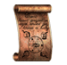
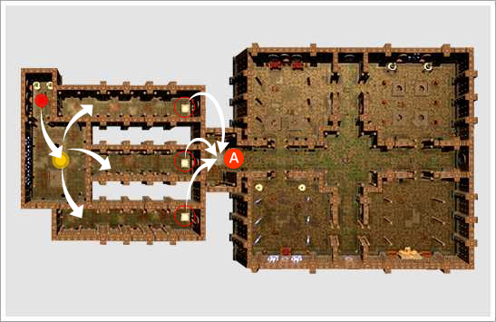
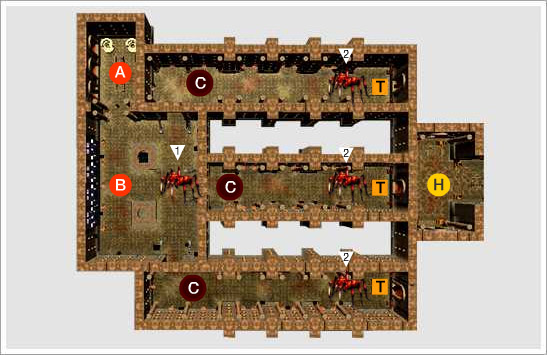
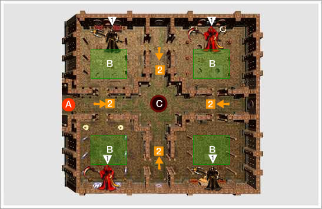

## Portão Infernal

<html>
  <head>
    <meta charset="utf-8" />
    <meta name="viewport" content="width=device-width" />
  </head>
  <body>

Você deve estar levemente familiarizado com a Guerra Celestial, que aconteceu há centenas de anos. Naquela época, as almas dos que foram controlados pelo poder de Tzfah vagavam na entrada do inferno sem poder obter a salvação. Isso ocorreu devido à <strong>maldição eterna de Kafma</strong>. O número de almas sem descanso era absurdo.

Como você deve estar sabendo, as criaturas evoluem consumindo a alma humana. Naquele lugar onde as almas perdidas estavam vagando, não se sabe como, surgiram centenas de criaturas. Essas criaturas começaram a obter forças incomensuráveis devorando a alma daqueles que foram degenerados...

<strong>Kafma</strong> percebeu o seu grave erro tarde demais, pois as criaturas já estavam extremamente poderosas. A única e a última coisa possível de ser feita era construir uma barreira sagrada para que estas criaturas não espalhassem seus poderes pelo mundo afora. Descobriu-se, posteriormente, que aquelas criaturas eram obras de Tzfah, que viu na falha de Kafma a chance de aumentar o poder de seus exércitos.

Agora o local é chamado de <strong>portão infernal</strong>. Não temos nem ideia de quantas criaturas então presas dentro da barreira sagrada e nem como elas prosperaram durante o longo tempo em que estiveram presas.

A nossa grande preocupação e quanto aos rumores que estão se espalhando rapidamente sobre alguns <strong>documentos antigos</strong> escritos na língua dos demônios. Ao serem lidos, transportam a pessoa diretamente para o local amaldiçoado, o <strong>portão infernal</strong>. Para verificar se o rumor era verdadeiro, eu mesmo estudei o documento que consegui através da rota da escuridão... E para o azar de todos, o rumor era verídico...

Já ordenei aos cavaleiros reais do nosso reino de Hekalotia para que apaguem a curiosidade gerada por tais documentos, mas parece que existem alguns cavaleiros que se divertem ao enfrentar o perigo e que estão fazendo de tudo para conseguir chegar no portão. Espero que ao menos você não desperdice sua vida.

<strong>Calendário Hekalotiano, Ano 431, sobre o conteúdo da conversa com o Mago Real Nrugal</strong>

<strong>Agora restam apenas duas escolhas:</strong>

<strong>Escolher entre a chance de aumentar a sua glória derrotando a criaturas malignas dentro do portão infernal utilizando o pergaminho ancestral do Portão Infernal ou esperar uma morte que trará um sofrimento eterno...</strong>

<strong>Muito bem ~ Aqueles que possuem a força e a coragem ~ Façam a sua ESCOLHA!</strong>

 
<table border="0" cellpadding="0" cellspacing="0">
	<tr>
		<td colspan="2">
<strong>Itens</strong>
</td>
	</tr>
	<tr>						
		<td width="100px"></td>
		<td>
<strong>Portão do inferno (N/ind)</strong>

			
O acesso ao Calabouço Infernal é possível somente ao utilizar o ticket de entrada "Portão do Inferno (N/Ind)" às 23h00. O ticket de entrada "Portão do Inferno (N/Ind)" se encontra à venda no Premium Neil (BIGSALE).
</td>
	</tr>
</table>
 
<table border="0" cellpadding="0" cellspacing="0">
	<tr align="center">
		<td><strong>A Zona do Portão Infernal é divido, basicamente, zona de espera e zona interna.</strong></td>
	</tr>
	<tr align="center">
		<td width="600px"></td>
	</tr>
	<tr align="center">
		<td><strong>A Zona que você deve ir depois da Zona de Espera.</strong></td>
	</tr>
</table>
 

<table border="0" cellpadding="0" cellspacing="0">
	<tr align="center">
		<td><strong>Zona de Espera</strong></td>
	</tr>
	<tr align="center">
		<td width="600px"></td>
	</tr>
	<tr>
		<td>
<strong>A - Início da QUEST Portão Infernal.</strong>

			
- Área que você irá ressuscitar após morrer durante a QUEST Portão Infernal.
</td>
	</tr>
	<tr>
		<td>
<strong>B - Área onde os Esqueletos aparecem.</strong>

			
- Mago Esqueleto, Cavaleiro Esqueleto, Esqueleto.
</td>
	</tr>
	<tr>
		<td>
<strong>C - Zona de Teleporte.</strong>

			
- Mago Esqueleto, Cavaleiro Esqueleto, Esqueleto.
</td>
	</tr>
	<tr>
		<td>
<strong>T - Teleporte que o levará a Zona Infernal após derrotar o 2º Monstro Chefe.</strong>
</td>
	</tr>
	<tr>
		<td>
<strong>H - Teleporte que o levará a Zona Infernal.</strong>
</td>
	</tr>
	<tr>
		<td>
<strong>1 - Local de Respawn do primeiro Monstro Chefe (Tarântula).</strong>

			
- Desaparece após 4 minutos ao entrar no Portão Infernal.
</td>
	</tr>
	<tr>
		<td>
<strong>2 - Local de Respawn do primeiro Monstro Chefe (Tarântula)
</strong>

			
- Você pode passar para a próxima fase após derrotar o primeiro Chefe Monstro.
</td>
	</tr>
</table>
 

<strong>Zona de Ressurreição</strong>

Durante o procedimento da quest do portão infernal, caso tenha morrido, o personagem será transferido para parte interna da zona de espera, podendo prosseguir com a quest durante o tempo restante.

<strong>Waiting zone</strong>

Uma etapa para poder entrar na zona infernal. Esta área serve como preparativo, onde pode-se formar grupos. Entre outras coisas, também é uma zona em que aparecem os monstros chefes que necessitam ser derrotado para seguir para a zona infernal.

1 - Na primeira vez que usar a entrada será teleportado para a área de ressurreição dentro da área de espera.

2 - Dentro da área de espera, estamos fornecendo 4 min para fazer os preparativos. 
! não é im possível transferir para a área infernal. 
! não aparecerão os monstros chefes.

3 - Durante os 4min de espera você poderá caçar os monstros que aparecem nesta área. 	
! não aparecerão os monstros chefes.

4 - Chefe, aparecerá o segundo monstro chefe, localizado no fim do corredor, na frente da zona de teleporte. 
! Caso não tenha eliminado o primeiro monstro chefe, não aparecerá o segundo.

5 - Ao final dos três corredores está preparada a zona de teleporte, mas apenas um local pode ser usado para teleportar para a zona infernal. Dentre os 3 monstros chefes que aparecem no final de cada um dos 3 corredores, apenas um permite o teleporte para a tal zona. Caso não de para utilizar o teleporte mesmo após eliminar o monstro chefe, verifique outros teleportes, derrotando os monstros chefes respectivos. 
! A utilização do teleporte só é permitida após a eliminação do monstro chefe verdadeiro. (Teleporte atrás do monstro chefe).

6 - Transferência para a zona infernal utilizando o teleporte.

 
<table border="0" cellpadding="0" cellspacing="0">
	<tr align="center">
		<td><strong>Hell zone field</strong></td>
	</tr>
	<tr align="center">
		<td width="600px"></td>
	</tr>
	<tr>
		<td>
<strong>A - Hellgate starting point.</strong>
</td>
	</tr>
	<tr>
		<td>
<strong>B - This is the area where all the Skeletons appear</strong>

			
- Skeleton Knight, Spear Skeleton, Skeleton Warrior, Skeleton Archer
</td>
	</tr>
	<tr>
		<td>
<strong>C - The area where NPC Dionis appear after you have defeated the two boss monsters.</strong>

			
- NPC Dionis is selling weapons, armors and amulets in Hellgate.

			
- All options of the purchased items will be given randomly.
</td>
	</tr>
	<tr>
		<td>
<strong>1 - The area where the boss monster appears after you have defeated the Skeletons in the room.</strong>
</td>
	</tr>
	<tr>
		<td>
<strong>2 - The monster will attempt to kill NPC Dionis.</strong>

		
- You will be transported back to the area fifteen minutes after NPC Dionis has appeared.
</td>
	</tr>
</table>
 
<table border="0" cellpadding="0" cellspacing="0">
	<tr>
		<td>
<strong>Campo Zona Infernal</strong>
</td>
	</tr>
	<tr>
		<td>
Dentro de um total de 4 salas grandes estão os monstros chefes, que são os dominantes e governadores absolutos deste portão do inferno, como Arch Lich e Lich Infernal, que foram selados no passado por um feitiço antigo.
</td>	
	</tr>		
	<tr>
		<td>
<strong>1 - </strong>A forma de quebrar o feitiço de selamento, conforme a escrita do pergaminho ancestral e eliminar todos os esqueletos de cada uma das salas e através dos lichs libertar as almas malignas, fazendo-os descansar em paz livres dos seus pecados.

			
! Caso não tenha eliminado todos os esqueletos dentro da sala, não aparecerão os monstros chefes.

			
! Apenas um monstro chefe aparecerá com a quebra do selo.
</td>
	</tr>
	<tr>
		<td>
<strong>2 - </strong>A ordem não é importante. Entre em qualquer sala e elimine todos os esqueletos libertando as almas malignas, o Arch Lich e o Lich Infernal.

			
! Pode aparecer um monstro chefe não verdadeiro.
</td>
	</tr>
	<tr>
		<td>
<strong>3 - </strong>Para cada sala, igualmente as salas anteriores da zona de espera, apenas 2 monstros são os verdadeiros monstros chefes.

			
! Estamos avisando caso tenha eliminado o monstro chefe verdadeiro.

			
Mensagem de Notificação: [Eliminou o Lich]
</td>
	</tr>
	<tr>
		<td>
<strong>4 - </strong>Ao eliminar ambos os monstros verdadeiros aparecerá o NPC Dionis no centro da zona ao redor da Escultura de forma.

			
! Caso tenha eliminado ambos os monstros chefes, você será avisado. Mensagem de Notificação: [Apareceu o NPC ao redor da escultura]
</td>
	</tr>
</table>
 
<table border="0" cellpadding="0" cellspacing="0">
	<tr>
		<td>
<strong>Explicação breve da Zona Infernal</strong>
</td>
	</tr>
	<tr>
		<td>
Dentre os monstros chefes que aparecerem nas 4 salas, apenas 2 salas possuirão aleatoriamente o monstro chefe que permite a aparição do NPC Dionis e, caso tenha eliminado ambos os monstros chefes que possuem as características verdadeiras, o NPC aparecerá.
</td>	
	</tr>
	<tr>
		<td>
Ordem do Procedimento
</td>	
	</tr>
	<tr>
		<td>
<strong>Primeira Sala: </strong>eliminação dos esqueletos -&gt; Caso o Monstro chefe seja o verdadeiro, será mostrada a mensagem 'Eliminou o Lich'.
</td>
	</tr>
	<tr>
		<td>
<strong>Segunda Sala: </strong>eliminação dos esqueletos -&gt; Caso o Monstro chefe seja o verdadeiro, será mostrada a mensagem 'Eliminou o Lich'.
</td>
	</tr>
	<tr>
		<td>
<strong>Terceira Sala: </strong>eliminação dos esqueletos -&gt; Caso o Monstro chefe seja o verdadeiro, será mostrada a mensagem 'Eliminou o Lich'.
</td>
	</tr>
	<tr>
		<td>
<strong>Quarta Sala: </strong>Pode seguir para o centro sem necessidade de eliminar os monstros.
</td>
	</tr>
	<tr>
		<td>
Ao eliminar os dois monstros que possuem a forma verdadeira aparecerá o NPC comerciante Dionis.
</td>
	</tr>
	<tr>
		<td>
Mesmo que apareca o NPC Dionis, isso não significa que a quest tenha sido completada.
</td>
	</tr>
	<tr>
		<td>
Isso ocorre porque os monstros aparecerão nos quatro corredores da área para eliminar o NPC Dionis. Dionis é um comerciante que vende itens com opções extremas que não são vendidos pelos NPCs comuns e apenas pode ser encontrado dentro do Portão Infernal. Caso o Dionis tenha morrido, não ressuscitará novamente.

		
Desejo-lhe sorte!
</td>
	</tr>
</table>
  </body>
</html>
