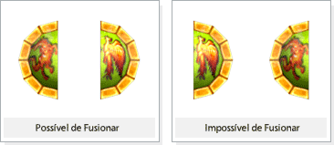

## Procura da vida eterna

<html>
  <head>
    <meta charset="utf-8" />
    <meta name="viewport" content="width=device-width" />
  </head>
  <body>

Você já deve ter ouvido lendas de quando os deuses ainda se comunicavam com os humanos e de como eles nos ajudaram a evoluir. Por isso os humanos daquela época não eram fracos como os de hoje.

Mas através dos agentes de Tzfah, a adoração sobre os deuses transformou-se em experimentos. A Sephira e a Imortalidade que foram gravadas em nossos corações pelos deuses na hora da criação desapareceram; começamos nosso mergulho na escuridão. Desde esse momento, as lembranças que os humanos tinham do aprendizado e do amor que tinham pelos deuses foi sumindo, transformando-se em um sonho distante - acordamos atolados na Guerra Celestial. Mas mesmo com o erro dos humanos de quererem estudar os deuses e não mais louva-los, os deuses não podiam descartar o amor dos humanos... Mas isso foi num tempo em que a ponte Sephira ainda ligava os dois mundos. 

Recentemente os oráculos akelotianos e hekalotianos estavam perdidos dentro dos mesmos sonhos repetidos todas as noites. Mas o que eles não sabiam é que todos eles tiveram exatamente os mesmo sonhos.

Dentro do sonho, eles ouviam os gritos de sofrimento saindo de todos os lados do mundo, inclusive os sons das mortes. Num lugar onde as espadas se rebatiam e as magicas se entrelacavam trazendo o sofrimento, os oraculos estavam apenas assistindo a essa batalha enfiados num canto tremendo de terror sem poder fazer absolutamente nada.

Aqueles que estavam se confrontando certamente nao eram humanos. Cada vez que eles gritavam, era com se a alma dos oráculos fossem açoitadas por chicotes de fogo. Esses seres possuiam asas e entre os que estavam confrontando alguns exalavam um brilho e outros exalavam a escuridão

Quando eles encontravam a morte, alguns viravam uma luz, outros escuridão caindo para a terra.

No instante em que os oráculos estavam assistindo esta guerra, tremendo de terror, ecoava um som dentro do seu coração dizendo "Vá avisá-los", e assim eles despertavam do sonho.

 
<table border="0" cellpadding="0" cellspacing="0"> 
	<tr>
		<td colspan="2" align="center">
<strong>Quest Item</strong>
</td>			
	</tr>		
	<tr>
		<td width="100px"></td>
		<td>
<strong>Alma de Unicórnio</strong>
 
			
Um dos pedaços da pedra da imortalidade. Pode ser transformado apenas se estiver junto com a 'Alma do Fenix'.

		</td>
	</tr>
	<tr>
		<td width="100px"></td>
		<td>
<strong>Alma de Fênix</strong>
 
			
Um dos pedacos da pedra da imortalidade. Pode ser transformado apenas se estiver junto com a 'Alma do Unicórnio'.

		</td>
	</tr>
	<tr>
		<td width="100px"></td>
		<td>
<strong>Pedra da Imortalidade</strong>
 
			
Pedra da Vida Eterna; e a fusão da alma do Fenix e do Unicórnio. Possuir a pedra da imortalidade significa estar pronto para elevar-se ao estado de semideus, transformando-se em um Arch. Ao equipar a pedra da imortalidade no slot de Orbs e ir ao encontro do rei do seu reino, poderá receber mais uma Quest necessária para ser um Arch.

		</td>
	</tr>
</table>
 

<strong>Procedimentos<strong>

1 - Quando o personagem alcancar o Nivel 370, poderá receber a quest através do oráculo que pertence ao seu reino.
- Caso faça parte da Hekalotia terá de receber a quest pelo Oráculo azul e caso faça parte da 'Akelonia' terá de receber a quest pelo Oráculo vermelho.

2 - Caçando Lich Vatama, Lich Crunt e Rei Demonlord poderá obter a alma do Fenix e caçando o LugeferBroken poderá obter a alma do Unicórnio.

3 - Caso tenha obtido ambas as almas, de fênix e unicórnio, leve-as consigo dentro do inventaáio junto com 10 sáfiras e procure o Oráculo do seu reino.

4 - Podera fundir em Pedra da Imortalidade clicando no Oráculo.

<table border="0" cellpadding="0" cellspacing="0"> 
	<tr>
		<td align="center">
<strong>Atenção</strong>
</td>			
	</tr>	
	<tr>
		<td align="center">
As almas deverão estar em forma para poder fundir.Ex.: Possível de Fusão
</td>			
	</tr>	
	<tr>
		<td width="3000px"></td>
	</tr>
</table>
  </body>
</html>
