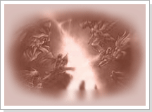
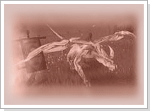
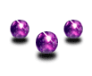

## Procura dos rastros do mundo celestial

<html>
  <head>
    <meta charset="utf-8" />
    <meta name="viewport" content="width=device-width" />
  </head>
  <body>

A Procura dos rastros do mundo celestial

<table border="0" cellpadding="0" cellspacing="0">
	<tr>						
		<td width="250px"></td>
		<td>
Existem rumores sobre a existência de poderosos cristais que foram utilizados de diversas formas pelo mundo celestial para combater na Guerra Celestial, e que foram espalhados pelos arredores do mundo. Ao juntar as forças destes cristais, mesmo sendo apenas uma parte do que sobrou da esquecida força celestial, eles poderão ser usados como uma ferramenta para a evolução do ser humano superior...Com o gradativo aumento das forças e o número de pessoas que atuam na cidade de Armia, esses cristais escondidos começam a sair das lendas e virar a realidade dos habitantes de Armia.
</td>
	</tr>
	<tr>						
		<td></td>
		<td>
Existem rumores de que esses cristais podem ser encontrados caçando os monstros nos arredores de Armia e que nesta região pode-ser encontrar 7 tipos diferentes destes cristais. Caso tenha conseguido os 7 cristais, vá ao Dragão Dourado na cidade de Armia. Ele atribuirá uma nova habilidade a sua arma utilizando esses cristais. O resultado pode maravilhoso ou maldito, tudo dependerá da sua sorte...
</td>	
	</tr>
</table>
<table border="0" cellpadding="0" cellspacing="0">
	<tr>
		<td width="150px"></td>
		<td>
<strong>Cristal</strong>

			
Os cristais que foram utilizados no mundo celestial possuem vários tipos de habilidades, eles foram apresentados aos humanos através da Guerra Celestial e hoje são encontrados nas redondezas da cidade de Armia. Dizem que o poder apenas se manifesta se você conseguir juntar todas essas 7 esferas. O resultado dessa junção é um misterio, mas você pode juntar os cristais quantas vezes você quiser ou puder.
</td>
	</tr>
</table>

<strong>Atenção<strong>

Se possuir os 7 cristais em sequência (de Cristal I ate Cristal VII), você poderá conseguir um atributo mais interessante. Com exceção dos itens itens Arch, todos os itens podem receber a força dos cristais.

Os atributos aplicados podem ser iguais aos que ja estão nas armas, iguais ou piores. A troca de atributo pode ser feita em armas com refinação +10 ou superior e Armas Ancient tembém.

Após o processo a refinação pode ser alterada.

  </body>
</html>
