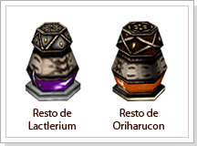
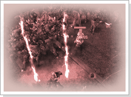

## Programa de Monstros

<html>
  <head>
    <meta charset="utf-8" />
    <meta name="viewport" content="width=device-width" />
  </head>
  <body>

Os Archs malignos, criados por Tzfah, eram verdadeiras maquinas de ódio e destruição, pois eles combinavam os poderes superiores dos Archs, mas ao invés da essência de justiça e bondade dos humanos, eles continham a corrupção e a devassidão dos monstros. Empregando tal poder contra os humanos, Tzfah conseguiu uma grande vitória na Guerra continental que aconteceu entre os humanos e os demônios, pois mesmo tendo o mesmo poder dos Archs malignos, os Archs não estavam em número suficiente. Os humanos precisavam descobrir uma forma de combater essas criaturas o mais rápido possível, pois tempo era essencial, e quem melhor entendia essa necessidade eram os alquimistas, por sua longa experiência em fusão de matéria prima. Azran, por ser uma região onde apareciam freqüentemente os Archs Malignos, foi feita como base de estudos da guilda dos alquimistas, formada basicamente de foemas e chamada de "Elixir", que aos poucos começava a entender como foram produzidos os Archs Malignos. 

Após se estabelecer definitivamente em Armia, a Elixir começou a patrocinar os Beastmasters que passavam pela cidade de Azran, para que eles encontrassem materiais para a pesquisa utilizando a vasta biodiversidade que a região oferecia. Esse projeto foi batizado de 'Programa de Monstros Compostos'. O único problema era que os alquimistas não tinham como saber a extensão real dos poderes dos monstros que eles conseguiram criar para ajudar os humanos na guerra. Sabia-se que os Archs malignos eram poderosos pela essência divina deles, mas os pesquisadores da ¡°Elixir¡± não dispunham desse poder, fazendo pequenas adaptações por meio das matérias encontrados e dos processos alquímicos.
			
 
<table border="0" cellpadding="0" cellspacing="0">
	<tr>						
		<td width="250px" align="center"></td>
		<td>
<strong>Resto de Oriharucon e Resto de Lactolerium</strong>

			
Por esta razão, a guilda dos alquimistas 'Elixir' começou a juntar os exploradores de todo o continente de Kerserf. As criaturas do 'Elixir', por serem fabricadas com tecnologia da Alquimia, tinham ossos feitos de um metal especial. Quem trouxesse os restos para a 'Elixir' ganharia em troca a Poeira de Lactolerium e Poeira de Oriharucon, que são derivados de um minério que possuía poderes místicos. Logo os restos foram chamados de Restos de Oriharucon e Restos de Lactolerium por ser os ingredientes para formar, respectivamente, Oriharucon e Lactolerium. O rumor era o suficiente para influenciar todos os exploradores, e Azran começou a transbordar de exploradores que chegavam de todas as partes do continente.
</td>
	</tr>
</table>
 
<table border="0" cellpadding="0" cellspacing="0">
	<tr>
		<td colspan="2"><strong>Notificação Pública da Elixir para Exploradores</strong></td>
	</tr>
	<tr>
		<td width="250px" align="center"></td>
		<td>Nós queremos lhes dizer sobre a forma de procedimento do teste para que não fiquem desorientados. Antes de qualquer coisa, há algo de importante que devem saber. Não podemos calcular a força destes seres que nós criamos e conseguir confronta-los está por sua conta e risco. Vocês devem ter chegado aqui cheios de dúvidas sobre este experimento. Aqueles que querem provar a sua força... Aqueles que desejam construir uma fortuna através de Lactolerium e Oriharucon... Aqueles que vieram para tirar dúvidas sobre os seres criados pelos humanos... Dentro destas paredes sólidas e seguras vocês poderão ter todas as respostas que buscam. Mas gostaria de dar um aviso a todos aqueles que realmente desejam entrar neste local onde a morte exala seu cheiro podre e o chão é manchado com o sangue de quem caiu. Não creia em ninguém a não ser em si mesmo! Se você não é forte o bastante não entre neste local! Sim, essas palavras visam gelar seu coração com o medo, pois as vezes o medo é o melhor indício para saber quem está pronto ou não. Este local cercado por paredes é apenas mais um campo de batalha. Para aqueles que procurarem este local por diversão e simples curiosidade, a única coisa que estará esperando é a morte.</td>
	</tr>
</table>
<table border="0" cellpadding="0" cellspacing="0">>
	<tr>
		<td width="100px" align="center"></td>
		<td>
<strong>Notificação pública de Elixir</strong>

			
Entrada para teste de monstros compostos das 10hrs.

			
Trata-se de um item premium, podendo ser adquirido pelo comerciante premium Neil dentro do jogo. Também pode ser adquirido através do site do WYD (wyd.ongame.com.br).
</td>
	</tr>
</table>
 

<table border="0" cellpadding="0" cellspacing="0" align="center">
	<tr align="center">
		<td colspan="2"><strong>Procedures</strong></td>
	</tr>
	<tr align="center">
		<td colspan="2"><strong>Teste de monstros compostos de 8hrs</strong></td>
	</tr>
	<tr>
		<td>
<strong>20:03</strong>
</td>
		<td>
Entrada e saída são seladas
</td>
	</tr>
	<tr>
		<td>
<strong>20:04</strong>
</td>
		<td>
Criação dos monstros de nível inferior
</td>
	</tr>
	<tr>
		<td>
<strong>20:05</strong>
</td>
		<td>
Abertura da barreira central
</td>
	</tr>
	<tr>
		<td>
<strong>20:07</strong>
</td>
		<td>
Criação dos monstros de nível intermediário
</td>
	</tr>
	<tr>
		<td>
<strong>20:09</strong>
</td>
		,td>
Criação dos monstros de níveis inferiores e intermediários
</td>
	</tr>
	<tr>
		<td>
<strong>20:11</strong>
</td>
		<td>
Criação dos monstros de níveis intermediários e superiores
</td>
	</tr>
	<tr>
		<td>
<strong>20:13</strong>
</td>
		<td>
Criação dos monstros de níveis superiores
</td>
	</tr>
	<tr>
		<td>
<strong>20:15</strong>
</td>
		<td>
Isolamento com Barreira defensiva, extinção dos monstros remanescentes no Coliseu
</td>
	</tr>
	<tr align="center">
		<td colspan="2"><strong>Teste de monstros compostos de 9hrs</strong></td>
	</tr>
	<tr>
		<td>
<strong>21:03</strong>
</td>
		<td>
Entrada e saída são seladas
</td>
	</tr>
	<tr>
		<td>
<strong>21:04</strong>
</td>
		<td>
Criação dos monstros de nível inferior
</td>
	</tr>
	<tr>
		<td>
<strong>21:05</strong>
</td>
		<td>
Abertura da barreira central
</td>
	</tr>
	<tr>
		<td>
<strong>21:07</strong>
</td>
		<td>
Criação dos monstros de nível intermediário
</td>
	</tr>
	<tr>
		<td>
<strong>21:09</strong>
</td>
		,td>
Criação dos monstros de níveis inferiores e intermediários
</td>
	</tr>
	<tr>
		<td>
<strong>21:11</strong>
</td>
		<td>
Criação dos monstros de níveis intermediários e superiores
</td>
	</tr>
	<tr>
		<td>
<strong>21:13</strong>
</td>
		<td>
Criação dos monstros de níveis superiores
</td>
	</tr>
	<tr>
		<td>
<strong>21:15</strong>
</td>
		<td>
Isolamento com Barreira defensiva, extinção dos monstros remanescentes no Coliseu
</td>
	</tr>
	<tr align="center">
		<td colspan="2"><strong>Teste de monstros compostos de 10hrs (apenas possuidor de notificação pública)</strong></td>
	</tr>
	<tr>
		<td>
<strong>22:03</strong>
</td>
		<td>
Entrada e saída são seladas
</td>
	</tr>
	<tr>
		<td>
<strong>22:04</strong>
</td>
		<td>
Criação dos monstros de nível inferior
</td>
	</tr>
	<tr>
		<td>
<strong>22:05</strong>
</td>
		<td>
Abertura da barreira central
</td>
	</tr>
	<tr>
		<td>
<strong>22:07</strong>
</td>
		<td>
Criação dos monstros de nível intermediário
</td>
	</tr>
	<tr>
		<td>
<strong>22:09</strong>
</td>
		,td>
Criação dos monstros de níveis inferiores e intermediários
</td>
	</tr>
	<tr>
		<td>
<strong>22:11</strong>
</td>
		<td>
Criação dos monstros de níveis intermediários e superiores
</td>
	</tr>
	<tr>
		<td>
<strong>22:13</strong>
</td>
		<td>
Criação dos monstros de níveis superiores
</td>
	</tr>
	<tr>
		<td>
<strong>22:15</strong>
</td>
		<td>
Isolamento com Barreira defensiva, extinção dos monstros remanescentes no Coliseu
</td>
	</tr>
	</table>
	 
	
<strong>Características das criaturas</strong>

	
-Serão criados de 20 a 56 monstros aleatoriamente

	
O Chefe do grupo de criaturas de nível inferior é arqueiro, possuindo ataque à longa distância.

	
Os demais monstros terão ataque de proximidade.

	
Dos monstros inferiores pode-se obter restos de Oriharucon

	
-Grupo de criaturas de nível superior

	
Serão criados de 16 a 56 monstros aleatoriamente.

	
O Chefe dos monstros terá ataque de proximidade e os demais, ataque mágico.

	
Dos monstros superiores podem obter restos de Lactolerium.

	 
	
<strong>Recompensa do Experimento</strong>

	
- Ao juntar 10 peças de Resto de Oriharucon ou Lactolerium e entregar ao Alquimista Jeffi junto com 1 milhão de Gold, esses itens serão transformados em Poeira de Oriharucon ou Lactolerium.

	
- No evento do Coliseu que acontece às 10h aparecerá o monstro Chefe e deste monstro poderá ser obtida a 'Pedra Adamantita' que pode transformar Conjuntos Embutidos, Mythril e Teia em peças Lendárias.

  </body>
</html>
