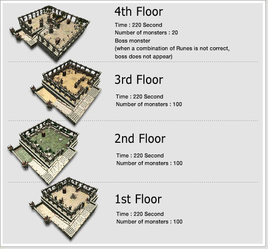
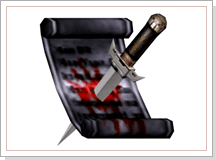
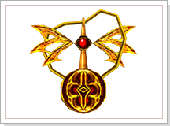
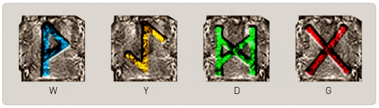

## Quarto Secreto

<html>
  <head>
    <meta charset="utf-8" />
    <meta name="viewport" content="width=device-width" />
  </head>
  <body>

Desde a antiguidade, para se tornar em um guerreiro, é necessário entrar num quarto secreto tomado por feitiços para provar sua bravura e, assim, ser considerado um verdadeiro guerreiro. Mas para entrar neste quarto somente a bravura não bastava, o que arrancou a vida dos muitos jovens guerreiros que tentaram, em vão, provar sua honra e dignidade. Com a entrada proibida pelos anciões, o quarto foi sendo esquecido pelas pessoas, mas com a chegada de uma nova época, a sua forma foi revelada pelos guerreiros e eles começaram a entrar novamente nestes quartos para testar e provar a sua coragem.

O Quarto Secreto tem a forma de uma torre e é formado por um total de quatro quartos. Atravessando cada um dos quartos com a mágica e tendo sua coragem aprovada, o guerreiro poderá passar para próxima etapa. Mas a entrada para o último quarto do último andar será permitida apenas para o guerreiro que possuir o 'Símbolo da Coragem'.

Para cada quarto no Quarto Secreto existe uma placa de pedra da antiguidade, gravada com as escritas rúnicas celestiais. Quando estas placas forem combinadas formando a palavra 'W.Y.D' aparecerá no último andar o chefe final do quarto. Dizem que caso não forme a palavra 'W.Y.D' o monstro não aparecerá. 

Dos exploradores que tentaram o quarto secreto, alguns derrotaram este chefe e adquiriram a 'Pedra Espiritual'. Claro que não se trata de pessoas quaisquer, mas aqueles que tem a benção dos deuses serão presenteados com a 'Pedra Espiritual'
		
 
<table border="0" cellpadding="0" cellspacing="0">
	<tr>
		<td align="center"><strong>Quarto Secreto</strong></td>	
	</tr>
	<tr>				
		<td>
Para participar do 'Quarto Secreto', você deve reunir-se com o grupo com o qual deseja realizar a quest na frente da entrada da cidade de Noatun, e clicar na 'Papel do Desafiante'. O 'Quarto Secreto' é formado por quatro andares no total e deve-se derrotar os monstros num intervalo de tempo definido. Quando a contagem de tempo finalizar ou quanto todos os monstros presentes no quarto forem derrotados será possível passar para o quarto seguinte.
</td>
	</tr>
	<tr>
		<td align="center"></td>
	</tr>
</table>
 
<table border="0" cellpadding="0" cellspacing="0">
	<tr>
		<td colspan="2" align="center"><strong>Carta de duelo</strong></td>
	</tr>
	<tr>
		<td width="250px" align="center"></td>
		<td>É o documento necessário para poder entrar no quarto secreto. É permitida a entrada em grupo. Neste caso apenas o líder do grupo deve estar com o 'Papel do Desafiante'.</td>
	</tr>
	<tr>
		<td colspan="2" align="center"><strong>Símbolo da Coragem</strong></td>
	</tr>
	<tr>
		<td width="250px" align="center"></td>
		<td>É um item que pode ser adquirido ao derrotar o rei do reino oponente. Trata-se de um símbolo que denota grande coragem. Apenas o possuidor deste símbolo e seu grupo poderão acessar o último quarto do 'Quarto Secreto'</td>
	</tr>
</table>

<strong>1 - </strong>Teleportar para dentro do quarto secreto clicando no Papel do Desafiante, após ter reunido com o grupo que deseja fazer a quest na frente da entrada do 'Quarto Secreto' (ao redor do altar do Thor). O 'Símbolo da Coragem' deve estar equipado com o líder do grupo antes de começar a quest para poder chegar no último andar.

<strong>2 - </strong>Ao entrar no quarto o respawn dos monstros será iniciado.

<strong>3 - </strong>Com o tempo esgotado, o grupo será transferido para o quarto seguinte.

Quanto menor o número de monstros remanescentes, maior o HP e a experiência fornecida pelos monstros da próxima etapa.

<table border="0" cellpadding="0" cellspacing="0">>
	<tr align="center">
		<td>
<strong>Level</strong>
</td>
		<td>
<strong>Normal</strong>
</td>
		<td>
<strong>Silver</strong>
</td>
		<td>
<strong>Gold</strong>
</td>
	</tr>
	<tr>
		<td>
<strong>números de monstros remanescentes</strong>
</td>
		<td>
<strong>31~100</strong>
</td>
		<td>
<strong>1~30</strong>
</td>
		<td>
<strong>0</strong>
</td>
	</tr>
</table>

<strong>3 - </strong>Do primeiro ao terceiro andar, qualquer pessoa que tiver o 'Papel do Desafiante' poderá entrar, mas para poder entrar no quarto andar, é necessário possuir o 'Símbolo da Coragem'.

<strong>4 - </strong>Ao entrar no último quarto, se estiver com as placas rúnicas formando a palavra 'W.Y.D' e derrotar todos os monstros da sala, o monstro chefe irá aparecer. Caso não tenha acertado as condições acima, o monstro chefe não irá aparecer.

 
<table border="0" cellpadding="5" cellspacing="5">
	<tr>
		<td colspan="4" align="center"><strong>Combinação de escrita Rúnica</strong></td>
	</tr>
	<tr>
		<td colspan="4" width="500px" align="center"></td>
	</tr>
	<tr>
		<td align="center"><strong>W</strong></td>
		<td align="center"><strong>Y</strong></td>
		<td align="center"><strong>D</strong></td>
		<td align="center"><strong>G</strong></td>
	</tr>
</table>

<table border="0" cellpadding="2" cellspacing="2" align="center">
	<tr align="center">
		<td rowspan="2"><strong>Nível</strong></td>
		<td rowspan="2"><strong>Tempo</strong></td>
		<td rowspan="2"><strong>No. de Monstros</strong></td>
		<td colspan="3">
<strong>List of Monster</strong>
</td>
	</tr>
	<tr align="center">
		<td>
Normal Zone
</td>
		<td>
Mystic Zone
</td>
		<td>
Arcane Zone
</td>
	</tr>
	<tr align="center">
		<td>
1º andar
</td>		  
		<td>
220 sec
</td>		  
		<td>
100
</td>		  
		<td>
Chaos Orc
</td>		  
		<td>
Froggy Knight
</td>		  
		<td>
War Taurus
</td>		  
	</tr>
	<tr align="center">
		<td>
2º andar
</td>		  
		<td>
220 sec
</td>		  
		<td>
100
</td>		  
		<td>
Elf Berserker
</td>		  
		<td>
Undead Skeleton
</td>		  
		<td>
Chaos Cyclop
</td>		  
	</tr>
	<tr align="center">
		<td>
3º andar
</td>		  
		<td>
220 sec
</td>		  
		<td>
100
</td>		  
		<td>
Wild Ghoul
</td>		  
		<td>
Dark Stone Golem
</td>		  
		<td>
Blue Hydra
</td>		  
	</tr>
	<tr align="center">
		<td>
4º andar
</td>
		<td>
220 sec
</td>		  
		<td>
20 + 1 boss
</td>		  
		<td>
Wild Taurus and Cruel Zakum (Boss)
</td>		  
		<td>
Guard Grymlock and Wise Gargoyle King (Boss)
</td>		  
		<td>
Undead Hell Chief Rujeper Broken King(Boss)
</td>		  
	</tr>
</table>
	 
	
<strong>Atenção:</strong>

	
Quando a personagem morre, usa o pergaminho do teleporte, é desconectado a quest termina automaticamente.

  </body>
</html>
