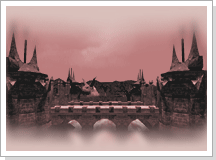
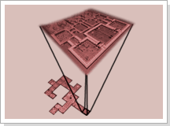
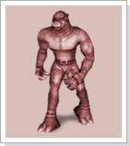
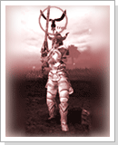

## Sociedade Wyd

<html>
  <head>
    <meta charset="utf-8" />
    <meta name="viewport" content="width=device-width" />
  </head>
  <body>

Para que Azran e Armia encontrassem finalmente a paz, muitos anos se passaram. Isto se deve principalmente ao sangue e a paixão dos muitos guerreiros que sacrificaram as suas vidas para enfrentar as criaturas malignas. Cada vez que respirar, lembre-se de que você não estaria aqui se não fossem por esses bravos homens... Sem o sacrifício dessas valorosas vidas não teríamos conseguido novamente nos estabelecer como uma grande cidade. Você, eu, todos nós finalmente conseguimos reunir forças suficiente não só para nos defendermos, mas também para contra-atacar esses monstros que por tanto tempo tiraram a alegria de nossas vidas e o sorriso do rosto de nossos filhos. Agora nós temos que tomar esta importante decisão aqui e neste momento.

<table border="0" cellpadding="0" cellspacing="0">
	<tr>
		<td align="center"></td>								
		<td>
<strong>Terra Abençoada dos Mortos...</strong>

			
Local de corpos apodrecidos e gritos de sofrimento das almas que não conseguiram encontrar o descanso eterno... Aqui é onde os poderes demoníacos podem influenciar a cobiça e o egoísmo que criou raízes no fundo da alma do ser humano. Não confie em ninguém dentro dessa área, pois mesmo o melhor amigo pode cortar-lhe o pescoço por um punhado de moedas de ouro. Um local dentro das cercas das cidades de Armia e Azran onde as promessas de mutualismo não servem. Esse local é chamado de 'Zona de Declaração Livre' (Zona de PvP)... 
</td>
		</tr>
		<tr>
			<td align="center"></td>
			<td>
Numa lenda por muito tempo esquecida, existia um local demoníaco chamado 'Castelo de Janus', que seria julgado pela justiça. Nós estamos formando uma expedição para levar a justiça para aquela terra de demônios. Você se considera um Guerreiro digno? Caso a resposta seja sim, participe de nossa expedição! Será uma longa e dura jornada, mas as recompensas serão tão boas quanto o esforço empregado. Se realmente quiser participar dessa perigosa empreitada, posso lhe arranjar uma informação valiosa. Diz o relato de que 'Dois Castelos' está localizado a leste da 'Zona de PvP'. O objetivo da expedição é destruir o castelo e derrotar o 'Lorde Zakum' que reside no Hall central. O 'Dois Castelos' possui uma estrutura no mínimo curiosa: é formado por duas construções idênticas que fica uma em cada lado, começando pelo centro. Por este motivo, deve-se escolher uma das duas portas existentes para começar a aventura e no Hall central existe uma cerca que o divide ao meio.
</td>
		</tr>
		<tr>
			<td>
Não será possível saber em qual lado da cerca o <strong>'Lorde Zakum'</strong> aparecerá. Portanto, mesmo que tenha chegado no Hall a salvo, existirá a possibilidade de nem mesmo encontrar o <strong>'Lorde Zakum'</strong>. Tenha muita cautela no momento de escolha dos portões. Se a sua expedição encontrar o <strong>'Lorde Zakum'</strong> e ainda conseguir derrotá-lo, a energia negativa será dispersa e a força mágica de Azran chegará até o local. Essa força de alta magnitude encontrará vocês e teleportará com segurança até a cidade de Azran
</td>								
			<td align="center"></td>
		</tr>
</table>
<table border="0" cellpadding="0" cellspacing="0">
	<tr>
		<td rowspan="5" width="150px"></td>			
	</tr>
	<tr>
		<td colspan="4">
 Equipa-se no lado oposto da medalha de guilda. Caso tenha equipado, será criada uma criatura que auxilia e protege o usuário. A vida desta criatura é ligada diretamente à do jogador. Cada vez que o jogador morrer, a criatura perderá 1 ponto da vitalidade. A vitalidade padrão é 3, podendo ser aumentado 1 ponto utilizando a Poeira de Oriharucon ou Lactolerium. Tome cuidado, pois quando a vida do Familiar chegar a zero, ele sumirá.
</td>			
	</tr>
	<tr>
		<td>
<strong>Nome</strong>
</td>
		<td>
<strong>Habilidade</strong>
</td>
	</tr>
	<tr>
		<td>
Imp
</td>
		<td>
- Aumento do dano em 6

			
- Aumento de Ataque mágico em 1%

			
- Auxilia o ataque do jogar usando mágicas de fogo

			
- Ataque aumenta de acordo com o Nível do Jogador
</td>
	</tr>
	<tr>
		<td colspan="3">
*Observação

						
As Poeiras de Oriharucon e de Lactolerium aumentam apenas a vitalidade, não tendo qualquer efeito no valor do ataque.
</td>
	</tr>
</table>

<strong>Obs.</strong>

'Dois Castelos' situa-se ao leste da 'Zona de PvP'

A chave do portão da parede que envolve o castelo no início pode ser adquirida pelos monstros guardiões que ficam nos arredores.

Ao abrir o portão do castelo e entrar nele, aparecerá um jardim imenso e duas portas, as duas portas podem ser abertas com a mesma chave e a chave pode ser obtida pelos monstros que residem no jardim.

Ao escolher um dos portões e entrar nela começará a batalha de verdade. Para que a expedição chegue no Hall central ela terá de passar por mais três portões, mas a cada portão ultrapassado os monstros que aparecem serão mais poderosos e a chance de dropar uma nova chave diminui.

O 'Zakum Warlock' possui uma grande resistência aos ataques mágicos e as mágicas não serão efetivas, mas mostra-se fraco aos ataques físicos e o 'Capitão de Guarda Zakum' mostra uma resistência maior aos ataques físicos, tendo uma resistência menor aos ataques mágicos.

A chave para entrar no 'Dois Castelos' poderá ser adquirida pelos monstros na parte frontal do castelo, nos redores da 'Zona de PvP'.

No Hall central existe uma cerca dividindo o Hall na metade e o Monstro Chefe aparecerá apenas em umas das duas localidades.

Ao derrotar o Chefe, obterá o Familiar dele e a expedição será transportada de volta para a cidade.

Caso não encontre o Chefe (Boss) no Hall central, será necessário o uso do Pergaminho do Retorno. A volta para a cidade através do pergaminho do retorno é permitida, mas não será possível retornar ao castelo partindo da cidade. Em adição, não serão permitidas as convocações ou teleportes através das Skills.

  </body>
</html>

