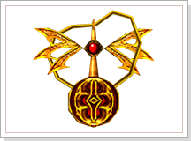

## Tempestade Inacabável

<html>
  <head>
    <meta charset="utf-8" />
    <meta name="viewport" content="width=device-width" />
  </head>
  <body>

Quando os reinos inimigos, <strong>'Akelonia'</strong> e <strong>'Hekalotia'</strong>, descobriram sobre a existência do lendário castelo Noatun, começaram a guerrear com ainda mais intensidade. Os confrontos violentos em volta do castelo Noatun acontecem com mais frequência e a cada dia aparecem mais guerreiros. 
O Castelo Noatun fora descoberto e foi declarada a quinta batalha frontal entre os reinos. Os cavaleiros do reino de Akelonia que estavam defendendo o castelo Noatun estavam esperando o sol nascente. Neste horário, um grupo de cavaleiros do acampamento de Hekalotia iniciou um avanço, não para o castelo de Noatun, mas para o centro do reino de Akelonia. No reino de Akelonia, que moveu a maioria dos seus exércitos para defender o castelo Noatun, estavam alguns dos vigias e as guardas de defesa, mas estes eram incapazes de vencer a força do exército de Hekalotia, e acabaram tombando no campo de batalha, forçando a volta dos poderosos exércitos de Akelonia para o reino. Através desta invasão, os Hekalotianos conseguem, pela primeira vez, conquistar o castelo Noatun. 
Com esta invasão surpresa, a guerra entre os dois reinos foi renovada e a violência despertou mais forte do que nunca nos corações dos cavaleiros. Enquanto a guerra não chegar ao fim, estas invasões nunca acabarão.

<table border="0" cellpadding="0" cellspacing="0">
	<tr>
		<td align="center" colspan="2"><strong>Símbolo da Coragem</strong></td>
	</tr>
	<tr>						
		<td width="250px"></td>
		<td>
É um item que pode ser adquirido ao derrotar o rei do reino oponente. Trata-se de um simbolo que denota grande coragem. Apenas o possuidor deste simbolo e seu grupo terão acesso ao último quarto do Quarto Secreto.
</td>
	</tr>
</table>

<strong>Procedimentos<strong>

<strong>1 - <strong>Cada reino possui tropas de defesa e a torre guardia para que possa se defender dos cavaleiros do reino oponente. A tropa de defesa e a torre de defesa atacarão os cavaleiros do reino oponente no instante da invasão para defender o seu reino.

<strong>2 - <strong>2 - O Símbolo da Coragem pode ser adquirido derrotando o Rei do reino oponente, que se localiza no centro do Reino. (Apenas os que possuírem o 'Simbolo da Coragem' terão acesso a última sala do Quarto Secreto).

  </body>
</html>
