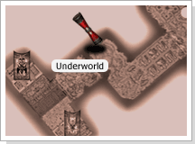

## Zona Elemental da Água

<html>
  <head>
    <meta charset="utf-8" />
    <meta name="viewport" content="width=device-width" />
  </head>
  <body>

O <strong>IMP</strong> obtido através de castelo de Janus mostrou aos Exploradores do continente o quanto os protegia dos Elementos Perigosos mesclados na natureza e dos monstros que aparecem nas Dungeons, Pantanos e Planicies. Com base nisto, foram feitas experiências nos seres úteis para transformá-los em <strong>'Familiar'</strong>. Nyerdes era o principal objeto do experimento. Mas era uma missão muito perigosa, pois exigia o uso de um documento chamado <strong>'Pergaminho da Convocação de Neses', que trazia dor, sofrimento, desgraça e até mesmo a morte para quem o usasse.</strong>

O 'Pergaminho da Convocação de Neses' era uma ferramenta utilizada para convocar os seres que foram transformados nas <strong>criaturas malignas arch</strong>. O texto a seguir e uma passagem de um documento escrito durante a época da Guerra Continental. Ao ler este texto, você poderá saber detalhadamente como o pergaminho de convocação de Neses foi utilizado.

"Tzfah, após a <strong>'Guerra Celestial'</strong>, juntou as forças com o Mago Real 'Neses' do Continente de Isotia, chamado 'Koren', através de um contrato. Ao mago foi confiado o dever de criar os seres poderosos e Archs malignos necessários para iniciar uma Guerra Continental. Os ingredientes necessários para criar tais seres foram preparados por Tzfah e seus seguidores. O pergaminho que transportaria aquelas criaturas-ingredientes que serviriam para formar os Arch's malignos e os habitantes do submundo para o mundo do meio era chamado de <strong>'Pergaminho da convocação de Neses'.</strong>

Tzfah colocou em cada um desses pergaminhos <strong>palavras secretas</strong> para que apenas ele e Neses pudessem reconhecê-las. Para que as criaturas necessárias fossem convocadas era preciso ler apenas as partes referentes a elas no pergaminho. Este foi o plano que impossibilitou o uso do pergaminho por outros.
						

Caso o pergaminho seja utilizado com uma linguagem errada, as criaturas seladas com as palavras secretas serão convocadas aleatoriamente, surgindo sem quebrar o selo. Por este motivo, o conjurador não terá qualquer domínio ou controle sobre elas."
						

<strong>Data e Autor desconhecidos</strong>

 	

Atualmente, mesmo pelas pesquisas dos sábios mais ilustres, não estamos conseguindo decifrar as 'Palavras Secretas'. Este pergaminho de convocação de Neses traz consigo os perigos, mas corre o boato de que o valor deste pergaminho é incalculável, mesmo que exista um grande perigo para consegui-lo. A verdade é que o número de vítimas está aumentando a cada hora que passa. Caso você consiga obter o pergaminho, mesmo que seja por acaso, espero que não o utilize. Sua vida não deve ser desperdiçada banalmente.

 
<table border="0" cellpadding="0" cellspacing="0">
	<tr>
		<td colspan="2" align="center"><strong>Pergaminho de Entrada</strong></td>
	</tr>
	<tr>
		<td width="150px" align="center"></td>
		<td>
<strong>Pergaminho da Água - Normal
</strong>
			
O Pergaminho da Água pode ser comprado no Premium Neil e também pode ser adquirido nos monstros das Dungeons. Esse item permite o acesso a uma sala onde você pode adquirir muitos itens bons.
</td>
	</tr>
	<tr>
		<td width="150px" align="center"></td>
		<td>
<strong>Pergaminho da Água - Místico
</strong>
			
O Pergaminho da Água pode ser comprado no Premium Neil e também pode ser adquirido nos monstros das Dungeons. Esse item permite o acesso a uma sala onde você pode adquirir muitos itens bons.
</td>
	</tr>
	<tr>
		<td width="150px" align="center"></td>
		<td>
<strong>Pergaminho da Água - Arcano
</strong>
			
O Pergaminho da Água pode ser comprado no Premium Neil e também pode ser adquirido nos monstros das Dungeons. Esse item permite o acesso a uma sala onde você pode adquirir muitos itens bons.
</td>
	</tr>
</table>
<table border="0" cellpadding="0" cellspacing="0">
	<tr>
		<td colspan="2" align="center"><strong>Evocação Neses</strong></td>
	</tr>
	<tr>
		<td width="250px" align="center"></td>
		<td>
Para obter o pergaminho de convocação de Neses você terá de passar por um procedimento no mínimo complicado. Dentro do mundo debaixo da terra pode-se obter algo chamado 'Pergaminho da Água'. Dizem os rumores que se trata de um pergaminho que permite a entrada para a 'Zona Elemental da Água', um local formado por 8 salas. Os monstros de cada sala possuem o 'Pergaminho da Água', que permite seguir para a próxima sala. A utilização do 'Pergaminho da Água' é permitida apenas em alguns pontos do Underworld. Você pode obter o pergaminho da convocação de Neses na oitava e última sala da zona.
</td>
	</tr>
	<tr>
		<td colspan="2" align="center"><strong>Procedimento</strong></td>
	</tr>
	<tr>
	<tr>
		<td width="250px" align="center"></td>
		<td>
		
1 - É formado por 8 salas e os 'Pergaminhos de Água' dropados pelos monstros de cada sala são transportados diretamente para o inventário do líder do 	grupo. Os membros do grupo são teleportados automaticamente.

		
2 - O pergaminho da convocação do Neses pode ser obtido ao derrotar todos os monstros até a sala de número 8, seguindo o procedimento acima.

		
3 - Ao utilizar o pergaminho da convocação de Neses (o local de utilização é o mesmo do 'Pergaminho de Água') você será transportado para uma região nova. Neste local os monstros aparecerão aleatoriamente e cada um trará uma recompensa diferente.
</td>
	</tr>
</table>
 

<strong>Normal</strong>

<table border="0" cellpadding="0" cellspacing="0" width="100%">
	<tr align="center">
		<td colspan="2" rowspan="2">
<strong>Monstros</strong>
</td>
		<td colspan="2">
<strong>Monstros Level 9 (Chefe)</strong>
</td>
	</tr>
	<tr align="center">
		<td>
<strong>Monstros Convocados</strong>
</td>
		<td>
<strong>Recompensas</strong>
</td>
	</tr>
	<tr>
		<td>
Meio Orc level 1
</td>
		<td>
Troll Caçador level 2
</td>
		<td>
Morlock, Mago Elfo Negro
</td>
		<td>
Resto de Oriharucon
</td>
	</tr>
	<tr>
		<td>
Chefe Ghoul level 3
</td>
		<td>
Ciclope Arqueiro level 4
</td>
		<td>
Troll Ghoul, Argos
</td>
		<td>
Poeira de Lactolerium
</td>
	</tr>
	<tr>
		<td>
Evocador Caveira level 5
</td>
		<td>
GrimLock Dourado level 6
</td>
		<td>
Mago Elfo Negro, Cav. Elfo Negro
</td>
		<td>
Poeira de Oriharucon
</td>
	</tr>
	<tr>
		<td>
Anc. Ciclope level 7
</td>
		<td>
Anf. Assassino level 8
</td>
		<td>
Aquagolem
</td>
		<td>
Nada
</td>
	</tr>
</table>

<strong>Místico</strong>

<table border="0" cellpadding="0" cellspacing="0" width="100%">
	<tr align="center">
		<td colspan="2" rowspan="2">
<strong>Monstros</strong>
</td>
		<td colspan="2">
<strong>Monstros level 9 (aparição de somente um tipo de monstro)</strong>
</td>
	</tr>
	<tr align="center">
		<td>
<strong>Monstros Convocados</strong>
</td>
		<td>
<strong>Recompensas</strong>
</td>
	</tr>
	<tr>
		<td>
Arqueiro Elfo level 1
</td>
		<td>
Troll Ghoul level 2
</td>
		<td>
Lorde_Demonio, Cav. Mortal
</td>
		<td>
Nada
</td>
	</tr>
	<tr>
		<td>
Anf. Ninja level 3
</td>
		<td>
Elfo level 4
</td>
		<td>
Cav. Mortal, Cav. Negro
</td>
		<td>
Poeira de Lactolerium
</td>
	</tr>
	<tr>
		<td>
GrimLock level 5
</td>
		<td>
Bruxa Elfa level 6
</td>
		<td>
Gárgula Sábi, Gárgula
</td>
		<td>
Poeira de Oriharucon
</td>
	</tr>
	<tr>
		<td>
Gárgula level 7
</td>
		<td>
Aquagolem level 8
</td>
		<td>
Hidra de Ouro
</td>
		<td>
Nada
</td>
	</tr>
</table>

<strong>Arcano</strong>

<table border="0" cellpadding="0" cellspacing="0" width="100%">
	<tr align="center">
		<td colspan="2" rowspan="2">
<strong>Monstros</strong>
</td>
		<td colspan="2">
<strong>Monstros Level 9 (Chefe)</strong>
</td>
	</tr>
	<tr align="center">
		<td>
<strong>Monstros Convocados</strong>
</td>
		<td>
<strong>Recompensas</strong>
</td>
	</tr>
	<tr>
		<td>
Gárgula level 1
</td>
		<td>
Golem de Fogo level 2
</td>
		<td>
Lugefer Maligno, Gárgula de Fogo
</td>
		<td>
Poeira de Lactolerium
</td>
	</tr>
	<tr>
		<td>
Cavaleiro Negro level 3
</td>
		<td>
Dragão Lich level 4
</td>
		<td>
Gárgula de Fogo, Ladrao Tauron
</td>
		<td>
Poeira de Lactolerium
</td>
	</tr>
	<tr>
		<td>
Tauron da Areia level 5
</td>
		<td>
Morlock level 6
</td>
		<td>
Assas. Taron, Taron da Areia
</td>
		<td>
Poeira de Oriharucon
</td>
	</tr>
	<tr>
		<td>
Anc. Ciclope level 7
</td>
		<td>
Verme da Areia level 8
</td>
		<td>
Treant
</td>
		<td>
Nada
</td>
	</tr>
</table>
 

<strong>Atenção:</strong>

O líder do grupo que está fazendo a quest deve reservar espaço no inventário para a criação do pergaminho da Água (2 quadros em vertical). Caso não tenha espaço no inventário para a criação do pergaminho da Água, ele será criado automaticamente na entrada da Zona de Elemental da Água.

Dentro das salas da 'Zona de Elemental da Água' não será permitido o uso de Convocações, Teleportes ou a utilização da Gema Estelar. Para prosseguir para a próxima sala é necessário que você utilize o Pergaminho dentro da sala que você está.

Caso existam outros personagens fazendo a quest na próxima sala que deseja ir, a passagem para ela não será permitida até que os usuários naquela sala terminem. Será exibida uma mensagem caso isso aconteça.

  </body>
</html>
