## Beast Master

<html>
  <head>
    <meta charset="utf-8" />
    <meta name="viewport" content="width=device-width" />
  </head>
  <body>

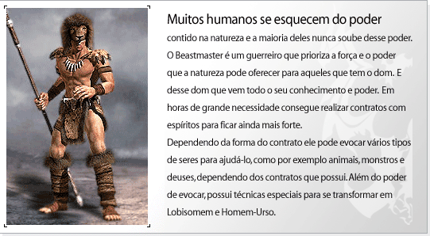

<strong>Evolução do Personagem</strong>

<table border="0" align="center">
	<tr align="center">
		<td><strong>Lista</strong></td>
		<td colspan="4"><strong>Aumento na capacidade por level</strong></td>
	</tr>
	<tr align="center">
		<td><strong>HP</strong></td>
		<td colspan="4">1</td>
	</tr>
	<tr align="center">
		<td><strong>MP</strong></td>
		<td colspan="4">2</td>
	</tr>
	<tr align="center">
		<td><strong>Defesa(AC)</strong></td>
		<td colspan="4">1</td>
	</tr>
	<tr align="center">
		<td><strong>Pontos de Aprendizagem</strong></td>
		<td colspan="4">2</td>
	</tr>
    <tr align="center">
		<td rowspan="2"><strong>Pontos de Status</strong></td>
		<td><strong>Level 1~255</strong></td>
        <td><strong>Level 256~300</strong></td>
        <td><strong>Level 301~355</strong></td>
        <td><strong>Level 356~400</strong></td>
	</tr>
    <tr align="center">
		<td><strong>5</strong></td>
        <td><strong>10</strong></td>
        <td><strong>20</strong></td>
        <td><strong>12</strong></td>
	</tr>
    <tr align="center">
		<td rowspan="2"><strong>Pontos de Skill</strong></td>
		<td><strong>Level 1~200</strong></td>
        <td><strong>Level 201~355</strong></td>
        <td><strong>Level 356~400</strong></td>
        <td></td>
	</tr>
    <tr align="center">
		<td><strong>3</strong></td>
        <td><strong>4</strong></td>
        <td><strong>3</strong></td>
        <td></td>
	</tr>
</table>

<strong>Tabela de Skill</strong>

 

<strong>Elemental</strong>
"Skill usada para convocar poderes dos espíritos. Possui um grande ataque e uma poderosa defesa."

<table align="center" border="0"  cellpadding="2" cellspacing="2">
	<tr align="center">
		<td>
Icon.
</td>
		<td>
Nome da Skill
</td>
		<td>
Requisitos
</td>
		<td>
Delay
</td>
		<td>
Atrib.
</td>
		<td>
Descrição
</td>
	</tr>
	<tr>
		<td align="center">
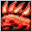
</td>
		<td align="center">
Fera Flamenjante
</td>
		<td align="center">
1 / 24 / 0
</td>
		<td align="center">
2
</td>
		<td align="center">
Fogo
</td>
		<td>
Ataque normal +25
</td>
	</tr>
	<tr>
		<td align="center">
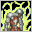
</td>
		<td align="center">
Chamas Etéreas
</td>
		<td align="center">
1 / 36 / 0
</td>
		<td align="center">
30
</td>
		<td align="center">
N
</td>
		<td>
Consome MP do inimigo
</td>
	</tr>
	<tr>
		<td align="center">

</td>
		<td align="center">
Som das Fadas
</td>
		<td align="center">
36 / 69 / 0
</td>
		<td align="center">
3
</td>
		<td align="center">
N
</td>
		<td>
Ataque normal +115
</td>
	</tr>
	<tr>
		<td align="center">

</td>
		<td align="center">
Enfraquecer
</td>
		<td align="center">
46 / 66 / 0
</td>
		<td align="center">
2
</td>
		<td align="center">
N
</td>
		<td>
Reduz o ataque no inimigo
</td>
	</tr>
	<tr>
		<td align="center">

</td>
		<td align="center">
Furia de Gaia
</td>
		<td align="center">
64 / 75 / 63
</td>
		<td align="center">
4
</td>
		<td align="center">
N
</td>
		<td>
Ataque normal +220
</td>
	</tr>
	<tr>
		<td align="center">

</td>
		<td align="center">
Proteção Elemental
</td>
		<td align="center">
82 / 78 / 81
</td>
		<td align="center">
15
</td>
		<td align="center">
N
</td>
		<td>
Aumento de Resistência
</td>
	</tr>
	<tr>
		<td align="center">

</td>
		<td align="center">
Força Elemental
</td>
		<td align="center">
136 / 90 / 135
</td>
		<td align="center">
1
</td>
		<td align="center">
N
</td>
		<td>
Ataque normal +160
</td>
	</tr>
	<tr>
		<td align="center">

</td>
		<td align="center">
Espírito Vingador (8ª Skill)
</td>
		<td align="center">
220 / 239 / 200
</td>
		<td align="center">
5
</td>
		<td align="center">
N
</td>
		<td>
Ataque normal +140
</td>
	</tr>
	<tr>
		<td align="center">

</td>
		<td align="center">
Anti Magia (9ª Skill)
</td>
		<td align="center">
Possuir todas as Skills anteriores.
</td>
		<td align="center">
---
</td>
		<td align="center">
N
</td>
		<td>
	Cria um escudo mágico que aumenta a esquiva contra danos mágicos.
</td>
	</tr>
	<tr>
		<td align="center">

</td>
		<td align="center">
Chama Resistente  (10ª Skill)
</td>
		<td align="center">
Possuir todas as Skills anteriores.
</td>
		<td align="center">
---
</td>
		<td align="center">
Fogo
</td>
		<td>
Ataque de fogo contra o inimigo. (Ativa)
</td>
	</tr>
</table>

*Requisitos (Level / Custo da Skill/ Pontos necessários na linhagem)

 

<strong>Evocação</strong>
A evocação está restrita a um tipo de monstro por vez. O HP de cada monstro convocado será alterado de acordo com a quantidade de montros. Os montros Grande Tigrer,Gorila

<table align="center" border="0"  cellpadding="2" cellspacing="2">
	<tr align="center">
		<td>
Icon.
</td>
		<td>
Nome da Skill
</td>
		<td>
Requisitos
</td>
		<td>
Delay
</td>
		<td>
Atrib.
</td>
		<td>
Descrição
</td>
	</tr>
	<tr>
		<td align="center">

</td>
		<td align="center">
Evocar Condor
</td>
		<td align="center">
1 / 33 / 0
</td>
		<td align="center">
5
</td>
		<td align="center">
N
</td>
		<td>
1 monstro a cada 30 pontos de aprendizagem na linhagem
</td>
	</tr>
	<tr>
		<td align="center">

</td>
		<td align="center">
Evocar Javali Selvagem
</td>
		<td align="center">
1 / 51 / 0
</td>
		<td align="center">
5
</td>
		<td align="center">
N
</td>
		<td>
1 monstro a cada 30 pontos de aprendizagem na linhagem
</td>
	</tr>
	<tr>
		<td align="center">

</td>
		<td align="center">
Evocar Lobo
</td>
		<td align="center">
47 / 72 / 0
</td>
		<td align="center">
5
</td>
		<td align="center">
N
</td>
		<td>
1 monstro a cada 40 pontos de aprendizagem na linhagem
</td>
	</tr>
	<tr>
		<td align="center">

</td>
		<td align="center">
Evocar Urso Selvagem
</td>
		<td align="center">
54 / 72 / 0
</td>
		<td align="center">
5
</td>
		<td align="center">
N
</td>
		<td>
1 monstro a cada 40 pontos de aprendizagem na linhagem
</td>
	</tr>
	<tr>
		<td align="center">

</td>
		<td align="center">
Evocar Grande Tigre
</td>
		<td align="center">
73 / 84 / 86
</td>
		<td align="center">
5
</td>
		<td align="center">
N
</td>
		<td>
1 monstro a cada 40 pontos de aprendizagem na linhagem
</td>
	</tr>
	<tr>
		<td align="center">
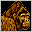
</td>
		<td align="center">
Evocar Gorila Gigante
</td>
		<td align="center">
95 / 93 / 112
</td>
		<td align="center">
5
</td>
		<td align="center">
N
</td>
		<td>
1 monstro a cada 80 pontos de aprendizagem na linhagem
</td>
	</tr>
	<tr>
		<td align="center">
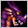
</td>
		<td align="center">
Evocar Dragão Negro
</td>
		<td align="center">
140 / 102 / 166
</td>
		<td align="center">
5
</td>
		<td align="center">
N
</td>
		<td>
1 monstro a cada 80 pontos de aprendizagem na linhagem
</td>
	</tr>
	<tr>
		<td align="center">

</td>
		<td align="center">
Evocar Succubus (8ª Skill)
</td>
		<td align="center">
220 / 220 / 200
</td>
		<td align="center">
20
</td>
		<td align="center">
N
</td>
		<td>
1 monstro
</td>
	</tr>
	<tr>
		<td align="center">

</td>
		<td align="center">
Unidade mental (9ª Skill)
</td>
		<td align="center">
Possuir todas as Skills anteriores.
</td>
		<td align="center">
---
</td>
		<td align="center">
N
</td>
		<td>
Aumenta a habilidade de evocação.
</td>
	</tr>
	<tr>
		<td align="center">

</td>
		<td align="center">
Invocação Final (10ª Skill)
</td>
		<td align="center">
Possuir todas as Skills anteriores.
</td>
		<td align="center">
---
</td>
		<td align="center">
N
</td>
		<td>
Aumenta a habilidade de evocação, evoca monstro especial. (Passiva)
</td>
	</tr>
</table>

*Requisitos (Level / Custo da Skill/ Pontos necessários na linhagem)

 

<strong>Natureza</strong>
Permite que o BeastMaster se transforme em um Lobisomem ou em um Homem-Urso e utilizar outras habilidades da Linhagem

<table align="center" border="0"  cellpadding="2" cellspacing="2">
	<tr align="center">
		<td>
Icon.
</td>
		<td>
Nome da Skill
</td>
		<td>
Requisitos
</td>
		<td>
Delay
</td>
		<td>
Atrib.
</td>
		<td>
Descrição
</td>
	</tr>
	<tr>
		<td align="center">

</td>
		<td align="center">
Lobisomem
</td>
		<td align="center">
1 / 33 / 0
</td>
		<td align="center">
20
</td>
		<td align="center">
N
</td>
		<td>
Transforma-se em Lobisomem
</td>
	</tr>
	<tr>
		<td align="center">

</td>
		<td align="center">
Armadura Elemental
</td>
		<td align="center">
1 / 45 / 0
</td>
		<td align="center">
-
</td>
		<td align="center">
N
</td>
		<td>
Aumenta absorção ao usar o escudo.
</td>
	</tr>
	<tr>
		<td align="center">

</td>
		<td align="center">
Homem-Urso
</td>
		<td align="center">
44 / 65 / 0
</td>
		<td align="center">
20
</td>
		<td align="center">
N
</td>
		<td>
Transforma-se em Homem Urso
</td>
	</tr>
	<tr>
		<td align="center">
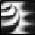
</td>
		<td align="center">
Escudo do Tormento
</td>
		<td align="center">
44 / 45 / 0
</td>
		<td align="center">
-
</td>
		<td align="center">
N
</td>
		<td>
Bônus de defesa ao usar um escudo.
</td>
	</tr>
	<tr>
		<td align="center">
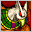
</td>
		<td align="center">
Astaroth
</td>
		<td align="center">
89 / 99 / 88
</td>
		<td align="center">
20
</td>
		<td align="center">
N
</td>
		<td>
Transforma-se em Corvo Infernal
</td>
	</tr>
	<tr>
		<td align="center">

</td>
		<td align="center">
Metamorfose Superior
</td>
		<td align="center">
89 / 45 / 88
</td>
		<td align="center">
-
</td>
		<td align="center">
N
</td>
		<td>
Aumenta a capacidade de todas transformações
</td>
	</tr>
	<tr>
		<td align="center">
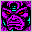
</td>
		<td align="center">
Titã
</td>
		<td align="center">
141 / 132 / 140
</td>
		<td align="center">
20
</td>
		<td align="center">
N
</td>
		<td>
Transforma-se em Titã
</td>
	</tr>
	<tr>
		<td align="center">
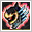
</td>
		<td align="center">
Éden (8ª Skill)
</td>
		<td align="center">
220 / 212 / 200
</td>
		<td align="center">
20
</td>
		<td align="center">
N
</td>
		<td>
Transforma-se em Eden
</td>
	</tr>
	<tr>
		<td align="center">

</td>
		<td align="center">
Concha resistente (9ª Skill)
</td>
		<td align="center">
Possuir todas as Skills anteriores.
</td>
		<td align="center">
---
</td>
		<td align="center">
N
</td>
		<td>
Adiciona chance aleatória de dano crítico.
</td>
	</tr>
	<tr>
		<td align="center">

</td>
		<td align="center">
Espinhos Fortalecidos (10ª Skill)
</td>
		<td align="center">
Possuir todas as Skills anteriores.
</td>
		<td align="center">
---
</td>
		<td align="center">
N
</td>
		<td>
Aumenta o número de espinhos reflexivos. (Passiva)
</td>
	</tr>
</table>

*Requisitos (Level / Custo da Skill/ Pontos necessários na linhagem)

 

<strong>8ª Skill</strong>

-A 8ª Skill só pode ser obtida após aprender todas da linhagem desejada. Não é possível adquirir mais de uma 8ª Skill. Caso você decida utilizar o Círculo Divino ou um Reset de Skill, você deverá comprar a 8ª Skill novamente, pois a mesma também é resetada. 						
-O dano causado pela skill dependerá dos pontos de aprendizagem na linhagem escolhida, Atributos do personagem, e armar e armaduras equipadas. Os pontos de Mana aumentam de acordo com os Pontos de Skill. O Máximo de aprendizado nas linhagens é de 200 e pode ser aumentado dependendo dos itens. 

<strong>9ª Skill</strong>

- NPCs venderão a 9ª skill por 2000 pontos de fama. 
- Para comprar a 9ª skill será necessário ter aprendido todas as skills anteriores da mesma linhagem. 
- É possível aprender apenas uma 9ª skill. 
- Ao aprender a 9ª skill a linhagem terá um novo limite de aprendizagem (320 pontos). 
- A habilidade poderá ser removida utilizando-se o Círculo divino puro de sua linhagem.

<strong>10ª Skill</strong>

- Livros da 10ª Skill podem ser adquiridos através da caça de determinados monstros como Kefra, Beriel e LugeferMaligno (Água 'A'). 
- O aprendizado da 10ª Skill é semelhante à 9ª Skill, depende da linhagem e custa 4000 pontos de fama do personagem. 
- É possível aprender somente uma 10ª Skill. 
- 10ª Skill pode ser inicializada ao utilizar o item "Círculo Divino Completo Puro".

<a href="https://github.com/RonierBastos/Coisas-de-Wyd/blob/master/Guias%20WYD%20BR/Iniciante/Quests/Quests%20Archs/Runas-Secretas.md">
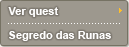
</a>

O Nome e Classe do personagem Celestial será baseada no Personagem Arch e você pode comprar a nova Skills Sephira para Celestial: 'Limite da Alma'. * Você pode utilizar a Skill "Limite da Alma" após aprender a 8ª Skill e a mesma aumentará a habilidade de classe.
  
Você não poderá realizar as QUESTs "Pesadelo" e "Cubo da Maldade". No entanto, se você utilizar a "Carta do Pesadelo" você poderá realizar a QUEST "Pesadelo" 24 vezes. * O tempo de espera da "Carta do Pesadelo" é de 20 horas e quando você reutiliza ele, irá acumular o tempo que ainda não foi utilizado.

<strong>Celestial seguem o tipo de Armadura do Arch.</strong>

Personagens Celestiais, possuem a vantagem de não possuir restrição de level para utilizar Armaduras. Personagens Celestiais, possuem a vantagem de não possuir restrição de classe da arma, com exceção de armas Classe E.

<strong> Evolução do Personagem Celestial</strong>

As Habilidades do Celestial irá depender do Arch, após completar com sucesso a QUEST "Segredo das Runas".

<strong>Pontos Iniciais</strong>

- Pontos de Status 1,001 / Pontos de Aprendizagem 855 / Pontos de Skill 1,500

<strong>Os pontos Bônus do Celestial dependem do level do Arch na hora da evolução para Celestial</strong>

<table align="center" border="0"  cellpadding="5" cellspacing="5">
	<tr>
		<td>
Level alcançado
</td>
		<td>
356 ~ 370
</td>
		<td>
371 ~ 380
</td>
		<td>
381 ~ 398
</td>
		<td>
399
</td>
		<td>
400
</td>
	</tr>
	<tr>
		<td>

</td>
		<td>
Fera Flamejante
</td>
		<td>
1 / 24 / 0
</td>
		<td>
2
</td>
		<td>
Fogo
</td>
		<td>
Ataque normal +25
</td>
	</tr>
	<tr>
		<td>

</td>
		<td>
Fera Flamejante
</td>
		<td>
1 / 24 / 0
</td>
		<td>
2
</td>
		<td>
Fogo
</td>
		<td>
Ataque normal +25
</td>
	</tr>
	<tr>
		<td>

</td>
		<td>
Fera Flamejante
</td>
		<td>
1 / 24 / 0
</td>
		<td>
2
</td>
		<td>
Fogo
</td>
		<td>
Ataque normal +25
</td>
	</tr>
	<tr>
		<td>

</td>
		<td>
Fera Flamejante
</td>
		<td>
1 / 24 / 0
</td>
		<td>
2
</td>
		<td>
Fogo
</td>
		<td>
Ataque normal +25
</td>
	</tr>
	<tr>
		<td>

</td>
		<td>
Fera Flamejante
</td>
		<td>
1 / 24 / 0
</td>
		<td>
2
</td>
		<td>
Fogo
</td>
		<td>
Ataque normal +25
</td>
	</tr>
	<tr>
		<td>

</td>
		<td>
Fera Flamejante
</td>
		<td>
1 / 24 / 0
</td>
		<td>
2
</td>
		<td>
Fogo
</td>
		<td>
Ataque normal +25
</td>
	</tr>
	<tr>
		<td>

</td>
		<td>
Fera Flamejante
</td>
		<td>
1 / 24 / 0
</td>
		<td>
2
</td>
		<td>
Fogo
</td>
		<td>
Ataque normal +25
</td>
	</tr>
	<tr>
		<td>

</td>
		<td>
Fera Flamejante
</td>
		<td>
1 / 24 / 0
</td>
		<td>
2
</td>
		<td>
Fogo
</td>
		<td>
Ataque normal +25
</td>
	</tr>		
</table>

Os pontos Bônus do Celestial dependem de quantas salas da QUEST <a href="https://github.com/RonierBastos/Coisas-de-Wyd/blob/master/Guias%20WYD%20BR/Iniciante/Quests/Quests%20Archs/Contrato-dos-Espiritos.md">"Contrato dos Espíritos"</a> o Arch passar

<table align="center" border="0"  cellpadding="5" cellspacing="5">
	<tr>
		<td>
Fase
</td>									
		<td>
1
</td>									
		<td>
2
</td>									
		<td>
3
</td>									
		<td>
4
</td>
	</tr>
	<tr>
		<td>
Pontos de Bônus
</td>
		<td>
100
</td>
		<td>
200
</td>
		<td>
300
</td>
		<td>p>400
</td>
	</tr>		
</table>

Aumento de Habilidade por level

<table align="center" border="0"  cellpadding="5" cellspacing="5">
	<tr>
		<td>
Aumento de habilidade por cada classe
</td>
		<td>
TransKnight

			
HP 4, MP 1
</td>
		<td>
Foema

			
HP 1, MP 3
</td>									
		<td>
BeastMaster

			
HP 1, MP 4
</td>
		<td>
Huntress

			
HP 2, MP 2
</td>
	</tr>
	<tr>									
		<td>
Pontos de habilidade comum
</td>
		<td>
Pontos de Status

			
6
</td>
		<td>
Pontos de Skill

			
4
</td>
		<td>
Pontos de Aprendizagem

			
2
</td>
		<td>
DEF
									
			
2
</td>
	</tr>								
</table>

<strong>Recompensa ao se tornar Celestial</strong>

Para refinar a Capa do Celestial não é necessário somente as Poeiras de Lactolerium ou Oriharucon. Para refinar a Capa você precisa de Poerias de Lactolerium e outros ingredientes.

Você pode refinar sua capa no NPC Odin localizado no Continente Desconhecido. 2 Pergaminhos Selados, 1 Selo Mágico e 4 Packs de Lactolerium são necessários para refinar a Capa do Celestial. Refinação possui 100% de sucesso.

<table align="center" border="0"  cellpadding="5" cellspacing="5">
	<tr>			
		<td rowspan="3">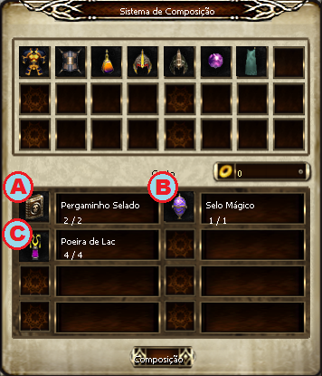</td>
		<td colspan="2">
1 - Slot A : Pergaminho Selado
				
						
2 - Slot B : Selo Mágico
				
						
3 - Slot C : pack de LActolerium
</td>
	</tr>
	<tr>						
		<td>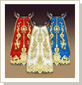</td>
		<td>
[Mestre da Capa]
									
			
Pode ser obtido do Arch e é a real prova de que você é um Líder do Reino.
</td>
	</tr>
	<tr>
		<td>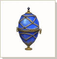</td>
		<td>
[Selo Mágico]
									
			
Dropado no Monstro Chefe encontrado em "hagalz - 8ª Carta Mágica"
</td>
	</tr>		
</table>		

Você poderá usar a Cythera(melhor elmo do jogo) no slot do Elmo e o tipo da Cythera que você receberá é baseado no level do personagem Arch no momento da evolução para Celestial. Item móvel.

<table align="center" border="0"  cellpadding="5" cellspacing="5"> 
	<tr align="center">
		<td>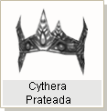</td>
		<td width="150px">Arch level  356 ~ 380</td>
		<td width="200px">DEF 80, -10% consumo de MP, 30 perfuração</td>
		<td width="200px">Classe F, item móvel, utilizado no slot do Elmo</td>
	</tr>
	<tr><tr align="center">
		<td>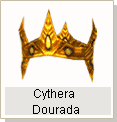</td>
		<td width="150px">Arch level  381 ~ 399</td>
		<td width="200px">DEF 80, -10% consumo de MP, 30 perfuração, 30 absorção de dano</td>
		<td width="200px">Classe F, item móvel, utilizado no slot do Elmo</td>
	</tr>
	<tr><tr align="center">
		<td>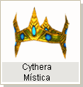</td>
		<td width="150px">Arch level 400</td>
		<td width="200px">DEF 80, -10% consumo de MP, 40 perfuração, 40 absorção de dano</td>
		<td width="200px">Classe F, item móvel, utilizado no slot do Elmo</td>
	</tr>
  <table>

<strong>Atenção:</strong> caso o arch possua alguma Cythera equipada no momento da criação do Celestial, a mesma será sobreposta pela nova, sendo perdida para sempre. Essa perda é irrecuperável, portanto, é aconselhável que a remova antes de criar o seu Celestial.

<strong>Soul Type</strong>

Você pode alterar o atributo da Skill "Limite da Alma" levando as joias ao NPC Ehre na Cidade de Erion.

<table>
	<tr>
		<td rowspan="13" widthh="px">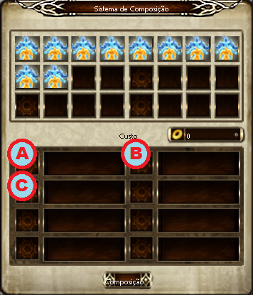</td>
		<td colspan="4"></td>
	</tr>
	<tr>		
		<td colspan="3">Joias</td>		
		<td rowspan="2">Atributo</td>
	</tr>
	<tr>	
		<td>A</td>
		<td>B</td>
		<td>C</td>
	</tr>
	<tr>				
		<td>Diamante</td>
		<td>Diamante</td>
		<td>Diamante</td>
		<td>FOR/CON</td>
	</tr>
	<tr>
		<td>Esmeralda</td>
		<td>Esmeralda</td>
		<td>Esmeralda</td>
		<td>INT/CON</td>
	</tr>
	<tr>				
		<td>Coral</td>
		<td>Coral</td>
		<td>Coral</td>
		<td>DES/CON</td>
	</tr>
	<tr>
		<td>Garnet</td>
		<td>Garnet</td>
		<td>Garnet</td>
		<td>FOR/DES</td>
	</tr>
	<tr>				
		<td>Diamante</td>
		<td>Emeralda</td>
		<td>Coral</td>
		<td>INT/DES</td>
	</tr>
	<tr>				
		<td>Diamante</td>
		<td>Coral</td>
		<td>Garnet</td>
		<td>CON/DES</td>
	</tr>
	<tr>				
		<td>Esmeralda</td>
		<td>Coral</td>
		<td>Garnet</td>
		<td>FOR</td>
	</tr>
	<tr>				
		<td>Esmeralda</td>
		<td>Diamante</td>
		<td>Coral</td>
		<td>INT</td>
	</tr>
	<tr>				
		<td>Coral</td>
		<td>Esmeralda</td>
		<td>Garnet</td>
		<td>CON</td>
	</tr>
	<tr>				
		<td>Garnet</td>
		<td>Diamante</td>
		<td>Conta</td>
		<td>DES</td>
	</tr>	
</table>

<strong>Atenção</strong>

Você deve colocar as joias na ordem correta. 
(Caso as joias sejam colocadas na ordem incorreta, as mesmas irão desaparecer e o atributo da Skill não será alterado )

  </body>
</html>
