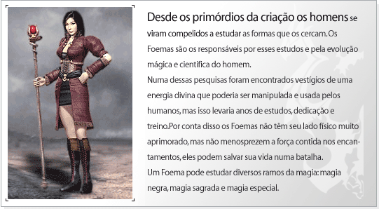

## Foema

<html>
  <head>
    <meta charset="utf-8" />
    <meta name="viewport" content="width=device-width" />
  </head>
  <body>

<strong>Evolução do Personagem</strong>

<table border="0" align="center">
	<tr align="center">
		<td><strong>Lista</strong></td>
		<td colspan="4"><strong>Aumento na capacidade por level</strong></td>
	</tr>
	<tr align="center">
		<td><strong>HP</strong></td>
		<td colspan="4">1</td>
	</tr>
	<tr align="center">
		<td><strong>MP</strong></td>
		<td colspan="4">3</td>
	</tr>
	<tr align="center">
		<td><strong>Defesa(AC)</strong></td>
		<td colspan="4">1</td>
	</tr>
	<tr align="center">
		<td><strong>Pontos de Aprendizagem</strong></td>
		<td colspan="4">2</td>
	</tr>
    <tr align="center">
		<td rowspan="2"><strong>Pontos de Status</strong></td>
		<td><strong>Level 1~255</strong></td>
        <td><strong>Level 256~300</strong></td>
        <td><strong>Level 301~355</strong></td>
        <td><strong>Level 356~400</strong></td>
	</tr>
    <tr align="center">
		<td><strong>5</strong></td>
        <td><strong>10</strong></td>
        <td><strong>20</strong></td>
        <td><strong>12</strong></td>
	</tr>
    <tr align="center">
		<td rowspan="2"><strong>Pontos de Skill</strong></td>
		<td><strong>Level 1~200</strong></td>
        <td><strong>Level 201~355</strong></td>
        <td><strong>Level 356~400</strong></td>
        <td></td>
	</tr>
    <tr align="center">
		<td><strong>3</strong></td>
        <td><strong>4</strong></td>
        <td><strong>3</strong></td>
        <td></td>
	</tr>
</table>

<strong>Tabela de Skill</strong>

 

<strong>Magia Sagrada</strong>
 Recuperar HP , ressuscitar, ataque com elemento sagrado e remover status negativos.

<table align="center" border="0"  cellpadding="2" cellspacing="2">
	<tr align="center">
		<td>
Icon.
</td>
		<td>
Nome da Skill
</td>
		<td>
Requisitos
</td>
		<td>
Delay
</td>
		<td>
Atrib.
</td>
		<td>
Descrição
</td>
	</tr>
	<tr>
		<td align="center">

</td>
		<td align="center">
Flecha Mágica
</td>
		<td align="center">
1 / 12 / 0
</td>
		<td align="center">
2
</td>
		<td align="center">
Sagrado
</td>
		<td>
Ataque normal +15
</td>
	</tr>
	<tr>
		<td align="center">

</td>
		<td align="center">
Desintoxicar
</td>
		<td align="center">
20 / 42 / 0
</td>
		<td align="center">
3
</td>
		<td align="center">
N
</td>
		<td>
Cura todo o status negativo do personagem
</td>
	</tr>
	<tr>
		<td align="center">

</td>
		<td align="center">
Flash
</td>
		<td align="center">
34 / 66 / 0
</td>
		<td align="center">
8
</td>
		<td align="center">
N
</td>
		<td>
Obstrui a visão do inimigo
</td>
	</tr>
	<tr>
		<td align="center">

</td>
		<td align="center">
Cura
</td>
		<td align="center">
1 / 48 / 0
</td>
		<td align="center">
2
</td>
		<td align="center">
N
</td>
		<td>
Recupera HP do personagem
</td>
	</tr>
	<tr>
		<td align="center">

</td>
		<td align="center">
Choque Divino
</td>
		<td align="center">
58 / 78 / 86
</td>
		<td align="center">
3
</td>
		<td align="center">
Sagrado
</td>
		<td>
Ataque normal +155
</td>
	</tr>
	<tr>
		<td align="center">

</td>
		<td align="center">
Recuperar
</td>
		<td align="center">
69 / 48 / 102
</td>
		<td align="center">
3
</td>
		<td align="center">
N
</td>
		<td>
Recupera o HP de todos os membros do grupo
</td>
	</tr>
	<tr>
		<td align="center">

</td>
		<td align="center">
Julgamento Divino
</td>
		<td align="center">
133 / 102 / 180
</td>
		<td align="center">
10
</td>
		<td align="center">
Sagrado
</td>
		<td>
Ataque normal +200
</td>
	</tr>
	<tr>
		<td align="center">

</td>
		<td align="center">
Renascimento(8ª Skill)
</td>
		<td align="center">
220 / 281 / 200
</td>
		<td align="center">
5
</td>
		<td align="center">
N
</td>
		<td>
Ressuscita membros do Grupo ou Guilda mortos
</td>
	</tr>
	<tr>
		<td align="center">

</td>
		<td align="center">
Cenote (9ª Skill)
</td>
		<td align="center">
Possuir todas as Skills anteriores.
</td>
		<td align="center">
---
</td>
		<td align="center">
N
</td>
		<td>
Recuperação de vida será dobrada aleatoriamente.
</td>
	</tr>
	<tr>
		<td align="center">

</td>
		<td align="center">
Proteção Absoluta (10ª Skill)
</td>
		<td align="center">
Possuir todas as Skills anteriores.
</td>
		<td align="center">
---
</td>
		<td align="center">
Fogo
</td>
		<td>
Proteção absoluta. (Ativa)
</td>
	</tr>
</table>

*Requisitos (Level / Custo da Skill/ Pontos necessários na linhagem)

 

<strong>Magia Negra</strong>
 Consegue seus poderes dos céus em forma de fogo, gelo e relâmpagos.

<table align="center" border="0"  cellpadding="2" cellspacing="2">
	<tr align="center">
		<td>
Icon.
</td>
		<td>
Nome da Skill
</td>
		<td>
Requisitos
</td>
		<td>
Delay
</td>
		<td>
Atrib.
</td>
		<td>
Descrição
</td>
	</tr>
	<tr>
		<td align="center">

</td>
		<td align="center">
Ataque de Fogo
</td>
		<td align="center">
1 / 18 / 0
</td>
		<td align="center">
2
</td>
		<td align="center">
Fogo
</td>
		<td>
Ataque normal + 20
</td>
	</tr>
	<tr>
		<td align="center">

</td>
		<td align="center">
Relâmpago
</td>
		<td align="center">
1 / 51 / 0
</td>
		<td align="center">
3
</td>
		<td align="center">
Relâmpago
</td>
		<td>
	Ataque normal + 65
</td>
	</tr>
	<tr>
		<td align="center">

</td>
		<td align="center">
Lança de Gelo
</td>
		<td align="center">
30 / 69 / 0
</td>
		<td align="center">
3
</td>
		<td align="center">
Gelo
</td>
		<td>
Ataque normal + 95, congelamento
</td>
	</tr>
	<tr>
		<td align="center">

</td>
		<td align="center">
Tempestade de Meteoros
</td>
		<td align="center">
46 / 72 / 0
</td>
		<td align="center">
5
</td>
		<td align="center">
Fogo
</td>
		<td>
Ataque normal + 55
</td>
	</tr>
	<tr>
		<td align="center">

</td>
		<td align="center">
Nevasca
</td>
		<td align="center">
76 / 72 / 112
</td>
		<td align="center">
5
</td>
		<td align="center">
Gelo
</td>
		<td>
Ataque normal +200, congelamento
</td>
	</tr>
	<tr>
		<td align="center">

</td>
		<td align="center">
Trovão
</td>
		<td align="center">
100 / 90 / 148
</td>
		<td align="center">
1
</td>
		<td align="center">
Relâmpago
</td>
		<td>
Ataque normal +100
</td>
	</tr>
	<tr>
		<td align="center">

</td>
		<td align="center">
Fênix de Fogo
</td>
		<td align="center">
140 / 81 / 190
</td>
		<td align="center">
7
</td>
		<td align="center">
Fogo
</td>
		<td>
Ataque normal +350
</td>
	</tr>
	<tr>
		<td align="center">

</td>
		<td align="center">
Inferno (8ª Skill)
</td>
		<td align="center">
220 / 224 / 200
</td>
		<td align="center">
7
</td>
		<td align="center">
Fogo
</td>
		<td>
Ataque normal +340
</td>
	</tr>
	<tr>
		<td align="center">

</td>
		<td align="center">
Magia Misteriosa (9ª Skill)
</td>
		<td align="center">
Possuir todas as Skills anteriores.
</td>
		<td align="center">
---
</td>
		<td align="center">
N
</td>
		<td>
	Adiciona mais dano durante 5 minutos, aumentando o consumo de mana
</td>
	</tr>
	<tr>
		<td align="center">

</td>
		<td align="center">
Congelamento Proficiente (10ª Skill)
</td>
		<td align="center">
Possuir todas as Skills anteriores.
</td>
		<td align="center">
---
</td>
		<td align="center">
N
</td>
		<td>
Congela o inimigo. (Passiva)
</td>
	</tr>
</table>

*Requisitos (Level / Custo da Skill/ Pontos necessários na linhagem)

 

<strong>Magia Especial</strong>
 Skills mágicas conseguidas através da natureza e dos deuses.

<table align="center" border="0"  cellpadding="2" cellspacing="2">
	<tr align="center">
		<td>
Icon.
</td>
		<td>
Nome da Skill
</td>
		<td>
Requisitos
</td>
		<td>
Delay
</td>
		<td>
Atrib.
</td>
		<td>
Descrição
</td>
	</tr>
	<tr>
		<td align="center">

</td>
		<td align="center">
Névoa Venenosa
</td>
		<td align="center">
1 / 24 / 0
</td>
		<td align="center">
2
</td>
		<td align="center">
Veneno
</td>
		<td>
Ataque normal + 20, envenenamento
</td>
	</tr>
	<tr>
		<td align="center">

</td>
		<td align="center">
Velocidade
</td>
		<td align="center">
22 / 39 / 0
</td>
		<td align="center">
3
</td>
		<td align="center">
N
</td>
		<td>
Aumento da velocidade
</td>
	</tr>
	<tr>
		<td align="center">

</td>
		<td align="center">
Teleporte
</td>
		<td align="center">
1 / 54 / 0
</td>
		<td align="center">
1
</td>
		<td align="center">
N
</td>
		<td>
Convoca membros do grupo
</td>
	</tr>
	<tr>
		<td align="center">

</td>
		<td align="center">
Escudo Mágico
</td>
		<td align="center">
34 / 63 / 0
</td>
		<td align="center">
1
</td>
		<td align="center">
N
</td>
		<td>
Aumento de defesa
</td>
	</tr>
	<tr>
		<td align="center">

</td>
		<td align="center">
Arma Mágica
</td>
		<td align="center">
61 / 75 / 60
</td>
		<td align="center">
3
</td>
		<td align="center">
N
</td>
		<td>
Aumento ao ataque físico
</td>
	</tr>
	<tr>
		<td align="center">

</td>
		<td align="center">
Toque de Athena
</td>
		<td align="center">
77 / 72 / 76
</td>
		<td align="center">
4
</td>
		<td align="center">
N
</td>
		<td>
Aumento de todos os pontos de aprendizagem
</td>
	</tr>
	<tr>
		<td align="center">

</td>
		<td align="center">
Controle de Mana
</td>
		<td align="center">
141 / 81 / 200
</td>
		<td align="center">
1
</td>
		<td align="center">
N
</td>
		<td>
Reduz o MP e converte em HP
</td>
	</tr>
	<tr>
		<td align="center">

</td>
		<td align="center">
Cancelamento (8ª Skill)
</td>
		<td align="center">
220 / 269 / 200
</td>
		<td align="center">
N
</td>
		<td align="center">
N
</td>
		<td>
Desabilita o uso de poções
</td>
	</tr>
	<tr>
		<td align="center">

</td>
		<td align="center">
Remover memória (9ª Skill)
</td>
		<td align="center">
Possuir todas as Skills anteriores.
</td>
		<td align="center">
---
</td>
		<td align="center">
N
</td>
		<td>
O personagem alvo não poderá se mover ou utilizar poções.
</td>
	</tr>
	<tr>
		<td align="center">

</td>
		<td align="center">
Incapacitador (10ª Skill)
</td>
		<td align="center">
Possuir todas as Skills anteriores.
</td>
		<td align="center">
---
</td>
		<td align="center">
N
</td>
		<td>
Remove status adicionais do inimigo (debuff). (Ativa)
</td>
	</tr>
</table>

*Requisitos (Level / Custo da Skill/ Pontos necessários na linhagem)

 

<strong>8ª Skill</strong>

-A 8ª Skill só pode ser obtida após aprender todas da linhagem desejada. Não é possível adquirir mais de uma 8ª Skill. Caso você decida utilizar o Círculo Divino ou um Reset de Skill, você deverá comprar a 8ª Skill novamente, pois a mesma também é resetada. 						
-O dano causado pela skill dependerá dos pontos de aprendizagem na linhagem escolhida, atributos do personagem, e armar e armaduras equipadas. Os pontos de Mana aumentam de acordo com os Pontos de Skill. O Máximo de aprendizado nas linhagens é de 200 e pode ser aumentado dependendo dos itens. 

 

<strong>9ª Skill</strong>

- NPCs venderão a 9ª skill por 2000 pontos de fama. 
- Para comprar a 9ª skill será necessário ter aprendido todas as skills anteriores da mesma linhagem. 
- É possível aprender apenas uma 9ª skill. 
- Ao aprender a 9ª skill a linhagem terá um novo limite de aprendizagem (320 pontos). 
- A habilidade poderá ser removida utilizando-se o Círculo divino puro de sua linhagem.

 

<strong>10ª Skill</strong>

- Livros da 10ª Skill podem ser adquiridos através da caça de determinados monstros como Kefra, Beriel e LugeferMaligno (Água 'A'). 
- O aprendizado da 10ª Skill é semelhante à 9ª Skill, depende da linhagem e custa 4000 pontos de fama do personagem. 
- É possível aprender somente uma 10ª Skill. 
- 10ª Skill pode ser inicializada ao utilizar o item "Círculo Divino Completo Puro".

</body>
</html>
