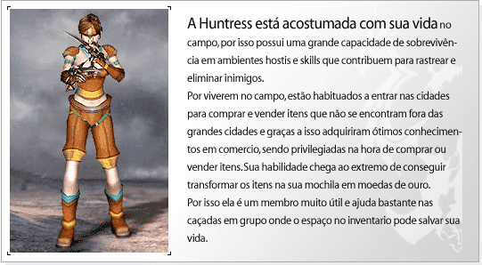
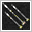
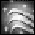
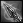

## Huntress

<html>
  <head>
    <meta charset="utf-8" />
    <meta name="viewport" content="width=device-width" />
  </head>
  <body>

<strong>Evolução do Personagem</strong>

<table border="0" align="center">
	<tr align="center">
		<td><strong>Lista</strong></td>
		<td colspan="4"><strong>Aumento na capacidade por level</strong></td>
	</tr>
	<tr align="center">
		<td><strong>HP</strong></td>
		<td colspan="4">2</td>
	</tr>
	<tr align="center">
		<td><strong>MP</strong></td>
		<td colspan="4">1</td>
	</tr>
	<tr align="center">
		<td><strong>Defesa(AC)</strong></td>
		<td colspan="4">1</td>
	</tr>
	<tr align="center">
		<td><strong>Pontos de Aprendizagem</strong></td>
		<td colspan="4">2</td>
	</tr>
    <tr align="center">
		<td rowspan="2"><strong>Pontos de Status</strong></td>
		<td><strong>Level 1~255</strong></td>
        <td><strong>Level 256~300</strong></td>
        <td><strong>Level 301~355</strong></td>
        <td><strong>Level 356~400</strong></td>
	</tr>
    <tr align="center">
		<td><strong>5</strong></td>
        <td><strong>10</strong></td>
        <td><strong>20</strong></td>
        <td><strong>12</strong></td>
	</tr>
    <tr align="center">
		<td rowspan="2"><strong>Pontos de Skill</strong></td>
		<td><strong>Level 1~200</strong></td>
        <td><strong>Level 201~355</strong></td>
        <td><strong>Level 356~400</strong></td>
        <td></td>
	</tr>
    <tr align="center">
		<td><strong>3</strong></td>
        <td><strong>4</strong></td>
        <td><strong>3</strong></td>
        <td></td>
	</tr>
</table>

<strong>Tabela de Skill</strong>

 

<strong>Sobrevivência</strong>
 Dá a huntress uma capacidade de fuga maior ou aumenta a defesa em suas caçadas

<table align="center" border="0"  cellpadding="2" cellspacing="2">
	<tr align="center">
		<td>
Icon.
</td>
		<td>
Nome da Skill
</td>
		<td>
Requisitos
</td>
		<td>
Delay
</td>
		<td>
Atrib.
</td>
		<td>
Descrição
</td>
	</tr>
	<tr>
		<td align="center">

</td>
		<td align="center">
Ataque Fatal
</td>
		<td align="center">
1 / 21 / 0
</td>
		<td align="center">
6
</td>
		<td align="center">
N
</td>
		<td>
Ataque no inimigo selecionado
</td>
	</tr>
	<tr>
		<td align="center">

</td>
		<td align="center">
Ilusão
</td>
		<td align="center">
1 / 39 / 0
</td>
		<td align="center">
3
</td>
		<td align="center">
N
</td>
		<td>
Cria uma ilusão do personagem eqnaunto ele locomove a outro ponto
</td>
	</tr>
	<tr>
		<td align="center">

</td>
		<td align="center">
Agressividade
</td>
		<td align="center">
35 / 66 / 0
</td>
		<td align="center">
6
</td>
		<td align="center">
N
</td>
		<td>
Aumenta o ataque do personagem quando utilizado um arco ou uma garra
</td>
	</tr>
	<tr>
		<td align="center">

</td>
		<td align="center">
Encantar Gelo
</td>
		<td align="center">
35 / 66 / 0
</td>
		<td align="center">
6
</td>
		<td align="center">
Gelo
</td>
		<td>
Encanto de Gelo a armas, causa efeito de lentidão ao alvo
</td>
	</tr>
	<tr>
		<td align="center">

</td>
		<td align="center">
Imunidade
</td>
		<td align="center">
61 / 84 / 90
</td>
		<td align="center">
6
</td>
		<td align="center">
N
</td>
		<td>
Defesa temporária contra veneno, congelamento, lentidão e ataque físico
</td>
	</tr>
	<tr>
		<td align="center">

</td>
		<td align="center">
Meditação
</td>
		<td align="center">
83 / 87 / 123
</td>
		<td align="center">
6
</td>
		<td align="center">
N
</td>
		<td>
Troca o valor de Ataque pelo de Defesa
</td>
	</tr>
	<tr>
		<td align="center">

</td>
		<td align="center">
Lança de Ferro
</td>
		<td align="center">
140 / 93 / 162
</td>
		<td align="center">
1-
</td>
		<td align="center">
N
</td>
		<td>
Ataque a um alvo e o que estive atrás
</td>
	</tr>
	<tr>
		<td align="center">

</td>
		<td align="center">
Tempestade de Raios(8ª Skill)
</td>
		<td align="center">
220 / 233 / 200
</td>
		<td align="center">
-
</td>
		<td align="center">
N
</td>
		<td>
Atira várias facas, atingindo diversos inimigos.
</td>
	</tr>
	<tr>
		<td align="center">

</td>
		<td align="center">
Contra ataque (9ª Skill)
</td>
		<td align="center">
Possuir todas as Skills anteriores.
</td>
		<td align="center">
---
</td>
		<td align="center">
N
</td>
		<td>
Evita ataques e aumenta o próximo dano.
</td>
	</tr>
	<tr>
		<td align="center">

</td>
		<td align="center">
Ataque Rápido Proficiente (10ª Skill)
</td>
		<td align="center">
Possuir todas as Skills anteriores.
</td>
		<td align="center">
---
</td>
		<td align="center">
Fogo
</td>
		<td>
Aumenta p ataque rápido. (Passiva)
</td>
	</tr>
</table>

*Requisitos (Level / Custo da Skill/ Pontos necessários na linhagem)

 

<strong>Troca</strong>
 Dá a huntress uma capacidade de fuga maior ou aumenta a defesa em suas caçadas.

<table align="center" border="0"  cellpadding="2" cellspacing="2">
	<tr align="center">
		<td>
Icon.
</td>
		<td>
Nome da Skill
</td>
		<td>
Requisitos
</td>
		<td>
Delay
</td>
		<td>
Atrib.
</td>
		<td>
Descrição
</td>
	</tr>
	<tr>
		<td align="center">

</td>
		<td align="center">
Golpe Felino
</td>
		<td align="center">
1 / 18 / 0
</td>
		<td align="center">
6
</td>
		<td align="center">
N
</td>
		<td>
Ataque normal +15
</td>
	</tr>
	<tr>
		<td align="center">

</td>
		<td align="center">
Ligação Espectral
</td>
		<td align="center">
1 / 39 / 0
</td>
		<td align="center">
-
</td>
		<td align="center">
N
</td>
		<td>
Adiciona dano para oponentes
</td>
	</tr>
	<tr>
		<td align="center">

</td>
		<td align="center">
Perícia do caçador
</td>
		<td align="center">
34 / 69 / 0
</td>
		<td align="center">
-
</td>
		<td align="center">
N
</td>
		<td>
Aumenta o poder de ataque ao usar armas de uma mão.
</td>
	</tr>
	<tr>
		<td align="center">

</td>
		<td align="center">
Extração
</td>
		<td align="center">
62 / 84 / 61
</td>
		<td align="center">
1
</td>
		<td align="center">
N
</td>
		<td>
	Extrai os ADD dos equipamentos
</td>
	</tr>
	<tr>
		<td align="center">

</td>
		<td align="center">
Alquimia
</td>
		<td align="center">
62 / 84 / 61
</td>
		<td align="center">
-
</td>
		<td align="center">
N
</td>
		<td>
Possibilita a criação de jóias
</td>
	</tr>
	<tr>
		<td align="center">

</td>
		<td align="center">
Explosão Etérea
</td>
		<td align="center">
83 / 90 / 82
</td>
		<td align="center">
-
</td>
		<td align="center">
N
</td>
		<td>
Atira várias facas, atingindo diversos inimigos.
</td>
	</tr>
	<tr>
		<td align="center">

</td>
		<td align="center">
Escudo Dourado
</td>
		<td align="center">
132 / 81 / 131
</td>
		<td align="center">
5
</td>
		<td align="center">
N
</td>
		<td>
Aumento de Defesa em troca de GOLD
</td>
	</tr>
	<tr>
		<td align="center">

</td>
		<td align="center">
Troca de Espíritos(8ª Skill)
</td>
		<td align="center">
220 / 242 / 200
</td>
		<td align="center">
10
</td>
		<td align="center">
N
</td>
		<td>
Troca MP por HP durante um período de tempo
</td>
	</tr>
	<tr>
		<td align="center">

</td>
		<td align="center">
Ponto do Mestre (9ª Skill)
</td>
		<td align="center">
Possuir todas as Skills anteriores.
</td>
		<td align="center">
---
</td>
		<td align="center">
N
</td>
		<td>
Melhoria da confecção de Jóias
</td>
	</tr>
	<tr>
		<td align="center">

</td>
		<td align="center">
Absorção de Alma (10ª Skill)
</td>
		<td align="center">
Possuir todas as Skills anteriores.
</td>
		<td align="center">
---
</td>
		<td align="center">
N
</td>
		<td>
Reduz o HP do inimigo e pode absorver este HP. (Passiva)
</td>
	</tr>
</table>

*Requisitos (Level / Custo da Skill/ Pontos necessários na linhagem)

 

<strong>Captura</strong>
 Aumenta a cahnce de derrotar ou capturar seus inimigos e caças.

<table align="center" border="0"  cellpadding="2" cellspacing="2">
	<tr align="center">
		<td>
Icon.
</td>
		<td>
Nome da Skill
</td>
		<td>
Requisitos
</td>
		<td>
Delay
</td>
		<td>
Atrib.
</td>
		<td>
Descrição
</td>
	</tr>
	<tr>
		<td align="center">

</td>
		<td align="center">
Lâmina das Sombras
</td>
		<td align="center">
1 / 27 / 0
</td>
		<td align="center">
6
</td>
		<td align="center">
N
</td>
		<td>
Ataque contra o inimigo selecionado
</td>
	</tr>
	<tr>
		<td align="center">

</td>
		<td align="center">
Evasão Aprimorada
</td>
		<td align="center">
1 / 42 / 0
</td>
		<td align="center">
6
</td>
		<td align="center">
N
</td>
		<td>
Aumento de Evasão
</td>
	</tr>
	<tr>
		<td align="center">

</td>
		<td align="center">
Visão Caçadora
</td>
		<td align="center">
51 / 69 / 0
</td>
		<td align="center">
-
</td>
		<td align="center">
N
</td>
		<td>
Aumento de crítico proporcional a velocidade
</td>
	</tr>
	<tr>
		<td align="center">

</td>
		<td align="center">
Olhos de Águia
</td>
		<td align="center">
62 / 75 / 92
</td>
		<td align="center">
-
</td>
		<td align="center">
N
</td>
		<td>
Aumento da distância de Ataque
</td>
	</tr>
	<tr>
		<td align="center">

</td>
		<td align="center">
Toxina da Serpente
</td>
		<td align="center">
62 / 78 / 92
</td>
		<td align="center">
-
</td>
		<td align="center">
N
</td>
		<td>
Envenena os inimigos ao efetuar ataque
</td>
	</tr>
	<tr>
		<td align="center">

</td>
		<td align="center">
Lâmina Aérea
</td>
		<td align="center">
83 / 90 / 123
</td>
		<td align="center">
-
</td>
		<td align="center">
N
</td>
		<td>
Aumento randômico do Dano
</td>
	</tr>
	<tr>
		<td align="center">

</td>
		<td align="center">
Proteção das Sombras
</td>
		<td align="center">
96 / 166 / 140
</td>
		<td align="center">
5
</td>
		<td align="center">
N
</td>
		<td>
Aumenta a defesa quando garras estão equipadas
</td>
	</tr>
	<tr>
		<td align="center">

</td>
		<td align="center">
Invisibilidade (8ª Skill)
</td>
		<td align="center">
220 / 227 / 200
</td>
		<td align="center">
6
</td>
		<td align="center">
N
</td>
		<td>
Torna o personagem invisível
</td>
	</tr>
	<tr>
		<td align="center">

</td>
		<td align="center">
Tiro direto (9ª Skill)
</td>
		<td align="center">
Possuir todas as Skills anteriores.
</td>
		<td align="center">
---
</td>
		<td align="center">
N
</td>
		<td>
Paralisa o adversário quando ele estiver dentro da área da sombra.
</td>
	</tr>
	<tr>
		<td align="center">

</td>
		<td align="center">
Garra Habilidosa  (10ª Skill)
</td>
		<td align="center">
Possuir todas as Skills anteriores.
</td>
		<td align="center">
---
</td>
		<td align="center">
N
</td>
		<td>
Aumenta destreza e dano quando a garra é equipada. (Passiva)
</td>
	</tr>
</table>

*Requisitos (Level / Custo da Skill/ Pontos necessários na linhagem)

 

<strong>8ª Skill</strong>

-A 8ª Skill só pode ser obtida após aprender todas da linhagem desejada. Não é possível adquirir mais de uma 8ª Skill. Caso você decida utilizar o Círculo Divino ou um Reset de Skill, você deverá comprar a 8ª Skill novamente, pois a mesma também é resetada. 						
-O dano causado pela skill dependerá dos pontos de aprendizagem na linhagem escolhida, Atributos do personagem, e armar e armaduras equipadas. Os pontos de Mana aumentam de acordo com os Pontos de Skill. O Máximo de aprendizado nas linhagens é de 200 e pode ser aumentado dependendo dos itens. 

 

<strong>9ª Skill</strong>

- NPCs venderão a 9ª skill por 2000 pontos de fama. 
- Para comprar a 9ª skill será necessário ter aprendido todas as skills anteriores da mesma linhagem. 
- É possível aprender apenas uma 9ª skill. 
- Ao aprender a 9ª skill a linhagem terá um novo limite de aprendizagem (320 pontos). 
- A habilidade poderá ser removida utilizando-se o Círculo divino puro de sua linhagem.

 

<strong>10ª Skill</strong>

- Livros da 10ª Skill podem ser adquiridos através da caça de determinados monstros como Kefra, Beriel e LugeferMaligno (Água 'A'). 
- O aprendizado da 10ª Skill é semelhante à 9ª Skill, depende da linhagem e custa 4000 pontos de fama do personagem. 
- É possível aprender somente uma 10ª Skill. 
- 10ª Skill pode ser inicializada ao utilizar o item "Círculo Divino Completo Puro".

</body>
</html>
