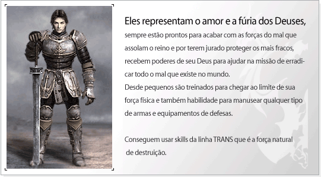
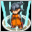
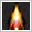
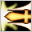
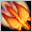
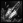
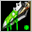
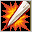

## Beast Master

<html>
  <head>
    <meta charset="utf-8" />
    <meta name="viewport" content="width=device-width" />
  </head>
  <body>

<strong>Evolução do Personagem</strong>

<table border="0" align="center">
	<tr align="center">
		<td><strong>Lista</strong></td>
		<td colspan="4"><strong>Aumento na capacidade por level</strong></td>
	</tr>
	<tr align="center">
		<td><strong>HP</strong></td>
		<td colspan="4">3</td>
	</tr>
	<tr align="center">
		<td><strong>MP</strong></td>
		<td colspan="4">1</td>
	</tr>
	<tr align="center">
		<td><strong>Defesa(AC)</strong></td>
		<td colspan="4">1</td>
	</tr>
	<tr align="center">
		<td><strong>Pontos de Aprendizagem</strong></td>
		<td colspan="4">2</td>
	</tr>
    <tr align="center">
		<td rowspan="2"><strong>Pontos de Status</strong></td>
		<td><strong>Level 1~255</strong></td>
        <td><strong>Level 256~300</strong></td>
        <td><strong>Level 301~355</strong></td>
        <td><strong>Level 356~400</strong></td>
	</tr>
    <tr align="center">
		<td><strong>5</strong></td>
        <td><strong>10</strong></td>
        <td><strong>20</strong></td>
        <td><strong>12</strong></td>
	</tr>
    <tr align="center">
		<td rowspan="2"><strong>Pontos de Skill</strong></td>
		<td><strong>Level 1~200</strong></td>
        <td><strong>Level 201~355</strong></td>
        <td><strong>Level 356~400</strong></td>
        <td></td>
	</tr>
    <tr align="center">
		<td><strong>3</strong></td>
        <td><strong>4</strong></td>
        <td><strong>3</strong></td>
        <td></td>
	</tr>
</table>

<strong>Tabela de Skill</strong>

 

<strong>Elemental</strong>
 "Skill usada para convocar poderes dos espíritos. Possui um grande ataque e uma poderosa defesa."

<table align="center" border="0"  cellpadding="2" cellspacing="2">
	<tr align="center">
		<td>
Icon.
</td>
		<td>
Nome da Skill
</td>
		<td>
Requisitos
</td>
		<td>
Delay
</td>
		<td>
Atrib.
</td>
		<td>
Descrição
</td>
	</tr>
	<tr>
		<td align="center">

</td>
		<td align="center">
Giro da Furia
</td>
		<td align="center">
1 / 24 / 0
</td>
		<td align="center">
4
</td>
		<td align="center">
Sagrado
</td>
		<td>
Adicional de +5 ao Ataque
</td>
	</tr>
	<tr>
		<td align="center">

</td>
		<td align="center">
Toque Sagrado
</td>
		<td align="center">
1 / 48 / 0
</td>
		<td align="center">
3
</td>
		<td align="center">
N
</td>
		<td>
Reduz a velocidade de ataque dos inimigos
</td>
	</tr>
	<tr>
		<td align="center">

</td>
		<td align="center">
Golpe Duplo
</td>
		<td align="center">
1 / 24 / 0
</td>
		<td align="center">
3
</td>
		<td align="center">
N
</td>
		<td>
Adicional de +13 ao Ataque
</td>
	</tr>
	<tr>
		<td align="center">

</td>
		<td align="center">
Samaritano
</td>
		<td align="center">
88 / 84 / 87
</td>
		<td align="center">
1
</td>
		<td align="center">
N
</td>
		<td>
Aumenta a defesa
</td>
	</tr>
	<tr>
		<td align="center">

</td>
		<td align="center">
Fanatismo
</td>
		<td align="center">
65 / 72 / 96
</td>
		<td align="center">
1
</td>
		<td align="center">
N
</td>
		<td>
Adicional de +75 ao Ataque
</td>
	</tr>
	<tr>
		<td align="center">

</td>
		<td align="center">
Aura da Vida
</td>
		<td align="center">
85 / 81 / 126
</td>
		<td align="center">
1
</td>
		<td align="center">
N
</td>
		<td>
Recupera o HP
</td>
	</tr>
	<tr>
		<td align="center">

</td>
		<td align="center">
Fúria Divina
</td>
		<td align="center">
131 / 90 / 150
</td>
		<td align="center">
3
</td>
		<td align="center">
N
</td>
		<td>
Puxa o alvo para a sua frente
</td>
	</tr>
	<tr>
		<td align="center">

</td>
		<td align="center">
Destino(8ª Skill)
</td>
		<td align="center">
220 / 224 / 200
</td>
		<td align="center">
6
</td>
		<td align="center">
Sagrado
</td>
		<td>
Ataque normal +190
</td>
	</tr>
	<tr>
		<td align="center">

</td>
		<td align="center">
Proteção Divina (9ª skill)
</td>
		<td align="center">
Possuir todas as Skills anteriores.
</td>
		<td align="center">
---
</td>
		<td align="center">
N
</td>
		<td>
Não será atacado por um determinado tempo. (Ativa)
</td>
	</tr>
	<tr>
		<td align="center">

</td>
		<td align="center">
Bênção Divina (10ª skill)
</td>
		<td align="center">
Possuir todas as Skills anteriores.
</td>
		<td align="center">
---
</td>
		<td align="center">
Fogo
</td>
		<td>
	Recupera HP de uma vez ao utilizar a Proteção Divina (9ª skill).
</td>
	</tr>
</table>

*Requisitos (Level / Custo da Skill/ Pontos necessários na linhagem)

 

<strong>Trans</strong>
 Skill usadas com armas para aumentar o dano físico.

<table align="center" border="0"  cellpadding="2" cellspacing="2">
	<tr align="center">
		<td>
Icon.
</td>
		<td>
Nome da Skill
</td>
		<td>
Requisitos
</td>
		<td>
Delay
</td>
		<td>
Atrib.
</td>
		<td>
Descrição
</td>
	</tr>
	<tr>
		<td align="center">

</td>
		<td align="center">
Carga
</td>
		<td align="center">
1 / 21 / 0
</td>
		<td align="center">
11
</td>
		<td align="center">
Sagrado
</td>
		<td>
Adicional de +5 ao Ataque
</td>
	</tr>
	<tr>
		<td align="center">

</td>
		<td align="center">
Mestre das Armas
</td>
		<td align="center">
1 / 45 / 0
</td>
		<td align="center">
1
</td>
		<td align="center">
N
</td>
		<td>
Aumento de ataque para armas equipadas
</td>
	</tr>
	<tr>
		<td align="center">

</td>
		<td align="center">
Golpe Mortal
</td>
		<td align="center">
29 / 69 / 0
</td>
		<td align="center">
11
</td>
		<td align="center">
N
</td>
		<td>
Adicional de +40 ao Ataque
</td>
	</tr>
	<tr>
		<td align="center">

</td>
		<td align="center">
Assalto
</td>
		<td align="center">
44 / 78 / 0
</td>
		<td align="center">
1
</td>
		<td align="center">
N
</td>
		<td>
Reduz a Defesa e aumenta o Ataque
</td>
	</tr>
	<tr>
		<td align="center">

</td>
		<td align="center">
Espada da Fênix
</td>
		<td align="center">
63 / 72 / 0
</td>
		<td align="center">
11
</td>
		<td align="center">
N
</td>
		<td>
Adicional de +60 ao Ataque
</td>
	</tr>
	<tr>
		<td align="center">

</td>
		<td align="center">
Samaritano
</td>
		<td align="center">
37 / 72 / 0
</td>
		<td align="center">
1
</td>
		<td align="center">
N
</td>
		<td>
Aumento de defesa
</td>
	</tr>
	<tr>
		<td align="center">

</td>
		<td align="center">
Noção de Combate
</td>
		<td align="center">
136 / 90 / 135
</td>
		<td align="center">
-
</td>
		<td align="center">
N
</td>
		<td>
Aumenta o Dano mínimo
</td>
	</tr>
	<tr>
		<td align="center">

</td>
		<td align="center">
Armadura Crítica (8ª Skill
</td>
		<td align="center">
220 / 218 / 200
</td>
		<td align="center">
25
</td>
		<td align="center">
N
</td>
		<td>
Aumento da Defesa e do ataque crítico
</td>
	</tr>
	<tr>
		<td align="center">

</td>
		<td align="center">
Mãos sangrentas (9ª Skill)
</td>
		<td align="center">
Possuir todas as Skills anteriores.
</td>
		<td align="center">
---
</td>
		<td align="center">
N
</td>
		<td>
Quando acertar um ataque crítico o HP será recuperado em quantidade aleatória.
</td>
	</tr>
	<tr>
		<td align="center">

</td>
		<td align="center">
Mestre das armas  (10ª Skill)
</td>
		<td align="center">
Possuir todas as Skills anteriores.
</td>
		<td align="center">
---
</td>
		<td align="center">
N
</td>
		<td>
Aumenta ataque crítico. (Passiva).
</td>
	</tr>
</table>

*Requisitos (Level / Custo da Skill/ Pontos necessários na linhagem)

 

<strong>Espada Mágica</strong>
 Ataques mágicos como Fogo, Gelo, raios e Sagrado.

<table align="center" border="0"  cellpadding="2" cellspacing="2">
	<tr align="center">
		<td>
Icon.
</td>
		<td>
Nome da Skill
</td>
		<td>
Requisitos
</td>
		<td>
Delay
</td>
		<td>
Atrib.
</td>
		<td>
Descrição
</td>
	</tr>
	<tr>
		<td align="center">

</td>
		<td align="center">
Perseguição
</td>
		<td align="center">
27 / 66 / 0
</td>
		<td align="center">
2
</td>
		<td align="center">
N
</td>
		<td>
	Diminui a imunidade do alvo
</td>
	</tr>
	<tr>
		<td align="center">

</td>
		<td align="center">
Espada Flamejante
</td>
		<td align="center">
1 / 45 / 0
</td>
		<td align="center">
4
</td>
		<td align="center">
Fogo
</td>
		<td>
Adicional de +25 ao Ataque
</td>
	</tr>
	<tr>
		<td align="center">

</td>
		<td align="center">
Contra Ataque
</td>
		<td align="center">
25 / 60 / 0
</td>
		<td align="center">
3
</td>
		<td align="center">
N
</td>
		<td>
Adicional de +35 ao Ataque
</td>
	</tr>
	<tr>
		<td align="center">

</td>
		<td align="center">
Lâmina Congelante
</td>
		<td align="center">
39 / 78 / 0
</td>
		<td align="center">
4
</td>
		<td align="center">
Gelo
</td>
		<td>
Adicional de +50 ao Ataque, congelamento
</td>
	</tr>
	<tr>
		<td align="center">

</td>
		<td align="center">
Ataque da Alma
</td>
		<td align="center">
64 / 66 / 95
</td>
		<td align="center">
4
</td>
		<td align="center">
N
</td>
		<td>
Adicional de +65 ao Ataque
</td>
	</tr>
	<tr>
		<td align="center">

</td>
		<td align="center">
Punhalada Venenosa
</td>
		<td align="center">
85 / 87 / 126
</td>
		<td align="center">
4
</td>
		<td align="center">
Sagrado
</td>
		<td>
Adicional de +80 ao Ataque, envenenamento
</td>
	</tr>
	<tr>
		<td align="center">

</td>
		<td align="center">
Exterminar
</td>
		<td align="center">
138 / 90 / 200
</td>
		<td align="center">
9
</td>
		<td align="center">
Fogo
</td>
		<td>
Adicional de +90 ao Ataque
</td>
	</tr>
	<tr>
		<td align="center">

</td>
		<td align="center">
Tempestade de Gelo(8ª Skill)
</td>
		<td align="center">
220 / 227 / 200
</td>
		<td align="center">
5
</td>
		<td align="center">
Gelo
</td>
		<td>
Adicional de +210 ao Ataque, congelamento
</td>
	</tr>
	<tr>
		<td align="center">

</td>
		<td align="center">
Espelho mágico (9ª Skill)
</td>
		<td align="center">
Possuir todas as Skills anteriores.
</td>
		<td align="center">
---
</td>
		<td align="center">
N
</td>
		<td>
Aumenta o MP Máximo e a chance de acertar mais ataques.
</td>
	</tr>
	<tr>
		<td align="center">

</td>
		<td align="center">
Conexão de Gelo  (10ª Skill)
</td>
		<td align="center">
Possuir todas as Skills anteriores.
</td>
		<td align="center">
---
</td>
		<td align="center">
Gelo
</td>
		<td>
	Poder de gelo (Passiva).
</td>
	</tr>
</table>

*Requisitos (Level / Custo da Skill/ Pontos necessários na linhagem)

 

<strong>8ª Skill</strong>

-A 8ª Skill só pode ser obtida após aprender todas da linhagem desejada. Não é possível adquirir mais de uma 8ª Skill. Caso você decida utilizar o Círculo Divino ou um Reset de Skill, você deverá comprar a 8ª Skill novamente, pois a mesma também é resetada. 						
-O dano causado pela skill dependerá dos pontos de aprendizagem na linhagem escolhida, Atributos do personagem, e armar e armaduras equipadas. Os pontos de Mana aumentam de acordo com os Pontos de Skill. O Máximo de aprendizado nas linhagens é de 200 e pode ser aumentado dependendo dos itens.

 

<strong>9ª Skill</strong>

- NPCs venderão a 9ª skill por 2000 pontos de fama. 
- Para comprar a 9ª skill será necessário ter aprendido todas as skills anteriores da mesma linhagem. 
- É possível aprender apenas uma 9ª skill. 
- Ao aprender a 9ª skill a linhagem terá um novo limite de aprendizagem (320 pontos). 
- A habilidade poderá ser removida utilizando-se o Círculo divino puro de sua linhagem.

 

<strong>10ª Skill</strong>

- Livros da 10ª Skill podem ser adquiridos através da caça de determinados monstros como Kefra, Beriel e LugeferMaligno (Água 'A'). 
- O aprendizado da 10ª Skill é semelhante à 9ª Skill, depende da linhagem e custa 4000 pontos de fama do personagem. 
- É possível aprender somente uma 10ª Skill. 
- 10ª Skill pode ser inicializada ao utilizar o item "Círculo Divino Completo Puro".

</body>
</html>
