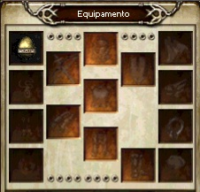
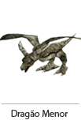
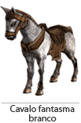

## Sistema de Montaria

<html>
  <head>
    <meta charset="utf-8" />
    <meta name="viewport" content="width=device-width" />
  </head>
  <body>

<strong>Origem da montaria</strong>

Entre as terras de Armia, há certos animais que são capturados e domesticados. Quando o domínio dos Homens se expandiu, esses animais agora se tornaram as melhores formas do transporte humano. Com o tempo, os papeis vitais desses animais aumentaram fenomenalmente. Devido ao crescimento da demanda, um novo trabalho surgiu em Armia. A população de Armia tornou-se adepta a caça e ao adestramento de animais, enquanto eles agora vivem de vender os animais que podem ser montados.

<strong>Sistema de montaria</strong>

Existem oito espécies de animais e 10 tipos de cavalos que podem ser usados para montaria.  
- Montaria ajuda para aumentar a locomoção de batalha do jogador, capacidade de ataque e velocidade, dependendo do animal que você tiver. 
- Dependendo do tipo de montaria, e possível aumentar as opções como o dano, ataque mágico, evasão e as resistências. 
- Eles também absorvem uma parte dos danos tomados pelo personagem.

<strong>Sistema de Crescimento</strong>

 A montaria não pode ser usada no momento que adquire, ela terra de passar por um processo de crescimento em 3 fases, ovo =&gt; cria =&gt; adulto, para poder montar.  
Para a montaria de transformar de ovo para cria, será preciso cultivá-lo através da Poeira de Oriharucon e a Poeira de Lactolerium.  
A evolução das crias e feita através de caça dos monstros e a cada momento de evolução aumenta o poder de ataque.  
As montarias na fase final do processo (Adulto) precisam de uma essência respectiva de cada animal, e enquanto evoluem aumentam o poder de ataque e o ataque mágico.

 

Local para equipar a montaria

O ovo de montaria ou a própria montaria deve ser equipado na parte superior esquerda da janela de inventário. Todo o efeito ligado a montaria (gasto de ração, caça e efeito ao montar) apenas será aplicado se a montaria estiver equipada corretamente.

<table cellpadding="0" cellspacing="0">
	<tbody>
	<tr>
		<td></td>
		<td>
Ao montar, o HP da montaria e simbolizado pela barra de cor laranja, junto ao HP do personagem.
</td>
	</tr>
	</tbody>
</table>

<strong>Elementos do Ovo</strong>

E o valor de refinamento necessário ate o nascimento. O ovo será chocado se tiver sucesso na refinação de acordo com o valor indicado para cada montaria.  
<strong>[Tempo estimado para o nascimento]</strong>  
E a exibição do tempo para permissão do próximo refinamento, sendo possível refinar novamente após esgotar esse tempo exibido. O tempo estimado será calculado apenas se a montaria estiver equipada no inventario.
 

<strong>Elementos da cria</strong>

<strong>[Vitalidade]</strong>

Quando o valor vitalidade da montaria chegar no 0, a montaria não poderá ser ressuscitada novamente. 
O valor da vitalidade será aplicado ao chocar do ovo, para cada montaria existe um valor padronizado entre 10 ~ 30 aleatoriamente. 
Os casos que reduzem a vitalidade são: durante a fase de cria quando o HP da montaria chegar no 0 e o valor do alimento chegar no 0. 
Em caso da montaria ser adulta, existem possibilidades de perder valor da vitalidade através da morte do personagem que está equipado com a montaria.

<strong>[HP]</strong>

É a energia (HP) da montaria. Pode ser recuperado através de rações. 
Quando o HP da montaria chegar a 0, a montaria morrera e não poderá mais se mover, sendo possível curar apenas através do mestre da montaria.

<strong>[Crescimento (level)]</strong>

E o level da montaria tendo o valor de 1 ~ 100. 
Ao alcançar o level 100, concluirá o crescimento e poderá ser montada. 
Para aumentar o level, será necessário adquirir a experiência exibida para cada level. 
Ao chegar no level 99, só poderá alcançar o level 100 através do Âmago respectivo para cada montaria.

<strong>[Ração]</strong>

E a exibição do grau de fome do animal. 
Quando o valor do alimento chegar no 0, será impossível utilizar a montaria. 
A ração será consumida de tempos em tempos de - 2~ 4 pontos dependendo da montaria. 
A ração apenas será consumida se a montaria estiver equipada. 
O valor do alimento pode ser aumentado através de ração respectiva para cada animal vendido na cidade de''Erion''.

<strong>[Experiência]</strong>

Experiência necessária para a evolução da montaria. (Grau de Crescimento + 100). 
Os seguintes animais possuem os valores: Porco: Grau de Crescimento +25(26~125), Javali: Grau de Crescimento +35(36~135), Lobo: Grau de Crescimento +45(46~145), Dragão Menor: Grau de Crescimento +55(56~155), Urso: Grau de Crescimento +65(66~165), Dente de Sabre: Grau de Crescimento +75(76~175). 
Ao completar a experiência requerida seguira para o level seguinte. 
A montaria deve caçar os monstros com o mesmo level ou maior, a sua experiência não aumentara matando os monstros com o level menor que da montaria.

<strong>Elementos da montaria adulta</strong>

<strong>[Vitalidade]</strong>

E a vitalidade da montaria que quando o valor relacionado chegar no 0, a montaria não poderá mais ser ressuscitada.  
A vitalidade de um animal adulto (level 100), será atribuída um valor entre 0~20 aleatoriamente no valor vitalício.  
Os casos que reduzem o valor da vitalidade são: quando o HP da montaria chegar no 0, quando o valor de alimento chegar no 0 e no caso do personagem que está equipada com a montaria morrer.  
Não existem modos para aumentar a vitalidade.

<strong>[HP]</strong>

E o HP da montaria. Pode ser aumentado através de rações. 
Quando o HP da montaria chegar a 0, a montaria morrera e não poderá mais mover, sendo possível curar apenas através do mestre da montaria.

<strong>[Level]</strong>

A montaria possui um valor de level entre 1 ~120. 
Ao alcançar o Lv 120, será adicionado a montaria 10% de Absorção de Dano. 
O level da montaria pode ser aumentado através dos âmagos, para cada vez que utilizar a essência aumentara 1 level da montaria. Quanto maior o level da montaria, maior será a probabilidade de falha. 
Em caso de falha na evolução através de Âmago, existe 20% de chance de perder 1 ponto de vitalidade. 
Com o aumento de level da montaria, aumentam as opções como o poder de ataque e o ataque mágico. 
Outras opções não sofrerão qualquer mudança através de level.

<strong>[Ração]</strong>

E a exibição do grau de fome do animal. 
Quando o valor do alimento chegar no 0, será impossível se utilizar a montaria. 
A ração será consumida de tempo em tempo de -2~4 pontos dependendo da montaria 
A ração apenas será consumida se a montaria estiver equipada. 
O valor do alimento pode ser aumentado através de ração respectiva para cada animal vendido na cidade de Erion.

<strong>[Chocando Ovo]</strong>

Chocando o ovo para o nascimento da cria, e necessário completar o valor critico de cada ovo através de Poeira de Oriharucon ou Poeira de Lactlerium. 
Existe algo chamado de ''Tempo Estimado Para o Nascimento'' isto significa o tempo que deve esperar após uma refinação para tentar a próxima refinação. 
O Tempo estimado para o nascimento é um valor padrão para todos os tipos de montarias podendo ser aplicados aleatoriamente entre 4 ~ 9 horas, em caso de falha no refinamento esse tempo será aplicado aleatoriamente entre um valor de 0 ~ 3 horas. 
Para chocar, o ovo terá de estar equipado no inventário.

<strong>[Nascimento]</strong>

Após o nascimento, no estado de cria a montaria tera de caçar um número de monstros predefinidos.
A cria começa no level 1, podendo alcançar ate o level 99 através da caça aos monstros nas quantidades requeridas para cada level, para passar do level 99 para o level 100 terá de ser usada o Âmago respectivo de cada montaria.
Para aumentar o level das montarias é necessário caçar os monstros com level superior ao da montaria e para cada monstro derrotado 1 ponto de experiência é adicionado.
A vitalidade da cria será aplicada aleatoriamente entre o valor de 10 ~ 30 no momento da chocagem.

<strong>Defesa e ataque da cria</strong>

<table align="center" border="0" cellpadding="5" cellspacing="5"> 
	<tr>
		<td><strong>Nome</strong></td>
		<td align="center"><strong>ATQ.</strong></td>
		<td align="center"><strong>DEF</strong></td>
		<td align="center"><strong>HP</strong></td>
	</tr>
	<tr>
		<td>Porco</td>
		<td align="center">10 + (LV x 6)</td>
		<td align="center">50</td>
		<td align="center">7,000</td>
	</tr>
	<tr>
		<td>Javali</td>
		<td align="center">15 + (LV x 6)</td>
		<td align="center">50</td>
		<td align="center">8,000</td>
	</tr>
	<tr>
		<td>Lobo</td>
		<td align="center">20 + (LV x 6)</td>
		<td align="center">50</td>
		<td align="center">8,000</td>
	</tr>
	<tr>
		<td>Dragão Menor</td>
		<td align="center">25 + (LV x 6)</td>
		<td align="center">50</td>
		<td align="center">7,500</td>
	</tr>
	<tr>
		<td>Urso</td>
		<td align="center">30 + (LV x 6)</td>
		<td align="center">50</td>
		<td align="center">9,000</td>
	</tr>
	<tr>
		<td>Dente de Sabre</td>
		<td align="center">35 + (LV x 6)</td>
		<td align="center">50</td>
		<td align="center">9,000</td>
	</tr>
	<tr>
		<td>Cavalo S/ Sela</td>
		<td align="center">35 + (LV x 6)</td>
		<td align="center">50</td>
		<td align="center">9,000</td>
	</tr>
	<tr>
		<td>Cavalo Fantasma</td>
		<td align="center">35 + (LV x 6)</td>
		<td align="center">50</td>
		<td align="center">10,000</td>
	</tr>
	<tr>
		<td>Cavalo Leve</td>
		<td align="center">40 + (LV x 6)</td>
		<td align="center">50</td>
		<td align="center">11,000</td>
	</tr>
	<tr>
		<td>Cavalo Equipado</td>
		<td align="center">50 + (LV x 6)</td>
		<td align="center">50</td>
		<td align="center">11,000</td>
	</tr>
	<tr>
		<td>Andaluz</td>
		<td align="center">50 + (LV x 6)</td>
		<td align="center">50</td>
		<td align="center">12,000</td>
	</tr>
	<tr>
		<td>Fenrir</td>
		<td align="center">50 + (LV x 6)</td>
		<td align="center">50</td>
		<td align="center">12,000</td>
	</tr>
	<tr>
		<td>Unicórnio</td>
		<td align="center">50 + (LV x 6)</td>
		<td align="center">50</td>
		<td align="center">15,000</td>
	</tr>
	<tr>
		<td>Pégasus</td>
		<td align="center">50 + (LV x 6)</td>
		<td align="center">50</td>
		<td align="center">15,000</td>
	</tr>
	<tr>
		<td>Unisus</td>
		<td align="center">50 + (LV x 6)</td>
		<td align="center">50</td>
		<td align="center">15,000</td>
	</tr>
	<tr>
		<td>Grifo</td>
		<td align="center">55 + (LV x 6)</td>
		<td align="center">50</td>
		<td align="center">20,000</td>
	</tr>
	<tr>
		<td>Hipogrifo</td>
		<td align="center">55 + (LV x 6)</td>
		<td align="center">50</td>
		<td align="center">20,000</td>
	</tr>
	<tr>
		<td>Grifo Sangrento</td>
		<td align="center">55 + (LV x 6)</td>
		<td align="center">50</td>
		<td align="center">20,000</td>
	</tr>
	<tr>
		<td>Tigre e Fogo</td>
		<td align="center">60 + (LV x 6)</td>
		<td align="center">50</td>
		<td align="center">23,000</td>
	</tr>
</table>
 

<strong>Adulto</strong>

Ao concluir a evolução o personagem poderá montar no animal. 
Mesmo na fase adulta o grau de evolução será exibido, podendo aumentar o seu level através de um item especifico (Âmago). Lembre-se que há a probabilidade de falha na utilização do item. 
Em caso de falha existe uma possibilidade de 20% de reduzir 1 ponto da vitalidade. 
Cada montaria possui suas habilidades padrões e para cada level aumentado, os valores a serem aumentados serão diferentes. 
No caso de estar montado em um animal, dependendo do tipo da montaria, pode aumentar as opções como o dano, ataque mágico, evasão, resistência e a absorção, mas dentre eles a evasão, resistência e a absorção não serão afetados com a evolução dos níveis da montaria. 
A vitalidade das montarias adultas será definido aleatoriamente entre 0 ~ 20 pontos adicionados na longevidade pré-definida na fase de cria.

<strong>Morte da Montaria</strong>

A montaria pode sofrer a morte na fase de cria e na fase adulta. 
A montaria sofrera a morte nos casos como o HP chegar no 0, o valor do alimento chegar no 0 e quando o personagem que está equipado com a montaria morrer. 
Caso a montaria tenha morrido, ela pode ser ressuscitada através do mestre da montaria na cidade de "Erion" com estado de 100HP e valor 5 de alimento. 
Cada vez que a montaria for ressuscitada, terá de ser pago um valor definido e perderá de 0 ~ 3 pontos de vitalidade para cada morte.

<table align="center" border="0" cellpadding="0" cellspacing="0"> 
	<tr align="center">
		<td><strong>Nome</strong></td>
		<td><strong>Custo para reviver</strong></td>
		<td><strong>Redução de vitalidade</strong></td>
		<td><strong>HP após reviver</strong></td>
		<td><strong>HP padrão</strong></td>
		<td><strong>Valor de ração após reviver</strong></td>
		<td><strong>Valor do alimento Cria/Adulto</strong></td>
	</tr>
	<tr align="center">
		<td>Porco</td>
		<td>30,000</td>
		<td rowspan="19">0 ~ -3</td>
		<td rowspan="19">100</td>
		<td>7,000</td>
		<td rowspan="19">5</td>
		<td rowspan="19">30 / 100</td>
	</tr>
	<tr align="center">
		<td>Javali</td>
		<td>60,000</td>
		<td>8,000</td>
	</tr>
	<tr align="center">
		<td>Lobo</td>
		<td>100,000</td>
		<td>8,000</td>
	</tr>
	<tr align="center">
		<td>Dragão Menor</td>
		<td>150,000</td>
		<td>7,500</td>
	</tr>
	<tr align="center">
		<td>Urso</td>
		<td>210,000</td>
		<td>9,000</td>
	</tr>
	<tr align="center">
		<td>Dente de Sabre</td>
		<td>280,000</td>
		<td>9,000</td>
	</tr>
	<tr align="center">
		<td>Cavalo S/ Sela</td>
		<td>500,000</td>
		<td>10,000</td>
	</tr>
	<tr align="center">
		<td>Cavalo Fantasma</td>
		<td>500,000</td>
		<td>11,000</td>
	</tr>
	<tr align="center">
		<td>Cavalo Leve</td>
		<td>500,000</td>
		<td>11,000</td>
	</tr>
	<tr align="center">
		<td>Cavalo Equipado</td>
		<td>500,000</td>
		<td>11,000</td>
	</tr>
	<tr align="center">
		<td>Andaluz</td>
		<td>500,000</td>
		<td>12,000</td>
	</tr>
	<tr align="center">
		<td>Fenrir</td>
		<td>700,000</td>
		<td>12,000</td>
	</tr>
	<tr align="center">
		<td>Unicórnio</td>
		<td>850,000</td>
		<td>15,000</td>
	</tr>
	<tr align="center">
		<td>Pégasus</td>
		<td>850,000</td>
		<td>15,000</td>
	</tr>
	<tr align="center">
		<td>Unisus</td>
		<td>850,000</td>
		<td>15,000</td>
	</tr>
	<tr align="center">
		<td>Grifo</td>
		<td>950,000</td>
		<td>20,000</td>
	</tr>
	<tr align="center">
		<td>Hipogrifo</td>
		<td>950,000</td>
		<td>20,000</td>
	</tr>
	<tr align="center">
		<td>Grifo Sangrento</td>
		<td>950,000</td>
		<td>20,000</td>
	</tr>
	<tr align="center">
		<td>Tigre e Fogo</td>
		<td>1,500,000</td>
		<td>23,000</td>
	</tr>
</table>

<strong>Informações de montaria</strong>

As informações sobre a montaria abaixo se referem apenas as montarias que completaram todas as evoluções. As explicações a seguir são informações necessárias para compreensão da tabela abaixo. Em caso de informações de cria veja a seção ''Crescimento''.

 

<strong>Valor da ração</strong>

Trata-se de valor Máximo de alimento que cada montaria pode ter durante a fase de cria e fase adulta, o valor para todas as crias são de 30 e o valor para adulto e de 100 para todos.

 

<strong>Vitalidade</strong>

É um valor a ser definido no momento da chocagem e no instante que se torna adulto.  
A vitalidade será definida aleatoriamente entre os valores de 10 ~ 30 no momento da chocagem. Na hora que se torna um adulto, um valor entre 0 ~20 são adicionados aleatoriamente em cima do valor definido na fase de cria.  
A vitalidade será descontada entre 0 ~ 3 aleatoriamente quando o HP da montaria chegar no 0, o valor de alimento chegar no 0 ou quando o personagem equipado com a montaria morrer.  
As montarias que chegarem no valor 0 na vitalidade não poderão ser revividos.

 

<strong>HP</strong>

É o valor de vitalidade da montaria, sendo o mesmo quanto na fase de cria quanto na fase adulta.

 

<strong>Custo para nascimento</strong>

É o valor que terá de pagar quando a montaria sofre uma morte, pode ser revivido através do mestre de montaria na cidade de ''Erion''.

 

<strong>Aumento de dano</strong>

São os valores aplicados ao montar na criatura já adulta.

 

<strong>Evasão e Resistência</strong>

Mostra a evasão e a resistência a tudo, o valor da tabela será adicionado ao personagem. 
A evasão e a resistência não serão modificadas mesmo com aumento de level da montaria.

 

<strong>Absorção de dano</strong>

É um valor atribuído a montaria no momento que estiver montado e tomar um dano, esta fixada em 25%. 
Por exemplo, caso tenha tomado um dano equivalente ao 100, 75 dos 100 ira para o personagem e 25 será aplicado a montaria.

 

<strong>Movimento</strong>

É a velocidade de movimento das montarias, não tendo qualquer relação com a velocidade do personagem, seguirá a velocidade da montaria. Os valores que apresentam um diferencial significa que pode ter 2 tipos de velocidade através do atalho ''R''.
(Ex.: caso seja 3 / 6, 3: andando, 6: correndo)

 
<table align="center" border="0"> 
	<tr>
		<td rowspan="6" align="center" cellpadding="0" cellspacing="0"></td>
		<td cellpadding="10" cellspacing="10"><strong>Level Requerido:</strong></td>
		<td align="center" cellpadding="10" cellspacing="10">1</td>
		<td cellpadding="10" cellspacing="10"><strong>Absorção de Dano</strong></td>
		<td align="center" cellpadding="10" cellspacing="10" width="80px">-</td>
	</tr>
	<tr>
		<td><strong>Vitalidade:</strong></td>
		<td align="center">10~50</td>
		<td><strong>Aumento de Dano:</strong></td>
		<td align="center">-</td>
	</tr>
	<tr>
		<td><strong>Valor de Ração (Cria/Adulto):</strong></td>
		<td align="center">30/100</td>
		<td><strong>Ataque Mágico</strong></td>
		<td align="center">-</td>
	</tr>
	<tr>
		<td><strong>Consumo de Ração:</strong></td>
		<td align="center">2 por hora</td>
		<td><strong>Evasão:</strong></td>
		<td align="center">-</td>
	</tr>
	<tr>
		<td><strong>Custo de Nascimento:</strong></td>
		<td align="center">30</td>
		<td><strong>Resistência:</strong></td>
		<td align="center">-</td>
	</tr>
	<tr>
		<td><strong>HP:</strong></td>
		<td align="center">7</td>
		<td><strong>Movimento:</strong></td>
		<td align="center">4</td>
	</tr>
</table>
<table align="center" border="0"> 
	<tr>
		<td rowspan="6" align="center" cellpadding="0" cellspacing="0"></td>
		<td cellpadding="10" cellspacing="10"><strong>Level Requerido:</strong></td>
		<td align="center" cellpadding="10" cellspacing="10">61</td>
		<td cellpadding="10" cellspacing="10"><strong>Absorção de Dano</strong></td>
		<td align="center" cellpadding="10" cellspacing="10" width="80px">25%</td>
	</tr>
	<tr>
		<td><strong>Vitalidade:</strong></td>
		<td align="center">10~50</td>
		<td><strong>Aumento de Dano:</strong></td>
		<td align="center">-</td>
	</tr>
	<tr>
		<td><strong>Valor de Ração (Cria/Adulto):</strong></td>
		<td align="center">30/100</td>
		<td><strong>Ataque Mágico</strong></td>
		<td align="center">-</td>
	</tr>
	<tr>
		<td><strong>Consumo de Ração:</strong></td>
		<td align="center">2 por hora</td>
		<td><strong>Evasão:</strong></td>
		<td align="center">-</td>
	</tr>
	<tr>
		<td><strong>Custo de Nascimento:</strong></td>
		<td align="center">60</td>
		<td><strong>Resistência:</strong></td>
		<td align="center">-</td>
	</tr>
	<tr>
		<td><strong>HP:</strong></td>
		<td align="center">8</td>
		<td><strong>Movimento:</strong></td>
		<td align="center">4</td>
	</tr>
</table>
<table align="center" border="0"> 
	<tr>
		<td rowspan="6" align="center" cellpadding="0" cellspacing="0"></td>
		<td cellpadding="10" cellspacing="10"><strong>Level Requerido:</strong></td>
		<td align="center" cellpadding="10" cellspacing="10">81</td>
		<td cellpadding="10" cellspacing="10"><strong>Absorção de Dano</strong></td>
		<td align="center" cellpadding="10" cellspacing="10" width="80px">25%</td>
	</tr>
	<tr>
		<td><strong>Vitalidade:</strong></td>
		<td align="center">10~50</td>
		<td><strong>Aumento de Dano:</strong></td>
		<td align="center">(LV+20)x0.1</td>
	</tr>
	<tr>
		<td><strong>Valor de Ração (Cria/Adulto):</strong></td>
		<td align="center">30/100</td>
		<td><strong>Ataque Mágico</strong></td>
		<td align="center">(LV+15)x0.1</td>
	</tr>
	<tr>
		<td><strong>Consumo de Ração:</strong></td>
		<td align="center">2 por hora</td>
		<td><strong>Evasão:</strong></td>
		<td align="center">-</td>
	</tr>
	<tr>
		<td><strong>Custo de Nascimento:</strong></td>
		<td align="center">100</td>
		<td><strong>Resistência:</strong></td>
		<td align="center">-</td>
	</tr>
	<tr>
		<td><strong>HP:</strong></td>
		<td align="center">8</td>
		<td><strong>Movimento:</strong></td>
		<td align="center">5</td>
	</tr>
</table>
<table align="center" border="0"> 
	<tr>
		<td rowspan="6" align="center" cellpadding="0" cellspacing="0"></td>
		<td cellpadding="10" cellspacing="10"><strong>Level Requerido:</strong></td>
		<td align="center" cellpadding="10" cellspacing="10">81</td>
		<td cellpadding="10" cellspacing="10"><strong>Absorção de Dano</strong></td>
		<td align="center" cellpadding="10" cellspacing="10" width="80px">25%</td>
	</tr>
	<tr>
		<td><strong>Vitalidade:</strong></td>
		<td align="center">10~50</td>
		<td><strong>Aumento de Dano:</strong></td>
		<td align="center">(LV+20)x0.8</td>
	</tr>
	<tr>
		<td><strong>Valor de Ração (Cria/Adulto):</strong></td>
		<td align="center">30/100</td>
		<td><strong>Ataque Mágico</strong></td>
		<td align="center">(LV+15)x0.15</td>
	</tr>
	<tr>
		<td><strong>Consumo de Ração:</strong></td>
		<td align="center">2 por hora</td>
		<td><strong>Evasão:</strong></td>
		<td align="center">-</td>
	</tr>
	<tr>
		<td><strong>Custo de Nascimento:</strong></td>
		<td align="center">150</td>
		<td><strong>Resistência:</strong></td>
		<td align="center">-</td>
	</tr>
	<tr>
		<td><strong>HP:</strong></td>
		<td align="center">7,5</td>
		<td><strong>Movimento:</strong></td>
		<td align="center">5</td>
	</tr>
</table>
<table align="center" border="0"> 
	<tr>
		<td rowspan="6" align="center" cellpadding="0" cellspacing="0"></td>
		<td cellpadding="10" cellspacing="10"><strong>Level Requerido:</strong></td>
		<td align="center" cellpadding="10" cellspacing="10">101</td>
		<td cellpadding="10" cellspacing="10"><strong>Absorção de Dano</strong></td>
		<td align="center" cellpadding="10" cellspacing="10" width="80px">25%</td>
	</tr>
	<tr>
		<td><strong>Vitalidade:</strong></td>
		<td align="center">10~50</td>
		<td><strong>Aumento de Dano:</strong></td>
		<td align="center">(LV+20)x0.1</td>
	</tr>
	<tr>
		<td><strong>Valor de Ração (Cria/Adulto):</strong></td>
		<td align="center">30/100</td>
		<td><strong>Ataque Mágico</strong></td>
		<td align="center">(LV+15)x0.2</td>
	</tr>
	<tr>
		<td><strong>Consumo de Ração:</strong></td>
		<td align="center">2 por hora</td>
		<td><strong>Evasão:</strong></td>
		<td align="center">-</td>
	</tr>
	<tr>
		<td><strong>Custo de Nascimento:</strong></td>
		<td align="center">210</td>
		<td><strong>Resistência:</strong></td>
		<td align="center">-</td>
	</tr>
	<tr>
		<td><strong>HP:</strong></td>
		<td align="center">9</td>
		<td><strong>Movimento:</strong></td>
		<td align="center">4</td>
	</tr>
</table>
<table align="center" border="0"> 
	<tr>
		<td rowspan="6" align="center" cellpadding="0" cellspacing="0"></td>
		<td cellpadding="10" cellspacing="10"><strong>Level Requerido:</strong></td>
		<td align="center" cellpadding="10" cellspacing="10">116</td>
		<td cellpadding="10" cellspacing="10"><strong>Absorção de Dano</strong></td>
		<td align="center" cellpadding="10" cellspacing="10" width="80px">25%</td>
	</tr>
	<tr>
		<td><strong>Vitalidade:</strong></td>
		<td align="center">10~50</td>
		<td><strong>Aumento de Dano:</strong></td>
		<td align="center">(LV+20)x1.5</td>
	</tr>
	<tr>
		<td><strong>Valor de Ração (Cria/Adulto):</strong></td>
		<td align="center">30/100</td>
		<td><strong>Ataque Mágico</strong></td>
		<td align="center">(LV+15)x0.25</td>
	</tr>
	<tr>
		<td><strong>Consumo de Ração:</strong></td>
		<td align="center">2 por hora</td>
		<td><strong>Evasão:</strong></td>
		<td align="center">-</td>
	</tr>
	<tr>
		<td><strong>Custo de Nascimento:</strong></td>
		<td align="center">280</td>
		<td><strong>Resistência:</strong></td>
		<td align="center">-</td>
	</tr>
	<tr>
		<td><strong>HP:</strong></td>
		<td align="center">9</td>
		<td><strong>Movimento:</strong></td>
		<td align="center">5</td>
	</tr>
</table>
<table align="center" border="0"> 
	<tr>
		<td rowspan="6" align="center" cellpadding="0" cellspacing="0"></td>
		<td cellpadding="10" cellspacing="10"><strong>Level Requerido:</strong></td>
		<td align="center" cellpadding="10" cellspacing="10">131</td>
		<td cellpadding="10" cellspacing="10"><strong>Absorção de Dano</strong></td>
		<td align="center" cellpadding="10" cellspacing="10" width="80px">25%</td>
	</tr>
	<tr>
		<td><strong>Vitalidade:</strong></td>
		<td align="center">10~50</td>
		<td><strong>Aumento de Dano:</strong></td>
		<td align="center">(LV+20)x2.5</td>
	</tr>
	<tr>
		<td><strong>Valor de Ração (Cria/Adulto):</strong></td>
		<td align="center">30/100</td>
		<td><strong>Ataque Mágico</strong></td>
		<td align="center">(LV+15)x0.5</td>
	</tr>
	<tr>
		<td><strong>Consumo de Ração:</strong></td>
		<td align="center">4 por hora</td>
		<td><strong>Evasão:</strong></td>
		<td align="center">-</td>
	</tr>
	<tr>
		<td><strong>Custo de Nascimento:</strong></td>
		<td align="center">500</td>
		<td><strong>Resistência:</strong></td>
		<td align="center">16%</td>
	</tr>
	<tr>
		<td><strong>HP:</strong></td>
		<td align="center">10</td>
		<td><strong>Movimento:</strong></td>
		<td align="center">3~6</td>
	</tr>
</table>
<table align="center" border="0"> 
	<tr>
		<td rowspan="6" align="center" cellpadding="0" cellspacing="0"></td>
		<td cellpadding="10" cellspacing="10"><strong>Level Requerido:</strong></td>
		<td align="center" cellpadding="10" cellspacing="10">146</td>
		<td cellpadding="10" cellspacing="10"><strong>Absorção de Dano</strong></td>
		<td align="center" cellpadding="10" cellspacing="10" width="80px">25%</td>
	</tr>
	<tr>
		<td><strong>Vitalidade:</strong></td>
		<td align="center">10~50</td>
		<td><strong>Aumento de Dano:</strong></td>
		<td align="center">(LV+20)x 3</td>
	</tr>
	<tr>
		<td><strong>Valor de Ração (Cria/Adulto):</strong></td>
		<td align="center">30/100</td>
		<td><strong>Ataque Mágico</strong></td>
		<td align="center">(LV+15)x0.6</td>
	</tr>
	<tr>
		<td><strong>Consumo de Ração:</strong></td>
		<td align="center">4 por hora</td>
		<td><strong>Evasão:</strong></td>
		<td align="center">-</td>
	</tr>
	<tr>
		<td><strong>Custo de Nascimento:</strong></td>
		<td align="center">500</td>
		<td><strong>Resistência:</strong></td>
		<td align="center">20%</td>
	</tr>
	<tr>
		<td><strong>HP:</strong></td>
		<td align="center">10</td>
		<td><strong>Movimento:</strong></td>
		<td align="center">3~6</td>
	</tr>
</table>
<table align="center" border="0"> 
	<tr>
		<td rowspan="6" align="center" cellpadding="0" cellspacing="0"></td>
		<td cellpadding="10" cellspacing="10"><strong>Level Requerido:</strong></td>
		<td align="center" cellpadding="10" cellspacing="10">161</td>
		<td cellpadding="10" cellspacing="10"><strong>Absorção de Dano</strong></td>
		<td align="center" cellpadding="10" cellspacing="10" width="80px">25%</td>
	</tr>
	<tr>
		<td><strong>Vitalidade:</strong></td>
		<td align="center">10~50</td>
		<td><strong>Aumento de Dano:</strong></td>
		<td align="center">(LV+20)x 3.5</td>
	</tr>
	<tr>
		<td><strong>Valor de Ração (Cria/Adulto):</strong></td>
		<td align="center">30/100</td>
		<td><strong>Ataque Mágico</strong></td>
		<td align="center">(LV+15)x0.65</td>
	</tr>
	<tr>
		<td><strong>Consumo de Ração:</strong></td>
		<td align="center">4 por hora</td>
		<td><strong>Evasão:</strong></td>
		<td align="center">-</td>
	</tr>
	<tr>
		<td><strong>Custo de Nascimento:</strong></td>
		<td align="center">500</td>
		<td><strong>Resistência:</strong></td>
		<td align="center">24%</td>
	</tr>
	<tr>
		<td><strong>HP:</strong></td>
		<td align="center">11</td>
		<td><strong>Movimento:</strong></td>
		<td align="center">3~6</td>
	</tr>
</table>
<table align="center" border="0"> 
	<tr>
		<td rowspan="6" align="center" cellpadding="0" cellspacing="0"></td>
		<td cellpadding="10" cellspacing="10"><strong>Level Requerido:</strong></td>
		<td align="center" cellpadding="10" cellspacing="10">176</td>
		<td cellpadding="10" cellspacing="10"><strong>Absorção de Dano</strong></td>
		<td align="center" cellpadding="10" cellspacing="10" width="80px">25%</td>
	</tr>
	<tr>
		<td><strong>Vitalidade:</strong></td>
		<td align="center">10~50</td>
		<td><strong>Aumento de Dano:</strong></td>
		<td align="center">(LV+20)x 4</td>
	</tr>
	<tr>
		<td><strong>Valor de Ração (Cria/Adulto):</strong></td>
		<td align="center">30/100</td>
		<td><strong>Ataque Mágico</strong></td>
		<td align="center">(LV+15)x0.7</td>
	</tr>
	<tr>
		<td><strong>Consumo de Ração:</strong></td>
		<td align="center">4 por hora</td>
		<td><strong>Evasão:</strong></td>
		<td align="center">-</td>
	</tr>
	<tr>
		<td><strong>Custo de Nascimento:</strong></td>
		<td align="center">500</td>
		<td><strong>Resistência:</strong></td>
		<td align="center">28%</td>
	</tr>
	<tr>
		<td><strong>HP:</strong></td>
		<td align="center">11</td>
		<td><strong>Movimento:</strong></td>
		<td align="center">3~6</td>
	</tr>
</table>
<table align="center" border="0"> 
	<tr>
		<td rowspan="6" align="center" cellpadding="0" cellspacing="0"></td>
		<td cellpadding="10" cellspacing="10"><strong>Level Requerido:</strong></td>
		<td align="center" cellpadding="10" cellspacing="10">201</td>
		<td cellpadding="10" cellspacing="10"><strong>Absorção de Dano</strong></td>
		<td align="center" cellpadding="10" cellspacing="10" width="80px">25%</td>
	</tr>
	<tr>
		<td><strong>Vitalidade:</strong></td>
		<td align="center">10~50</td>
		<td><strong>Aumento de Dano:</strong></td>
		<td align="center">(LV+20)x 5</td>
	</tr>
	<tr>
		<td><strong>Valor de Ração (Cria/Adulto):</strong></td>
		<td align="center">30/100</td>
		<td><strong>Ataque Mágico</strong></td>
		<td align="center">(LV+15)x0.85</td>
	</tr>
	<tr>
		<td><strong>Consumo de Ração:</strong></td>
		<td align="center">4 por hora</td>
		<td><strong>Evasão:</strong></td>
		<td align="center">-</td>
	</tr>
	<tr>
		<td><strong>Custo de Nascimento:</strong></td>
		<td align="center">500</td>
		<td><strong>Resistência:</strong></td>
		<td align="center">32%</td>
	</tr>
	<tr>
		<td><strong>HP:</strong></td>
		<td align="center">12</td>
		<td><strong>Movimento:</strong></td>
		<td align="center">3~6</td>
	</tr>
</table>
<table align="center" border="0"> 
	<tr>
		<td rowspan="6" align="center" cellpadding="0" cellspacing="0"></td>
		<td cellpadding="10" cellspacing="10"><strong>Level Requerido:</strong></td>
		<td align="center" cellpadding="10" cellspacing="10">131</td>
		<td cellpadding="10" cellspacing="10"><strong>Absorção de Dano</strong></td>
		<td align="center" cellpadding="10" cellspacing="10" width="80px">25%</td>
	</tr>
	<tr>
		<td><strong>Vitalidade:</strong></td>
		<td align="center">10~50</td>
		<td><strong>Aumento de Dano:</strong></td>
		<td align="center">(LV+20)x 2.5</td>
	</tr>
	<tr>
		<td><strong>Valor de Ração (Cria/Adulto):</strong></td>
		<td align="center">30/100</td>
		<td><strong>Ataque Mágico</strong></td>
		<td align="center">(LV+15)x0.5</td>
	</tr>
	<tr>
		<td><strong>Consumo de Ração:</strong></td>
		<td align="center">4 por hora</td>
		<td><strong>Evasão:</strong></td>
		<td align="center">4%</td>
	</tr>
	<tr>
		<td><strong>Custo de Nascimento:</strong></td>
		<td align="center">500</td>
		<td><strong>Resistência:</strong></td>
		<td align="center">-</td>
	</tr>
	<tr>
		<td><strong>HP:</strong></td>
		<td align="center">10</td>
		<td><strong>Movimento:</strong></td>
		<td align="center">3~6</td>
	</tr>
</table>
<table align="center" border="0"> 
	<tr>
		<td rowspan="6" align="center" cellpadding="0" cellspacing="0"></td>
		<td cellpadding="10" cellspacing="10"><strong>Level Requerido:</strong></td>
		<td align="center" cellpadding="10" cellspacing="10">146</td>
		<td cellpadding="10" cellspacing="10"><strong>Absorção de Dano</strong></td>
		<td align="center" cellpadding="10" cellspacing="10" width="80px">25%</td>
	</tr>
	<tr>
		<td><strong>Vitalidade:</strong></td>
		<td align="center">10~50</td>
		<td><strong>Aumento de Dano:</strong></td>
		<td align="center">(LV+20)x 3</td>
	</tr>
	<tr>
		<td><strong>Valor de Ração (Cria/Adulto):</strong></td>
		<td align="center">30/100</td>
		<td><strong>Ataque Mágico</strong></td>
		<td align="center">(LV+15)x0.6</td>
	</tr>
	<tr>
		<td><strong>Consumo de Ração:</strong></td>
		<td align="center">4 por hora</td>
		<td><strong>Evasão:</strong></td>
		<td align="center">5%</td>
	</tr>
	<tr>
		<td><strong>Custo de Nascimento:</strong></td>
		<td align="center">500</td>
		<td><strong>Resistência:</strong></td>
		<td align="center">-</td>
	</tr>
	<tr>
		<td><strong>HP:</strong></td>
		<td align="center">10</td>
		<td><strong>Movimento:</strong></td>
		<td align="center">3~6</td>
	</tr>
</table>
<table align="center" border="0"> 
	<tr>
		<td rowspan="6" align="center" cellpadding="0" cellspacing="0"></td>
		<td cellpadding="10" cellspacing="10"><strong>Level Requerido:</strong></td>
		<td align="center" cellpadding="10" cellspacing="10">161</td>
		<td cellpadding="10" cellspacing="10"><strong>Absorção de Dano</strong></td>
		<td align="center" cellpadding="10" cellspacing="10" width="80px">25%</td>
	</tr>
	<tr>
		<td><strong>Vitalidade:</strong></td>
		<td align="center">10~50</td>
		<td><strong>Aumento de Dano:</strong></td>
		<td align="center">(LV+20)x 3.5</td>
	</tr>
	<tr>
		<td><strong>Valor de Ração (Cria/Adulto):</strong></td>
		<td align="center">30/100</td>
		<td><strong>Ataque Mágico</strong></td>
		<td align="center">(LV+15)x0.65</td>
	</tr>
	<tr>
		<td><strong>Consumo de Ração:</strong></td>
		<td align="center">4 por hora</td>
		<td><strong>Evasão:</strong></td>
		<td align="center">6%</td>
	</tr>
	<tr>
		<td><strong>Custo de Nascimento:</strong></td>
		<td align="center">500</td>
		<td><strong>Resistência:</strong></td>
		<td align="center">-</td>
	</tr>
	<tr>
		<td><strong>HP:</strong></td>
		<td align="center">11</td>
		<td><strong>Movimento:</strong></td>
		<td align="center">3~6</td>
	</tr>
</table>
<table align="center" border="0"> 
	<tr>
		<td rowspan="6" align="center" cellpadding="0" cellspacing="0"></td>
		<td cellpadding="10" cellspacing="10"><strong>Level Requerido:</strong></td>
		<td align="center" cellpadding="10" cellspacing="10">176</td>
		<td cellpadding="10" cellspacing="10"><strong>Absorção de Dano</strong></td>
		<td align="center" cellpadding="10" cellspacing="10" width="80px">25%</td>
	</tr>
	<tr>
		<td><strong>Vitalidade:</strong></td>
		<td align="center">10~50</td>
		<td><strong>Aumento de Dano:</strong></td>
		<td align="center">(LV+20)x 4</td>
	</tr>
	<tr>
		<td><strong>Valor de Ração (Cria/Adulto):</strong></td>
		<td align="center">30/100</td>
		<td><strong>Ataque Mágico</strong></td>
		<td align="center">(LV+15)x0.7</td>
	</tr>
	<tr>
		<td><strong>Consumo de Ração:</strong></td>
		<td align="center">4 por hora</td>
		<td><strong>Evasão:</strong></td>
		<td align="center">7%</td>
	</tr>
	<tr>
		<td><strong>Custo de Nascimento:</strong></td>
		<td align="center">500</td>
		<td><strong>Resistência:</strong></td>
		<td align="center">-</td>
	</tr>
	<tr>
		<td><strong>HP:</strong></td>
		<td align="center">11</td>
		<td><strong>Movimento:</strong></td>
		<td align="center">3~6</td>
	</tr>
</table>
<table align="center" border="0"> 
	<tr>
		<td rowspan="6" align="center" cellpadding="0" cellspacing="0"></td>
		<td cellpadding="10" cellspacing="10"><strong>Level Requerido:</strong></td>
		<td align="center" cellpadding="10" cellspacing="10">201</td>
		<td cellpadding="10" cellspacing="10"><strong>Absorção de Dano</strong></td>
		<td align="center" cellpadding="10" cellspacing="10" width="80px">25%</td>
	</tr>
	<tr>
		<td><strong>Vitalidade:</strong></td>
		<td align="center">10~50</td>
		<td><strong>Aumento de Dano:</strong></td>
		<td align="center">(LV+20)x 5</td>
	</tr>
	<tr>
		<td><strong>Valor de Ração (Cria/Adulto):</strong></td>
		<td align="center">30/100</td>
		<td><strong>Ataque Mágico</strong></td>
		<td align="center">(LV+15)x0.85</td>
	</tr>
	<tr>
		<td><strong>Consumo de Ração:</strong></td>
		<td align="center">4 por hora</td>
		<td><strong>Evasão:</strong></td>
		<td align="center">8%</td>
	</tr>
	<tr>
		<td><strong>Custo de Nascimento:</strong></td>
		<td align="center">500</td>
		<td><strong>Resistência:</strong></td>
		<td align="center">-</td>
	</tr>
	<tr>
		<td><strong>HP:</strong></td>
		<td align="center">12</td>
		<td><strong>Movimento:</strong></td>
		<td align="center">3~6</td>
	</tr>
</table>
<table align="center" border="0"> 
	<tr>
		<td rowspan="5" align="center" cellpadding="0" cellspacing="0"></td>
		<td><strong>Vitalidade:</strong></td>
		<td align="center">15~45</td>
		<td><strong>Aumento de Dano:</strong></td>
		<td align="center">(LV+20)x 5.5</td>
	</tr>
	<tr>
		<td><strong>Valor de Ração (Cria/Adulto):</strong></td>
		<td align="center">30/100</td>
		<td><strong>Ataque Mágico</strong></td>
		<td align="center">(LV+15)x0.9</td>
	</tr>
	<tr>
		<td><strong>Consumo de Ração:</strong></td>
		<td align="center">4 por hora</td>
		<td><strong>Evasão:</strong></td>
		<td align="center">-</td>
	</tr>
	<tr>
		<td><strong>Custo de Nascimento:</strong></td>
		<td align="center">700</td>
		<td><strong>Resistência:</strong></td>
		<td align="center">-</td>
	</tr>
	<tr>
		<td><strong>HP:</strong></td>
		<td align="center">12</td>
		<td><strong>Movimento:</strong></td>
		<td align="center">6</td>
	</tr>
</table>
<table align="center" border="0"> 
	<tr>
		<td rowspan="6" align="center" cellpadding="0" cellspacing="0"></td>
		<td cellpadding="10" cellspacing="10"><strong>Level Requerido:</strong></td>
		<td align="center" cellpadding="10" cellspacing="10">220</td>
		<td cellpadding="10" cellspacing="10"><strong>Absorção de Dano</strong></td>
		<td align="center" cellpadding="10" cellspacing="10" width="80px">29%</td>
	</tr>
	<tr>
		<td><strong>Vitalidade:</strong></td>
		<td align="center">15~45</td>
		<td><strong>Aumento de Dano:</strong></td>
		<td align="center">(LV+20)x 5.7</td>
	</tr>
	<tr>
		<td><strong>Valor de Ração (Cria/Adulto):</strong></td>
		<td align="center">30/100</td>
		<td><strong>Ataque Mágico</strong></td>
		<td align="center">(LV+15)x0.9</td>
	</tr>
	<tr>
		<td><strong>Consumo de Ração:</strong></td>
		<td align="center">4 por hora</td>
		<td><strong>Evasão:</strong></td>
		<td align="center">2%</td>
	</tr>
	<tr>
		<td><strong>Custo de Nascimento:</strong></td>
		<td align="center">850</td>
		<td><strong>Resistência:</strong></td>
		<td align="center">16%</td>
	</tr>
	<tr>
		<td><strong>HP:</strong></td>
		<td align="center">15</td>
		<td><strong>Movimento:</strong></td>
		<td align="center">6</td>
	</tr>
</table>
<table align="center" border="0"> 
	<tr>
		<td rowspan="6" align="center" cellpadding="0" cellspacing="0"></td>
		<td cellpadding="10" cellspacing="10"><strong>Level Requerido:</strong></td>
		<td align="center" cellpadding="10" cellspacing="10">220</td>
		<td cellpadding="10" cellspacing="10"><strong>Absorção de Dano</strong></td>
		<td align="center" cellpadding="10" cellspacing="10" width="80px">29%</td>
	</tr>
	<tr>
		<td><strong>Vitalidade:</strong></td>
		<td align="center">15~45</td>
		<td><strong>Aumento de Dano:</strong></td>
		<td align="center">(LV+20)x 5.7</td>
	</tr>
	<tr>
		<td><strong>Valor de Ração (Cria/Adulto):</strong></td>
		<td align="center">30/100</td>
		<td><strong>Ataque Mágico</strong></td>
		<td align="center">(LV+15)x0.9</td>
	</tr>
	<tr>
		<td><strong>Consumo de Ração:</strong></td>
		<td align="center">4 por hora</td>
		<td><strong>Evasão:</strong></td>
		<td align="center">3%</td>
	</tr>
	<tr>
		<td><strong>Custo de Nascimento:</strong></td>
		<td align="center">850</td>
		<td><strong>Resistência:</strong></td>
		<td align="center">8%</td>
	</tr>
	<tr>
		<td><strong>HP:</strong></td>
		<td align="center">15</td>
		<td><strong>Movimento:</strong></td>
		<td align="center">6</td>
	</tr>
</table>
<table align="center" border="0"> 
	<tr>
		<td rowspan="6" align="center" cellpadding="0" cellspacing="0"></td>
		<td cellpadding="10" cellspacing="10"><strong>Level Requerido:</strong></td>
		<td align="center" cellpadding="10" cellspacing="10">220</td>
		<td cellpadding="10" cellspacing="10"><strong>Absorção de Dano</strong></td>
		<td align="center" cellpadding="10" cellspacing="10" width="80px">31%</td>
	</tr>
	<tr>
		<td><strong>Vitalidade:</strong></td>
		<td align="center">15~45</td>
		<td><strong>Aumento de Dano:</strong></td>
		<td align="center">(LV+20)x 5.7</td>
	</tr>
	<tr>
		<td><strong>Valor de Ração (Cria/Adulto):</strong></td>
		<td align="center">30/100</td>
		<td><strong>Ataque Mágico</strong></td>
		<td align="center">(LV+15)x0.9</td>
	</tr>
	<tr>
		<td><strong>Consumo de Ração:</strong></td>
		<td align="center">4 por hora</td>
		<td><strong>Evasão:</strong></td>
		<td align="center">4%</td>
	</tr>
	<tr>
		<td><strong>Custo de Nascimento:</strong></td>
		<td align="center">850</td>
		<td><strong>Resistência:</strong></td>
		<td align="center">12%</td>
	</tr>
	<tr>
		<td><strong>HP:</strong></td>
		<td align="center">15</td>
		<td><strong>Movimento:</strong></td>
		<td align="center">6</td>
	</tr>
</table>
<table align="center" border="0"> 
	<tr>
		<td rowspan="6" align="center" cellpadding="0" cellspacing="0"></td>
		<td cellpadding="10" cellspacing="10"><strong>Level Requerido:</strong></td>
		<td align="center" cellpadding="10" cellspacing="10">256</td>
		<td cellpadding="10" cellspacing="10"><strong>Absorção de Dano</strong></td>
		<td align="center" cellpadding="10" cellspacing="10" width="80px">31%</td>
	</tr>
	<tr>
		<td><strong>Vitalidade:</strong></td>
		<td align="center">15~45</td>
		<td><strong>Aumento de Dano:</strong></td>
		<td align="center">(LV+20)x 5.9</td>
	</tr>
	<tr>
		<td><strong>Valor de Ração (Cria/Adulto):</strong></td>
		<td align="center">30/100</td>
		<td><strong>Ataque Mágico</strong></td>
		<td align="center">(LV+15)x0.95</td>
	</tr>
	<tr>
		<td><strong>Consumo de Ração:</strong></td>
		<td align="center">4 por hora</td>
		<td><strong>Evasão:</strong></td>
		<td align="center">3%</td>
	</tr>
	<tr>
		<td><strong>Custo de Nascimento:</strong></td>
		<td align="center">950</td>
		<td><strong>Resistência:</strong></td>
		<td align="center">20%</td>
	</tr>
	<tr>
		<td><strong>HP:</strong></td>
		<td align="center">20</td>
		<td><strong>Movimento:</strong></td>
		<td align="center">6</td>
	</tr>
</table>
<table align="center" border="0"> 
	<tr>
		<td rowspan="6" align="center" cellpadding="0" cellspacing="0"></td>
		<td cellpadding="10" cellspacing="10"><strong>Level Requerido:</strong></td>
		<td align="center" cellpadding="10" cellspacing="10">256</td>
		<td cellpadding="10" cellspacing="10"><strong>Absorção de Dano</strong></td>
		<td align="center" cellpadding="10" cellspacing="10" width="80px">31%</td>
	</tr>
	<tr>
		<td><strong>Vitalidade:</strong></td>
		<td align="center">15~45</td>
		<td><strong>Aumento de Dano:</strong></td>
		<td align="center">(LV+20)x 5.9</td>
	</tr>
	<tr>
		<td><strong>Valor de Ração (Cria/Adulto):</strong></td>
		<td align="center">30/100</td>
		<td><strong>Ataque Mágico</strong></td>
		<td align="center">(LV+15)x0.95</td>
	</tr>
	<tr>
		<td><strong>Consumo de Ração:</strong></td>
		<td align="center">4 por hora</td>
		<td><strong>Evasão:</strong></td>
		<td align="center">4%</td>
	</tr>
	<tr>
		<td><strong>Custo de Nascimento:</strong></td>
		<td align="center">950</td>
		<td><strong>Resistência:</strong></td>
		<td align="center">10%</td>
	</tr>
	<tr>
		<td><strong>HP:</strong></td>
		<td align="center">20</td>
		<td><strong>Movimento:</strong></td>
		<td align="center">6</td>
	</tr>
</table>
<table align="center" border="0"> 
	<tr>
		<td rowspan="6" align="center" cellpadding="0" cellspacing="0"></td>
		<td cellpadding="10" cellspacing="10"><strong>Level Requerido:</strong></td>
		<td align="center" cellpadding="10" cellspacing="10">256</td>
		<td cellpadding="10" cellspacing="10"><strong>Absorção de Dano</strong></td>
		<td align="center" cellpadding="10" cellspacing="10" width="80px">33%</td>
	</tr>
	<tr>
		<td><strong>Vitalidade:</strong></td>
		<td align="center">15~45</td>
		<td><strong>Aumento de Dano:</strong></td>
		<td align="center">(LV+20)x 5.9</td>
	</tr>
	<tr>
		<td><strong>Valor de Ração (Cria/Adulto):</strong></td>
		<td align="center">30/100</td>
		<td><strong>Ataque Mágico</strong></td>
		<td align="center">(LV+15)x0.95</td>
	</tr>
	<tr>
		<td><strong>Consumo de Ração:</strong></td>
		<td align="center">4 por hora</td>
		<td><strong>Evasão:</strong></td>
		<td align="center">5%</td>
	</tr>
	<tr>
		<td><strong>Custo de Nascimento:</strong></td>
		<td align="center">950</td>
		<td><strong>Resistência:</strong></td>
		<td align="center">16%</td>
	</tr>
	<tr>
		<td><strong>HP:</strong></td>
		<td align="center">20</td>
		<td><strong>Movimento:</strong></td>
		<td align="center">6</td>
	</tr>
</table>
<table align="center" border="0"> 
	<tr>
		<td rowspan="6" align="center" cellpadding="0" cellspacing="0"></td>
		<td cellpadding="10" cellspacing="10"><strong>Level Requerido:</strong></td>
		<td align="center" cellpadding="10" cellspacing="10">256</td>
		<td cellpadding="10" cellspacing="10"><strong>Absorção de Dano</strong></td>
		<td align="center" cellpadding="10" cellspacing="10" width="80px">34%</td>
	</tr>
	<tr>
		<td><strong>Vitalidade:</strong></td>
		<td align="center">15~45</td>
		<td><strong>Aumento de Dano:</strong></td>
		<td align="center">(LV+20)x 5.9</td>
	</tr>
	<tr>
		<td><strong>Valor de Ração (Cria/Adulto):</strong></td>
		<td align="center">30/100</td>
		<td><strong>Ataque Mágico</strong></td>
		<td align="center">(LV+15)x0.95</td>
	</tr>
	<tr>
		<td><strong>Consumo de Ração:</strong></td>
		<td align="center">4 por hora</td>
		<td><strong>Evasão:</strong></td>
		<td align="center">5%</td>
	</tr>
	<tr>
		<td><strong>Custo de Nascimento:</strong></td>
		<td align="center">950</td>
		<td><strong>Resistência:</strong></td>
		<td align="center">16%</td>
	</tr>
	<tr>
		<td><strong>HP:</strong></td>
		<td align="center">20</td>
		<td><strong>Movimento:</strong></td>
		<td align="center">6</td>
	</tr>
</table>
<table align="center" border="0"> 
	<tr>
		<td rowspan="6" align="center" cellpadding="0" cellspacing="0"></td>
		<td cellpadding="10" cellspacing="10"><strong>Level Requerido:</strong></td>
		<td align="center" cellpadding="10" cellspacing="10">256</td>
		<td cellpadding="10" cellspacing="10"><strong>Absorção de Dano</strong></td>
		<td align="center" cellpadding="10" cellspacing="10" width="80px">34%</td>
	</tr>
	<tr>
		<td><strong>Vitalidade:</strong></td>
		<td align="center">15~45</td>
		<td><strong>Aumento de Dano:</strong></td>
		<td align="center">(LV+20)x 5.9</td>
	</tr>
	<tr>
		<td><strong>Valor de Ração (Cria/Adulto):</strong></td>
		<td align="center">30/100</td>
		<td><strong>Ataque Mágico</strong></td>
		<td align="center">(LV+15)x0.95</td>
	</tr>
	<tr>
		<td><strong>Consumo de Ração:</strong></td>
		<td align="center">4 por hora</td>
		<td><strong>Evasão:</strong></td>
		<td align="center">8%</td>
	</tr>
	<tr>
		<td><strong>Custo de Nascimento:</strong></td>
		<td align="center">950</td>
		<td><strong>HP:</strong></td>
		<td align="center">20</td>
	</tr>
</table>
<table align="center" border="0"> 
	<tr>
		<td rowspan="6" align="center" cellpadding="0" cellspacing="0"></td>
		<td cellpadding="10" cellspacing="10"><strong>Level Requerido:</strong></td>
		<td align="center" cellpadding="10" cellspacing="10">256</td>
		<td cellpadding="10" cellspacing="10"><strong>Vitalidade</strong></td>
		<td align="center" cellpadding="10" cellspacing="10" width="80px">15~45</td>
	</tr>
	<tr>
		<td><strong>HP:</strong></td>
		<td align="center">20</td>
		<td><strong>Aumento de Dano:</strong></td>
		<td align="center">(LV+20)x 5.9</td>
	</tr>
	<tr>
		<td><strong>Valor de Ração (Cria/Adulto):</strong></td>
		<td align="center">30/100</td>
		<td><strong>Ataque Mágico</strong></td>
		<td align="center">(LV+15)x0.95</td>
	</tr>
	<tr>
		<td><strong>Consumo de Ração:</strong></td>
		<td align="center">4 por hora</td>
		<td><strong>Evasão:</strong></td>
		<td align="center">-</td>
	</tr>
	<tr>
		<td><strong>Custo de Nascimento:</strong></td>
		<td align="center">950</td>
	</tr>
</table>
 

<strong>Ração</strong>

A montaria que saiu da fase de ovo consome o valor de alimento de hora em hora, assim precisando sempre alimentar a montaria.
  
Quando o valor de alimento alcançar 0, a montaria morre, diminuindo o valor da vitalidade.
  
Ao alimentar a montaria antes do valor de alimento chegar a 0, recuperará não apenas o valor do alimento, mas também o HP.

<table align="center" border="0"  cellpadding="8" cellspacing="8"> 
	<tr>
		<td align="center"><strong>Imagem</strong></td>
		<td><strong>Nome</strong></td>
		<td><strong>Efeito</strong></td>
		<td align="center"><strong>Custo</strong></td>
	</tr>
	<tr>
		<td align="center" cellpadding="0" cellspacing="0"></td>
		<td>Ração de Porco</td>
		<td>Vitalidade do Alimento +2</td>
		<td>3,000</td>
	</tr>
	<tr>
		<td align="center" cellpadding="0" cellspacing="0"></td>
		<td>Ração de Javali</td>
		<td>Vitalidade do Alimento +2</td>
		<td>6,000</td>
	</tr>
	<tr>
		<td align="center" cellpadding="0" cellspacing="0"></td>
		<td>Ração de Lobo</td>
		<td>Vitalidade do Alimento +2</td>
		<td>10,000</td>
	</tr>
	<tr>
		<td align="center" cellpadding="0" cellspacing="0"></td>
		<td>Ração de Dragão Menor</td>
		<td>Vitalidade do Alimento +2</td>
		<td>15,000</td>
	</tr>
	<tr>
		<td align="center" cellpadding="0" cellspacing="0"></td>
		<td>Ração de Dragão Menor</td>
		<td>Vitalidade do Alimento +2</td>
		<td>21,000</td>
	</tr>
	<tr>
		<td align="center" cellpadding="0" cellspacing="0"></td>
		<td>Ração de Dente de Sabre</td>
		<td>Vitalidade do Alimento +2</td>
		<td>28,000</td>
	</tr>
	<tr>
		<td align="center" cellpadding="0" cellspacing="0"></td>
		<td>Ração de Cavalo</td>
		<td>Vitalidade do Alimento +2</td>
		<td>50,000</td>
	</tr>
	<tr>
		<td align="center" cellpadding="0" cellspacing="0"></td>
		<td>Ração de Fenrir</td>
		<td>Vitalidade do Alimento +2</td>
		<td>70,000</td>
	</tr>
	<tr>
		<td align="center" cellpadding="0" cellspacing="0"></td>
		<td>Ração de Unicórnio Ração de Pégasus Ração de Unisus</td>
		<td>Vitalidade do Alimento +2</td>
		<td>85,000</td>
	</tr>
	<tr>
		<td align="center" cellpadding="0" cellspacing="0"></td>
		<td>Ração de Grifo Ração de Hipogrifo Ração de Grifo Sangrento</td>
		<td>Vitalidade do Alimento +2</td>
		<td>95,000</td>
	</tr>
	<tr>
		<td align="center" cellpadding="0" cellspacing="0"></td>
		<td>Ração de Dragão Vermelho</td>
		<td>Vitalidade do Alimento +2</td>
		<td>-</td>
	</tr>
	<tr>
		<td align="center" cellpadding="0" cellspacing="0"></td>
		<td>Ração de Pantera Negra</td>
		<td>Vitalidade do Alimento +2</td>
		<td>-</td>
	</tr>
	<tr>
		<td align="center" cellpadding="0" cellspacing="0"></td>
		<td>Ração de Tigre de Fogo</td>
		<td>Vitalidade do Alimento +2</td>
		<td>150,000</td>
	</tr>
</table>
 

<strong>Medicamento de Montaria</strong>

<table align="center" border="0"  cellpadding="5" cellspacing="5"> 
	<tr>
		<td><strong>Imagem</strong></td>
		<td><strong>Nome</strong></td>
		<td><strong>Efeito</strong></td>
		<td><strong>Custo</strong></td>
	</tr>
	<tr>
		<td align="center" cellpadding="0" cellspacing="0"></td>
		<td width="150px">Restaurador Yus</td>
		<td width="280px">Vitalidade poderá ser aumentada até 60 pontos.</td>
		<td width="280px">Item que aumenta a vitalidade de montarias de 1 a 3 aleatoriamente, deve ser utilizado em Unisus, Pegasus e Unicórnios.</td>
	</tr>
	<tr>
		<td align="center" cellpadding="0" cellspacing="0"></td>
		<td>Restaurador Mencar</td>
		<td>Vitalidade poderá ser aumentada até 60 pontos.</td>
		<td>Item que aumenta a vitalidade de montarias de 1 a 3 aleatoriamente, deve ser utilizado em Cavalos equipados e Andaluz</td>
	</tr>
	<tr>
		<td align="center" cellpadding="0" cellspacing="0"></td>
		<td>Restaurador Birago</td>
		<td>Vitalidade poderá ser aumentada até 60 pontos.</td>
		<td>Item que aumenta a vitalidade de montarias de 1 a 3 aleatoriamente, deve ser utilizado em Dragões, Fenrir Selvagens e Fenrir.</td>
	</tr>
	<tr>
		<td align="center" cellpadding="0" cellspacing="0"></td>
		<td>Restaurador Acuban</td>
		<td>Vitalidade poderá ser aumentada até 60 pontos.</td>
		<td>Item que aumenta a vitalidade de montarias de 1 a 3 aleatoriamente, deve ser utilizado em Cavalo fantasma e cavalo leve.</td>
	</tr>
	<tr>
		<td align="center" cellpadding="0" cellspacing="0"></td>
		<td>Restaurador Kapel</td>
		<td>Vitalidade poderá ser aumentada até 60 pontos.</td>
		<td>Item que aumenta a vitalidade de montarias de 1 a 3 aleatoriamente, Dragão menos, Urso Domesticado</td>
	</tr>
	<tr>
		<td align="center" cellpadding="0" cellspacing="0"></td>
		<td>Restaurador Macav</td>
		<td>Vitalidade poderá ser aumentada até 60 pontos.</td>
		<td>Item que aumenta a vitalidade de montarias de 1 a 3 aleatoriamente, Grifo, Hipogrifo e Grifo Sangrento</td>
	</tr>
	<tr>
		<td align="center" cellpadding="0" cellspacing="0"></td>
		<td>Cavalo o retorno</td>
		<td>Após equipar a montaria e utilizar o item, a montaria irá reviver sem necessidade de ir até o mestre de montaria.</td>
		<td>Pode ser utilizado apenas em cavalo e inferiores.</td>
	</tr>
	<tr>
		<td align="center" cellpadding="0" cellspacing="0"></td>
		<td>Curar montaria</td>
		<td>Após equipar a montaria e utilizar o item, será curado 1 ponto de vitalidade.</td>
		<td>Pode ser utilizado apenas em cavalo e inferiores.</td>
	</tr>
	<tr>
		<td align="center" cellpadding="0" cellspacing="0"></td>
		<td>Catalisador Yus</td>
		<td>Evolui as crias de montarias, para utilizar o catalisador basta equipar a montaria.</td>
		<td>Pode ser utilizado em Cavalo Unisus, Pegasus e Unicórnio</td>
	</tr>
	<tr>
		<td align="center" cellpadding="0" cellspacing="0"></td>
		<td>Catalisador Birago</td>
		<td>Evolui as crias de montarias, para utilizar o catalisador basta equipar a montaria.</td>
		<td>Pode ser utilizado em Dragão, Fenrir Selvagem e Fenrir</td>
	</tr>
	<tr>
		<td align="center" cellpadding="0" cellspacing="0"></td>
		<td>Catalisador Mencar</td>
		<td>Evolui as crias de montarias, para utilizar o catalisador basta equipar a montaria.</td>
		<td>Pode ser utilizado em Cavalo Equipado e Andaluz.</td>
	</tr>
	<tr>
		<td align="center" cellpadding="0" cellspacing="0"></td>
		<td>Catalisador Acuban</td>
		<td>Evolui as crias de montarias, para utilizar o catalisador basta equipar a montaria.</td>
		<td>Pode ser utilizado em Cavalo sem Sela, Cavalo Fantasma e Cavalo Leve</td>
	</tr>
	<tr>
		<td align="center" cellpadding="0" cellspacing="0"></td>
		<td>Catalisador Macav</td>
		<td>Evolui as crias de montarias, para utilizar o catalisador basta equipar a montaria.</td>
		<td>Pode ser utilizado em Grifo, Hipogrifo e Grifo Sangrento</td>
	</tr>
	<tr>
		<td align="center" cellpadding="0" cellspacing="0"></td>
		<td>Acelerador de nascimento</td>
		<td>O acelerador de nascimento é um item que refina as montarias sem necessidade de esperar pelo tempo estimado de incubação</td>
		<td>Para que a cria de uma montaria nasça é necessário que siga o valor da incubação critica do ovo referente</td>
	</tr>
</table>
 

<strong>Âmagos</strong>

<table align="center" border="0"  cellpadding="5" cellspacing="5"> 
	<tr>
		<td align="center"><strong>Imagem</strong></td>
		<td width="200px"><strong>Nome</strong></td>
		<td align="center"><strong>Imagem</strong></td>
		<td width="200px"><strong>Nome</strong></td>
	</tr>
	<tr>
		<td align="center"></td>
		<td>Âmago de Porco</td>
		<td align="center"></td>
		<td>Âmago de Cavalo S/Sela N 
			Âmago de Cavalo Fantasma 
			Âmago de Cavalo Leve N 
			Âmago de Cavalo Equipado N 
			Âmago de Andaluz N</td>
	</tr>
	<tr>
		<td align="center"></td>
		<td>Âmago de Javali</td>
		<td align="center"></td>
		<td>Âmago de Cavalo S/ Sela B 
			Âmago de Cavalo Fantasma B 
			Âmago de Cavalo Leve B 
			Âmago de Cavalo Equipado B 
			Âmago de Andaluz B</td>
	</tr>
	<tr>
		<td align="center"></td>
		<td>Âmago de Lobo</td>
		<td align="center"></td>
		<td>Âmago de Fenrir</td>
	</tr>
	<tr>
		<td align="center"></td>
		<td>Âmago de Dragão Menor</td>
		<td align="center"></td>
		<td>Âmago de Unicórnio 
			Âmago de Pégasus 
			Âmago de Unisus</td>
	</tr>
	<tr>
		<td align="center"></td>
		<td>Âmago de Urso</td>
		<td align="center"></td>
		<td>Âmago de Grifo 
			Âmago de Hipogrifo 
			Âmago de Grifo Sangrento</td>
	</tr>
	<tr>
		<td align="center"></td>
		<td>Âmago de Dente de Sabre</td>
		<td align="center"></td>
		<td>Âmago de Tigre de Fogo</td>
	</tr>
	<tr>
		<td align="center"></td>
		<td>Âmago de Dragão vermelho</td>
		<td align="center"></td>
		<td>Âmago de Pantera Negra</td>
	</tr>
  </body>
</html>
